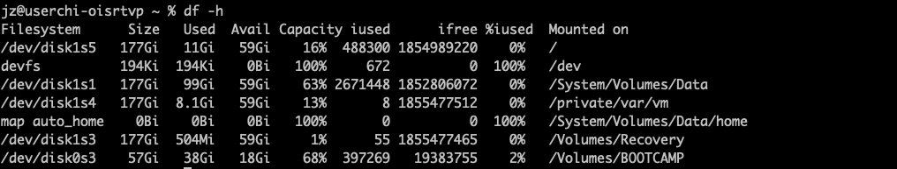

### 查看磁盘占用情况

  df  -h




查看目录下各个文件夹大小

```
du -h --max-depth=1 目录
```

会展示出来各个文件的大小，然后删除对应的大文件即可，如果删除文件后，磁盘空间并没有变话，可能是因为文件删除后，对应的句柄没释放

```
lsof / | grep -i delete
```

可以看到占用删除的线程，kill 调后，磁盘空间就释放出去了


### curl 发送post 请求

```
curl  -H "Content-Type: application/json" -X POST  -d '{"token":"d71b45f1b7be408e9d52b980d4134f73"}' http://192.168.124.47:10100/sso/server/getSsoUser
```

