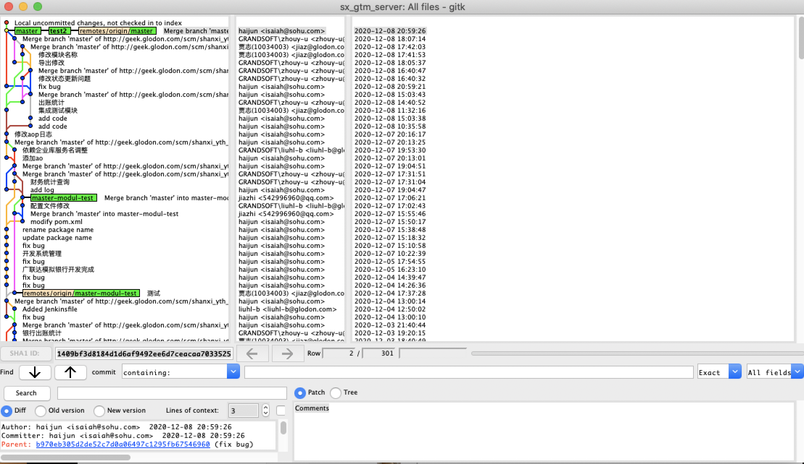
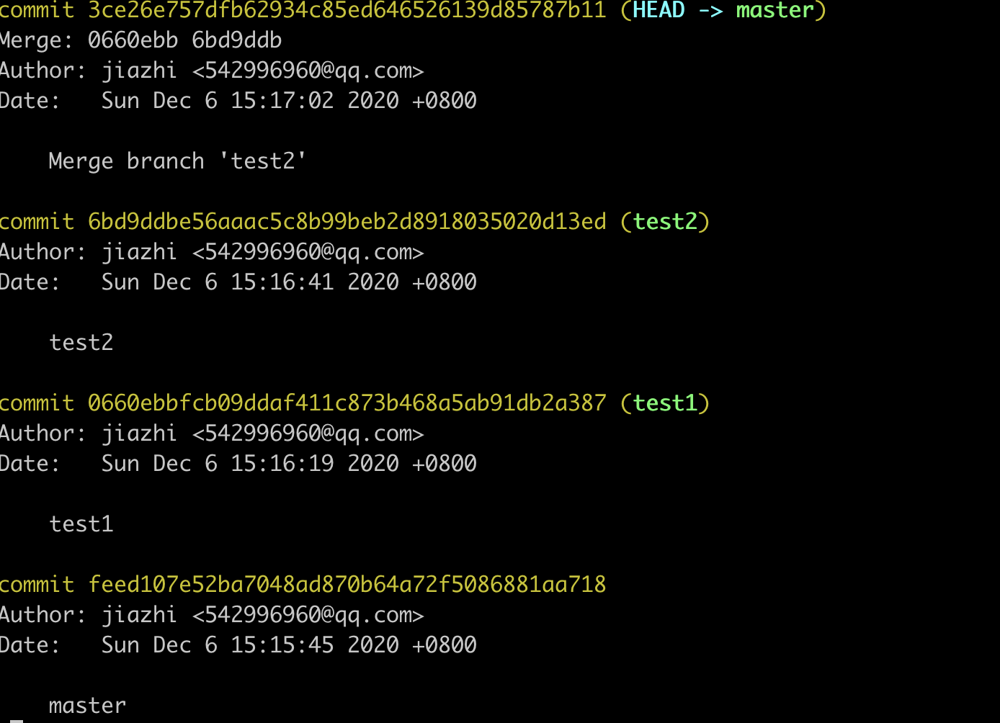
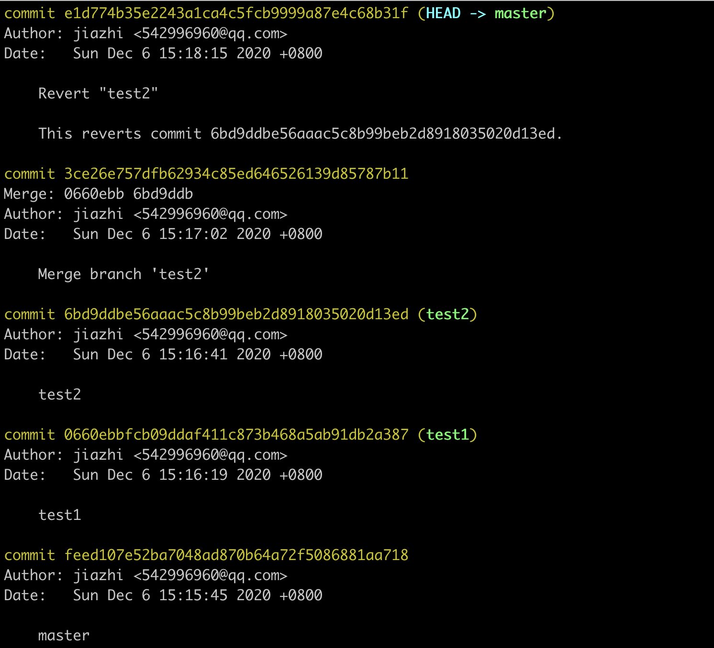
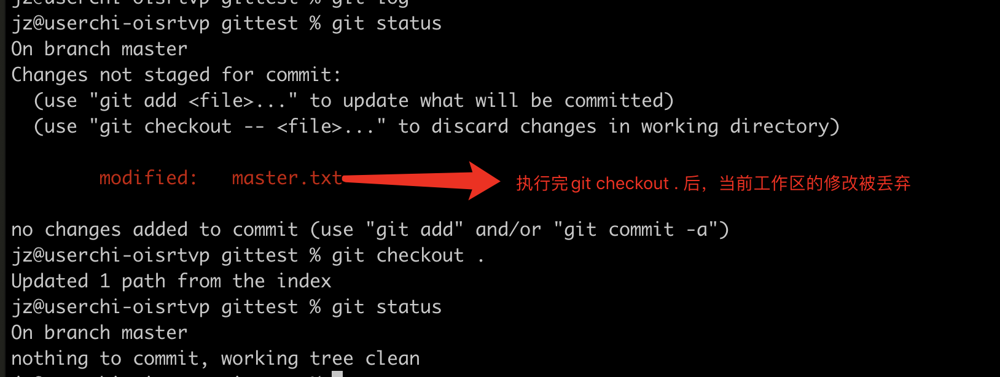
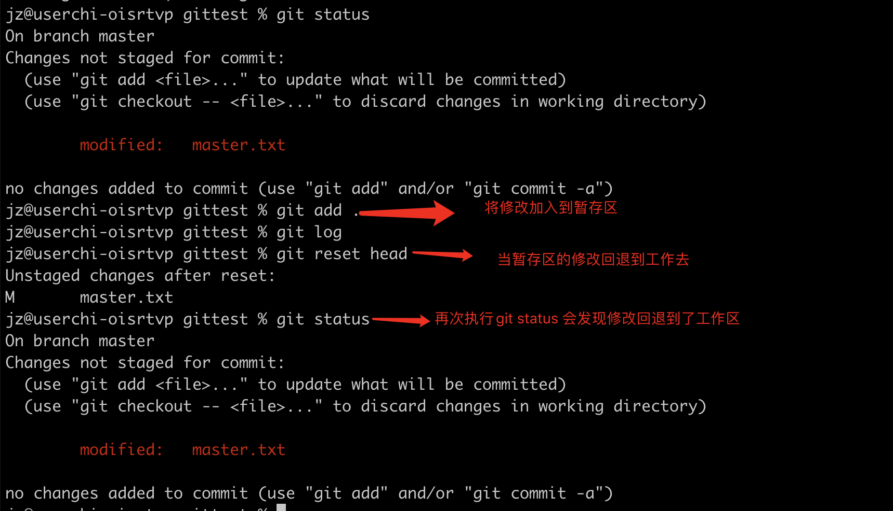
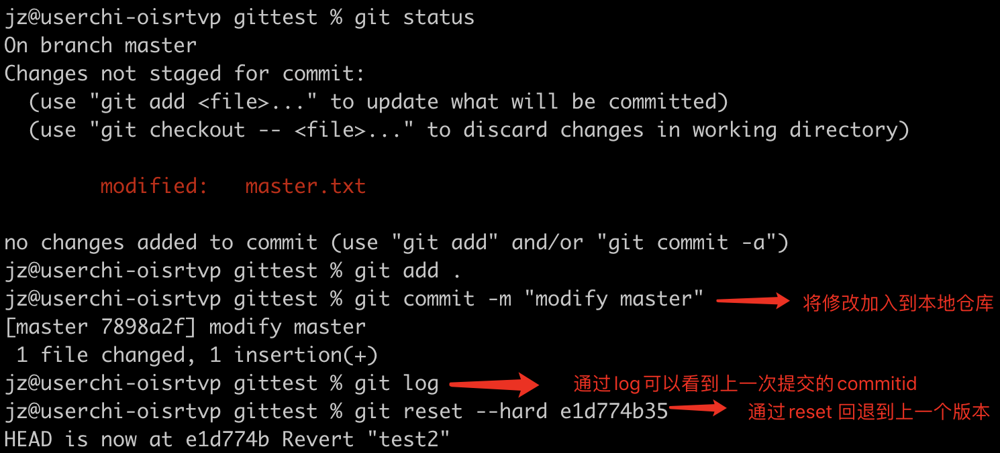
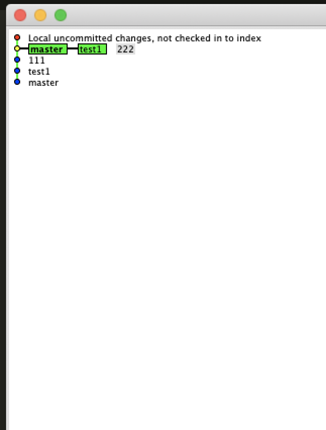
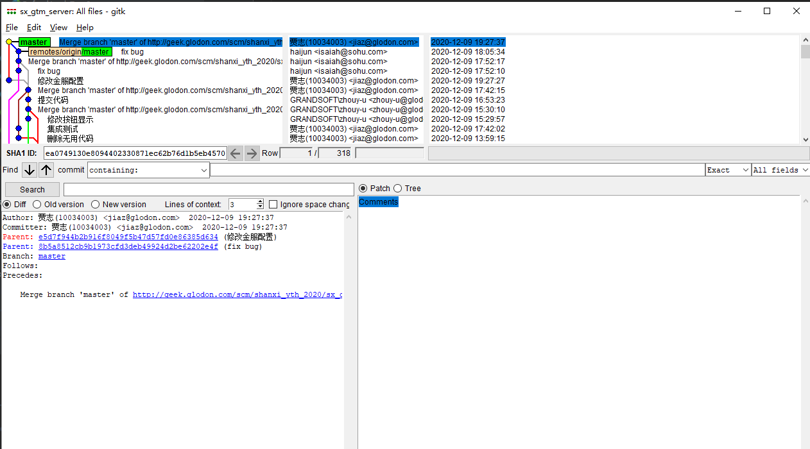

## git 常用命令 整理


### 远程仓库相关

     //将本地仓库和远程仓库做关联
    git remote add origin url
    
    //将远程仓库clone到本地
    git clone url
    
    //获取本地仓库关联的url
    git remote get-url origin 
    
    //设置本地仓库关联远程仓库的url
    git remote set-url origin url
### git 常用命令

```
//初始化一个git仓库
git init

//从远程分支下载代码
git pull origin 远程分支

//查看工作区的修改
git status

//将工作区的修改放到暂存区 (.指的是将工作区的全部文件放到暂存区，如果要指定文件，可以将. 替换为指定的文件名)
git add .

//将暂存区修改提交到代码仓库
git commit -m "msg" 

//将本地代码推送到远程仓库
git push origin 远程分支名称

```


### git 分支相关

  ```
//查看本地所有的分支 (当前分支会用“*”标记)
git branch

//查看本地和远端所有的分支名称 (远程分支会用特殊颜色标记，且前边会加 remote/)
git  branch -a  

//删除分支
git branch -d 

//删除远程分支
git push --origin -delete branch

//本地新建分支
git branch  "分支名称"

//分支切换
git checkout "分支名称"

//创建并切换分支
git checkout -b "分支名称"
  ```


### git log相关

```
//查看已提交的所有版本信息，不包括reset commit
git  log

//查看所有的版本信息，包含了reset commit
git  reflog

//使用可视化界面查看提交信息
gitk

//git log 和 reflog 的区别
比如 使用 git reset --hard HEAD~1，退回到上一个版本，用git log则是看不出来被删除的commitid，用git reflog则可以看到被删除的commitid，我们就可以使用被删除的commitid 恢复到被删除的那个版本。
```




### git revert

​         git revert是用一次新的commit来回滚之前的commit。 比如主分支为master分支，有三个开发分支依次为test1,test2。依次把test1,test2开发分支合并到master分支，

​            此时git提交记录为:

​     后来 发现从test2 分支合并过来的代码有问题，需要把test2分支合并的代码删除掉。可通过git revert 回滚test2分支的代码

​     **git revert 6bd9ddbe56**

revert后git 的提交记录变成

  

  对应的工作区从test2合并到的代码也没有了。

  从提交记录可以看到  revert 命令 。  是用一个新的commit 覆盖了原有test2的代码。

### git 版本回退

   1. 工作区修改，未执行add 操作，需要丢弃当前工作区修改

      **git checkout .**

      

   2. 执行了git add 操作后，需要丢弃暂存区的修改

       **git reset head**


3.   执行了git commit 后，需要丢弃修改

    **git reset --hard commitid**

   

### git rebase

    git checkout master
    git pull
    git checkout dev
    git rebase -i HEAD~2  //合并提交 --- 2表示合并两个
    git rebase master---->解决冲突--->git rebase --continue
    git checkout master
    git merge dev
    git push


>  git rebase 和git master 都可以用来合并一个分支到另外一个分支，不同点是，通过rebase 合并后的分支比较干净，是一条直线。通过merge 合并的分支会有很多支线分支

git rebase 合并分支图：

   

 通过git merge 合并的分支图 执行比较乱：

      

### git stash

​     git stash 作用的将工作区的修改暂存起来，不add 也不commit。

​    使用场景： 从master 分支 切出一个分支 test1 ，并在test1上开发任务。 此时需要在master分支做一些改动，比如bugfix。 但是test1分支的功能还没开发完成，如果commit的话，相当于是commit了一个非完整功能。可以使用git stash，将test1分支的代码暂存。然后checkout 到master 做master 分支修改。

     ```
//将工作区的修改暂存
git stash save "save message"  :
//查看当前所有的暂存
git stash list 
// 将暂存的内容恢复到工作去，并删除对应的stash，默认弹出第一个git stash pop stash@{$num}
git stash pop 
//丢弃stash@{$num}存储，从列表中删除这个存储
git stash drop stash@{$num} ：丢弃stash@{$num}存储，从列表中删除这个存储
//清空暂存区
git stash clear 
     ```

 

### 日常工作流程

假定 主分支 master 开发分支 test

 ```
//将远程仓库代码clone到本地
git clone remoteurl

//创建功能开发分支
git checkout -b test

//提交分支代码
git add .
git commit -m "msg"

//切换到master分支
git checkout master
//拉取远程分支代码
git pull origin master

//切换到test分支
git checkout test;

//将master最新的改动合并到test，有冲突解决冲突
git merge master

//切换到master分支
git checkout master

//合并test分支代码
git merge test

//推送到远程
git push origin master
 ```


