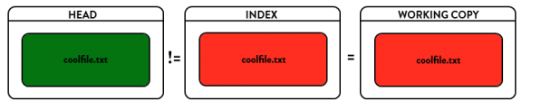
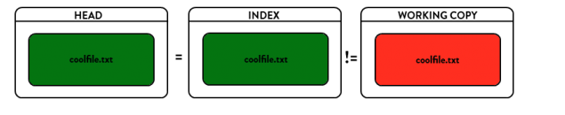
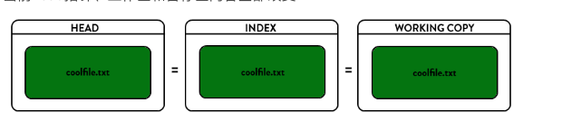

# git reset 版本回退

 ## 一.  reset 参数

### --soft  

​      仅仅移动当前Head指针，不会改变工作区和暂存区的内容    

### --mixed  

是reset的默认参数,移动head指针，改变暂存区内容，但不会改变工作区 

### --hard  

当前head指针、工作区和暂存区内容全部改变  

​     那我个人的理解，--soft用处不是很多，当commit之后想撤回commit，但还不想覆盖工作区内容时，使用--mixed；当想完全回滚时，使用--hard来覆盖工作区。

 

## 二、 如何回滚文件

###  1. 修改完，还未执行git add 
> git checkout .
> 使用暂存区的文件覆盖工作区，所以执行完git add .之后，再执行该命令是无效的  
> git checkout .和git add .是一对反义词

### 2.使用git add 提交到暂存区，还未commit之前

> git reset  先用Head指针覆盖当前的暂存区内容
> git checkout . 再用暂存区内容覆盖工作区内容
> 或者使用: git reset --hard 直接使用head覆盖当前暂存区和工作

### 3.已经git commit，还未git push

 >git reset --hard origin/master
 > 从远程仓库把代码取回来，然后覆盖本地仓库、本地暂存区和工作区  
 >
 >或者使用
 >
 > git reset --hard last_commit_id
 >  覆盖本地仓库、暂存区和工作区，其中查看last_commit_id命令为git log
 > 或者使用
 >
 >git reset --mixed last_commit_id  
 >覆盖本地的暂存区，再执行
 >
 >git checkout . 覆盖本地工作区

### 4. 一个git push的

> 那就没办法了
>
> 实际经常使用的情况有两种
>
> 修改错了，完全覆盖掉，使用
>
> git reset --hard commit_id
>
> 
>
> 错误的把大文件添加到了缓存区，使用
>
> git reset
> 撤回添加

