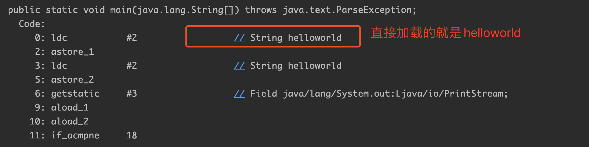
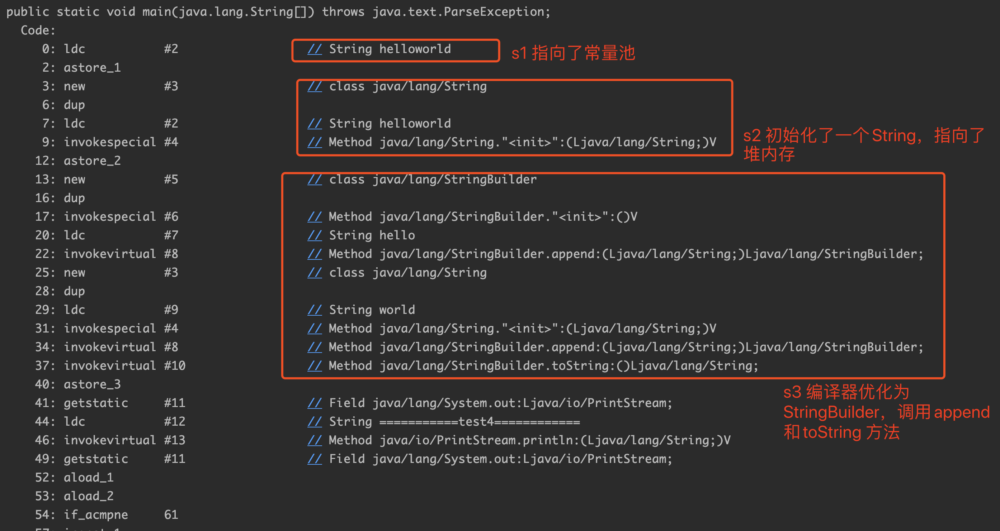
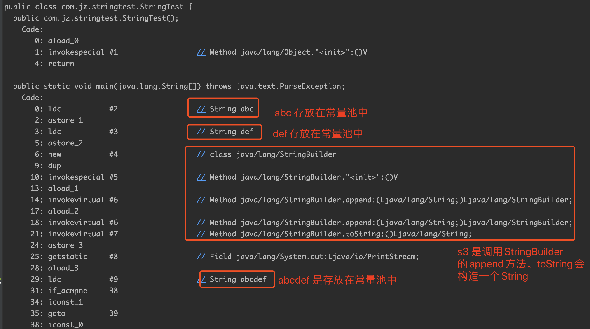
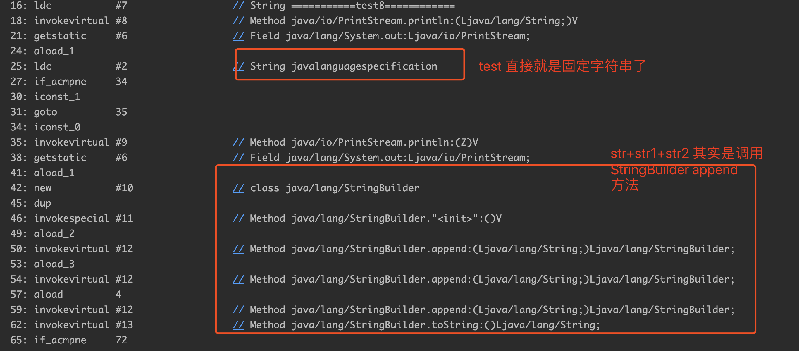

## String 的equal方法和== 比较

### 场景一

```java
public class StringMain {

    public static void main(String[] args) {
        String str1 = "helloworld";
        String str2 = "helloworld";
        System.out.println(str1 == str2);  //true
        System.out.println(str1.equals(str2)); //true
    }
}
```

String的equal比较的是字面值，所以返回true。== 返回true，说明str1和str2的内存地址相同，

​     原因是str1 = "helloworld";代码会首先在常量池中查找hellowrold,有就直接将其地址赋给s1，没有就创建一个"helloworld"，然后将其赋给s1;然后 String s2 = "helloworld";java同样会在缓冲区中查找"helloworld"，这次能查找到了，因为s1创建了一个"helloworld",所以会将其地址赋给s2，如此，s1和s2便有了相同的地址。

### 场景2

```java
public class StringMain {

    public static void main(String[] args) {
        String str1 = new String("helloworld");
        String str2 = new String("helloworld");
        System.out.println(str1 == str2);  //false
        System.out.println(str1.equals(str2)); //true
    }
}

```
​      分析： 采用new关键字新建一个字符串对象时，JVM首先在字符串池中查找有没有"helloworld"这个字符串对象，如果有，则不在池中再去创建"helloworld"这个对象了，直接在堆中创建一个"aaa"字符串对象，然后将堆中的这个"aaa"对象的地址返回赋给引用str1，这样，str1就指向了堆中创建的这个"aaa"字符串对象；如果没有，则首先在字符串池中创建一个"aaa"字符串对象，然后再在堆中创建一个"helloworld"字符串对象，然后将堆中这个"helloworld"字符串对象的地址返回赋给str1引用，这样，str1指向了堆中创建的这个"helloworld"字符串对象。当执行String str4=new String("aaa")时， 因为采用new关键字创建对象时，每次new出来的都是一个新的对象，也即是说引用str3和str4指向的是两个不同的对象，因此语句System.out.println(str3 == str4)输出：false。

### 场景3
```java
package com.jiazhi.test;

public class StringMain {

    public static void main(String[] args) {
        String str1 = new String("helloworld");
        String str2 = "helloworld";
        System.out.println(str1 == str2);  //false
        System.out.println(str1.equals(str2)); //true
    }
}

```
str1 指向堆内存，str2 指向字符串常量池，== 返回false


### 场景4

```java
public class StringMain {

    public static void main(String[] args) {
       String str1 = "helloworld";
       String str2 = "hello"+"world";
       System.out.println(str1 == str2);
       System.out.println(str1.equals(str2));
    }
}
```
str2 是由两个字符串常量相加组成，编译器即可确定str2的数据，str2 和str1 都是字符传常量池helloworld的引用，所有== 返回true。

查看对应的字节码文件:




### 场景5

```java
/**
 * 编译器无法确定
 */
public class StringMain {

    public static void main(String[] args) {
        String s0="helloworld";
        String s1=new String("helloworld");
        String s2="hello" + new String("world");
        System.out.println("===========test4============");
        System.out.println( s0==s1 ); //false
        System.out.println( s0==s2 ); //false 
        System.out.println( s1==s2 ); //false
    }
}
```
s0 指向了常量池，s1指向了对内存，s2 会优化为 StringBuilder.append方法，他们所指向的内存个不相同




### 场景6

```java
//编译器无法确定
public class StringMain {

    public static void main(String[] args) {
        String str1="abc";
        String str2="def";
        String str3=str1+str2;
        System.out.println("===========test5============");
        System.out.println(str3=="abcdef"); //false
    }
}
```
​      因为str3指向堆中的"abcdef"对象，而"abcdef"是字符串池中的对象，所以结果为false。JVM对String str="abc"对象放在常量池中是在编译时做的，而String str3=str1+str2是在运行时刻才能知道的。new对象也是在运行时才做的。而这段代码总共创建了5个对象，字符串池中两个、堆中三个。+运算符会在堆中建立来两个String对象，这两个对象的值分别是"abc"和"def"，也就是说从字符串池中复制这两个值，然后在堆中创建两个对象，然后再建立对象str3,然后将"abcdef"的堆地址赋给str3。




步骤：

1. 栈中开辟一块中间存放引用str1，str1指向池中String常量"abc"。 
2. 栈中开辟一块中间存放引用str2，str2指向池中String常量"def"。 
3. 栈中开辟一块中间存放引用str3。
4. str1 + str2通过StringBuilder的最后一步toString()方法还原一个新的String对象"abcdef"，因此堆中开辟一块空间存放此对象。
5. 引用str3指向堆中(str1 + str2)所还原的新String对象。 
6. str3指向的对象在堆中，而常量"abcdef"在池中，输出为false。

### 场景7

```java
public class StringMain {
    public static void main(String[] args) {
        String test="javalanguagespecification";
        String str="java";
        String str1="language";
        String str2="specification";
        System.out.println("===========test8============");
        System.out.println(test == "java" + "language" + "specification"); //true
        System.out.println(test == str + str1 + str2);//false
    }
}
```
​        为什么出现上面的结果呢？这是因为，字符串字面量拼接操作是在Java编译器编译期间就执行了，也就是说编译器编译时，直接把"java"、"language"和"specification"这三个字面量进行"+"操作得到一个"javalanguagespecification" 常量，并且直接将这个常量放入字符串池中，这样做实际上是一种优化，将3个字面量合成一个，避免了创建多余的字符串对象。而字符串引用的"+"运算是在Java运行期间执行的，即str + str2 + str3在程序执行期间才会进行计算，它会在堆内存中重新创建一个拼接后的字符串对象。总结来说就是：字面量"+"拼接是在编译期间进行的，拼接后的字符串存放在字符串池中；而字符串引用的"+"拼接运算实在运行时进行的，新创建的字符串存放在堆中。

​     对于直接相加字符串，效率很高，因为在编译器便确定了它的值，也就是说形如"I"+"love"+"java"; 的字符串相加，在编译期间便被优化成了"Ilovejava"。对于间接相加（即包含字符串引用），形如s1+s2+s3; 效率要比直接相加低，因为在编译器不会对引用变量进行优化。




### 场景8

```java
/**
 *  编译期确定
 */
public class StringMain {

    public static void main(String[] args) {
        String s0 = "ab";
        final String s1 = "b";
        String s2 = "a" + s1;
        System.out.println("===========test9============");
        System.out.println((s0 == s2)); //result = true
    }
}
```
​      和例子7中唯一不同的是s1字符串加了final修饰，对于final修饰的变量，它在编译时被解析为常量值的一个本地拷贝存储到自己的常量池中或嵌入到它的字节码流中。所以此时的"a" + s1和"a" + "b"效果是一样的。故上面程序的结果为true。


### 场景9

```java
/**
 *  编译期无法确定
 */
public class StringMain {

    public static void main(String[] args) {
        String s0 = "ab";
        final String s1 = getS1();
        String s2 = "a" + s1;
        System.out.println("===========test10============");
        System.out.println((s0 == s2)); //result = false
    }

    public static String getS1(){
        return "b";
    }
}
```
这里面虽然将s1用final修饰了，但是由于其赋值是通过方法调用返回的，那么它的值只能在运行期间确定，因此s0和s2指向的不是同一个对象，故上面程序的结果为false。

