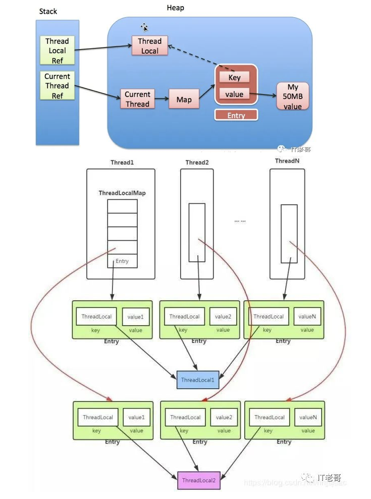
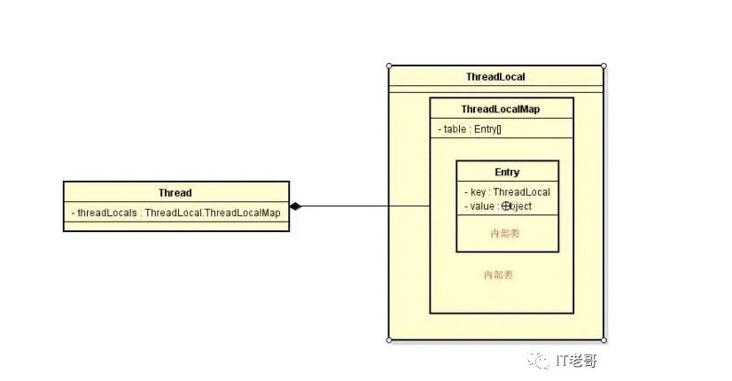

## ThreadLocal 

   ThreadLocal  指的是线程的本地变量，每个线程中存储的是共享变量的副本，各个线程操作各自的变量，互相隔离，互不影响。


#### 案例（线程不安全）

```java
package com.test.thread;

import java.text.ParseException;
import java.text.SimpleDateFormat;
import java.util.Date;
import java.util.concurrent.LinkedBlockingDeque;
import java.util.concurrent.ThreadPoolExecutor;
import java.util.concurrent.TimeUnit;

class DataUtilSafe{
    private static final SimpleDateFormat simpleDateFormat = new SimpleDateFormat("yyyy-mm-dd HH:mm:ss");
    public static Date parse(String date){
        try {
            return simpleDateFormat.parse(date);
        } catch (ParseException e) {
            e.printStackTrace();
        }
        return null;
    }

}

public class ThreadLocalTest {
    public static void main(String[] args) {

        ThreadPoolExecutor threadPoolExecutor = new ThreadPoolExecutor(20, 20, 0, TimeUnit.MICROSECONDS, new LinkedBlockingDeque<Runnable>(20));

         for(int i=0;i<20;i++){
             threadPoolExecutor.submit(new Runnable() {
                 @Override
                 public void run() {
                     System.out.println(DataUtilSafe.parse("2020-9-14 23:58:59"));
                 }
             });
         }

        try {
            TimeUnit.MILLISECONDS.sleep(4000);
        } catch (InterruptedException e) {
            e.printStackTrace();
        }
    }
}

```

​      上边的代码在执行过程中，不会得到正确的结果，是因为SimpleDateFormat 的parse 方法不是一个原子性操作，导致，多个线程同时访问simpleDateFormat 会出现线程安全问题。我们可以通过ThreadLocal 解决改问题

#### ThreadLocal 解决线程安全问题

 ```java
package com.test.thread;

import java.text.ParseException;
import java.text.SimpleDateFormat;
import java.util.Date;
import java.util.concurrent.LinkedBlockingDeque;
import java.util.concurrent.ThreadPoolExecutor;
import java.util.concurrent.TimeUnit;

class DataUtilSafe{
    //通过threadlocal 每个线程都有自己的一个SimpleDateFormat,，每个线程各自操作各自的对象，线程之间相互隔离
    private static ThreadLocal<SimpleDateFormat>  THREAD_LOCAL = ThreadLocal.withInitial(()->new SimpleDateFormat("yyyy-mm-dd HH:mm:ss"));
    public static Date parse(String date){
        try {
            return THREAD_LOCAL.get().parse(date);
        } catch (ParseException e) {
            e.printStackTrace();
        }
        return null;
    }

}

public class ThreadLocalTest {
    public static void main(String[] args) {

        ThreadPoolExecutor threadPoolExecutor = new ThreadPoolExecutor(20, 20, 0, TimeUnit.MICROSECONDS, new LinkedBlockingDeque<Runnable>(20));

         for(int i=0;i<20;i++){
             threadPoolExecutor.submit(new Runnable() {
                 @Override
                 public void run() {
                     System.out.println(DataUtilSafe.parse("2020-9-14 23:58:59"));
                 }
             });
         }

        try {
            TimeUnit.MILLISECONDS.sleep(4000);
        } catch (InterruptedException e) {
            e.printStackTrace();
        }
    }
}
//输出结果：
Tue Jan 14 23:58:59 CST 2020
Tue Jan 14 23:58:59 CST 2020
Tue Jan 14 23:58:59 CST 2020
Tue Jan 14 23:58:59 CST 2020
Tue Jan 14 23:58:59 CST 2020
Tue Jan 14 23:58:59 CST 2020
Tue Jan 14 23:58:59 CST 2020
Tue Jan 14 23:58:59 CST 2020
Tue Jan 14 23:58:59 CST 2020
Tue Jan 14 23:58:59 CST 2020
Tue Jan 14 23:58:59 CST 2020
Tue Jan 14 23:58:59 CST 2020
Tue Jan 14 23:58:59 CST 2020
Tue Jan 14 23:58:59 CST 2020
Tue Jan 14 23:58:59 CST 2020
Tue Jan 14 23:58:59 CST 2020
Tue Jan 14 23:58:59 CST 2020
Tue Jan 14 23:58:59 CST 2020
Tue Jan 14 23:58:59 CST 2020
Tue Jan 14 23:58:59 CST 2020
 ```

​     既然是因为多个线程共享SimpleDateFormat造成的，那么我们就让它不共享，每个线程存一份自己的SimpleDateFormat对象。自己玩自己的对象，就不会出现线程问题了。ThreadLocal作用就是让线程自己独立保存一份自己的变量副本。每个线程独立的使用自己的变量副本，不会影响其他线程内的变量副本。

##  ThreadLocal 简介

​      很多小伙伴认为ThreadLocal是多线程同步机制的一种，其实不然，他是为多线程环境下为变量线程安全提供的一种解决思路，他是解决多线程下成员变量的安全问题，不是解决多线程下共享变量的安全问题。

​       线程同步机制是多个线程共享一个变量，而ThreadLocal是每个线程创建一个自己的单独变量副本，所以每个线程都可以独立的改变自己的变量副本。并且不会影响其他线程的变量副本。


## **ThreadLocalMap**

  ThreadLocal内部有一个非常重要的内部类：ThreadLocalMap，该类才是真正实现线程隔离机制的关键，ThreadLocalMap内部结构类似于map，由键值对key和value组成一个Entry，key为ThreadLocal本身，value是对应的线程变量副本

注意：

1、ThreadLocal本身不存储值，他只是提供一个查找到值的key给你。

2、ThreadLocal包含在Thread中，不是Thread包含在ThreadLocal中。


**ThreadLocalMap 和HashMap的功能类似，但是实现上却有很大的不同：**

1. HashMap 的数据结构是数组+链表
2. ThreadLocalMap的数据结构仅仅是数组
3. HashMap 是通过链地址法解决hash 冲突的问题
4. ThreadLocalMap 是通过开放地址法来解决hash 冲突的问题
5. HashMap 里面的Entry 内部类的引用都是强引用
6. ThreadLocalMap里面的Entry 内部类中的key 是弱引用，value 是强引用

###  

### **链地址法**

这种方法的基本思想是将所有哈希地址为i的元素构成一个称为同义词链的单链表，并将单链表的头指针存在哈希表的第i个单元中，因而查找、插入和删除主要在同义词链中进行。


### **开放地址法**

这种方法的基本思想是一旦发生了冲突，就去**寻找下一个空的散列地址(这非常重要，源码都是根据这个特性，必须理解这里才能往下走)**，只要散列表足够大，空的散列地址总能找到，并将记录存入。


### **链地址法和开放地址法的优缺点**

开放地址法：

1. 容易产生堆积问题，不适于大规模的数据存储。
2. 散列函数的设计对冲突会有很大的影响，插入时可能会出现多次冲突的现象。
3. 删除的元素是多个冲突元素中的一个，需要对后面的元素作处理，实现较复杂。

链地址法：

1. 处理冲突简单，且无堆积现象，平均查找长度短。
2. 链表中的结点是动态申请的，适合构造表不能确定长度的情况。
3. 删除结点的操作易于实现。只要简单地删去链表上相应的结点即可。
4. 指针需要额外的空间，故当结点规模较小时，开放定址法较为节省空间。


**ThreadLocalMap 采用开放地址法原因**

1. ThreadLocal 中看到一个属性 HASH_INCREMENT = 0x61c88647 ，0x61c88647 是一个神奇的数字，让哈希码能均匀的分布在2的N次方的数组里, 即 Entry[] table，关于这个神奇的数字google 有很多解析，这里就不重复说了
2. ThreadLocal 往往存放的数据量不会特别大（而且key 是弱引用又会被垃圾回收，及时让数据量更小），这个时候开放地址法简单的结构会显得更省空间，同时数组的查询效率也是非常高，加上第一点的保障，冲突概率也低


### Thread、ThreadLocal、ThreadLocalMap之间的关系

  



从上面的结构图，我们已经窥见ThreadLocal的核心机制：

​      每个Thread线程内部都有一个Map。Map里面存储线程本地对象（key）和线程的变量副本（value）Thread内部的Map是由ThreadLocal维护的，由ThreadLocal负责向map获取和设置线程的变量值。所以对于不同的线程，每次获取副本值时，别的线程并不能获取到当前线程的副本值，形成了副本的隔离，彼此之间互不干扰。

## 源码解读

##### 先了解一下ThreadLocal类提供的几个方法

```java
public T get() { }
public void set(T value) { }
public void remove() { }
protected T initialValue() { }
```

get()方法是用来获取ThreadLocal在当前线程中保存的变量副本。
set()用来设置当前线程中变量的副本。
remove()用来移除当前线程中变量的副本。
initialValue()是一个protected方法，一般是用来在使用时进行重写的

##### get方法

```java
    //通过key 获取value
    public T get() {
        //获取当前线程
        Thread t = Thread.currentThread();
      
        //通过当前线程获取线程内部的ThreadLocalMap
        ThreadLocalMap map = getMap(t);
      
        if (map != null) {
          
            //通过key（this，就是当前的ThreadLocal），获取对应的Entry结果，key为ThreadLocal，value为设置的值
            ThreadLocalMap.Entry e = map.getEntry(this);
            
            //如果查找到了就返回value的值
            if (e != null) {
                @SuppressWarnings("unchecked")
                T result = (T)e.value;
                return result;
            }
        }
        
       //如果没有查找到，就设置默认值
        return setInitialValue();
    }

  //调用initialVaule 获取默认值
  private T setInitialValue() {
        T value = initialValue();
        Thread t = Thread.currentThread();
        ThreadLocalMap map = getMap(t);
        if (map != null)
            map.set(this, value);
        else
            createMap(t, value);
        return value;
    }
```


##### set方法

```java
    public void set(T value) {
      
        //获取当前线程
        Thread t = Thread.currentThread();
       
        //获取线程内部的ThreadLocalMap
        ThreadLocalMap map = getMap(t);
      
        //如果不为空，则设置value
        if (map != null)
            map.set(this, value);
        else
            createMap(t, value);
    }
    
     //创建一个ThreadLocalMap 并设置值
     void createMap(Thread t, T firstValue) {
        t.threadLocals = new ThreadLocalMap(this, firstValue);
    }


```

 

##### remove方法

```java
     public void remove() {
         //获取当前线程的ThreadLocalMap
         ThreadLocalMap m = getMap(Thread.currentThread());
         //删除元素
         if (m != null)
             m.remove(this);
     }
```

​       这里罗列了 ThreadLocal 的几个public方法，其实所有工作最终都落到了 ThreadLocalMap 的头上，ThreadLocal 仅仅是从当前线程取到 ThreadLocalMap 而已，具体执行，请看下面对 ThreadLocalMap 的分析。 


## ThreadLocalMap 源码分析

##### set 方法

  ```java
  private void set(ThreadLocal<?> key, Object value) {
    
            Entry[] tab = table;
            int len = tab.length;
           //计算key的索引位置
            int i = key.threadLocalHashCode & (len-1);

            //开放地址法寻找
            for (Entry e = tab[i];
                 e != null;
                 e = tab[i = nextIndex(i, len)]) {
                ThreadLocal<?> k = e.get();

                //找到key相同的元素，则用新的value 覆盖旧的value值
                if (k == key) {
                    e.value = value;
                    return;
                }
  
                //如果e不为null，key为null，说明key被回收了（弱引用），改位置的元素已经没有用处了，就可以将新的key和value放到这个位置
                if (k == null) {
                    replaceStaleEntry(key, value, i);
                    return;
                }
            }
            // 如果方法没有在上面的方法中return
            // 说明此时位置i的Entry是空的，可以设置key和value
            tab[i] = new Entry(key, value);
            int sz = ++size;
            // cleanSomeSlots方法返回false表示数组中已经不存在key为空需要清除的Entry了
            // 此时数组中元素的数量大于临界值了时
            // 需要调用rehash进行扩容
            if (!cleanSomeSlots(i, sz) && sz >= threshold)
                rehash();
        }

  ```

##### replaceStaleEntry 替换方法

```java
 private void replaceStaleEntry(ThreadLocal<?> key, Object value,
                                       int staleSlot) {
            Entry[] tab = table;
            int len = tab.length;
            Entry e;
  
            //清除元素的开始位置（记录索引位置最前面的）
            int slotToExpunge = staleSlot;
   
            //向前寻找，知道遇到entry为null的位置
            for (int i = prevIndex(staleSlot, len);
                 (e = tab[i]) != null;
                 i = prevIndex(i, len))
                if (e.get() == null)
                    slotToExpunge = i;

            // 向后寻找，知道遇到entry为null的位置
            for (int i = nextIndex(staleSlot, len);(e = tab[i]) != null; i = nextIndex(i, len)) {
              
                //获取key值
                ThreadLocal<?> k = e.get();

                //如果找到key值相同的元素，那么直接修改value的值
                if (k == key) {
                    e.value = value;
                    
                    // 将i位置和staleSlot位置的元素对换，i位置较前，是需要清除的元素
                    tab[i] = tab[staleSlot];
                    tab[staleSlot] = e;

                   // 如果相等, 则代表上面的向前寻找key为null的遍历没有找到，
                   // 即staleSlot位置前面的元素没有需要清除的，此时将slotToExpunge设置为i,
                   // 因为原staleSlot的元素已经被放到i位置了，这时位置i前面的元素都不需要清除
                    if (slotToExpunge == staleSlot)
                        slotToExpunge = i;
                    // 从slotToExpunge位置开始清除key为空的Entry
                    cleanSomeSlots(expungeStaleEntry(slotToExpunge), len);
                    return;
                }

                // 如果第一次遍历到key为null的元素，并且上面的向前寻找key为null的遍历没有找到，
                // 则将slotToExpunge设置为当前的位置
                if (k == null && slotToExpunge == staleSlot)
                    slotToExpunge = i;
            }

            // 如果key没有找到，则新建一个Entry，放在staleSlot位置
            tab[staleSlot].value = null;
            tab[staleSlot] = new Entry(key, value);

            // 如果slotToExpunge!=staleSlot，代表除了staleSlot位置还有其他位置的元素需要清除
             // 需要清除的定义：key为null的Entry，调用cleanSomeSlots方法清除key为null的Entry
            if (slotToExpunge != staleSlot)
                cleanSomeSlots(expungeStaleEntry(slotToExpunge), len);
        }

```


##### cleanSomeSlots方法

```java
rivate boolean cleanSomeSlots(int i, int n) {
    boolean removed = false;
    Entry[] tab = table;
    int len = tab.length;
    do {

        // 下一个索引位置
        i = nextIndex(i, len);
        Entry e = tab[i];

        // 遍历到key为null的元素
        if (e != null && e.get() == null) {

            // 重置n的值
            n = len;

            // 标志有移除元素
            removed = true;

            // 移除i位置及之后的key为null的元素
            i = expungeStaleEntry(i);
        }
    } while ( (n >>>= 1) != 0);
    return removed;
}
```


##### remove方法

```java
    */
        private void remove(ThreadLocal<?> key) {
            Entry[] tab = table;
            int len = tab.length;
        // 根据hashCode计算出当前ThreadLocal的索引位置
            int i = key.threadLocalHashCode & (len-1);
            // 从位置i开始遍历，直到Entry为null
            for (Entry e = tab[i];
                 e != null;
                 e = tab[i = nextIndex(i, len)]) {
                if (e.get() == key) {
                     // 则调用clear方法, 该方法会把key的引用清空
                    e.clear();
                 
                     //调用expungeStaleEntry方法清除key为null的Entry
                    expungeStaleEntry(i);
                    return;
                }
            }
        }
```


##### expungeStaleEntry方法

```java
  private int expungeStaleEntry(int staleSlot) {
            Entry[] tab = table;
            int len = tab.length;

            //把tab[staleSlot]位置上的元素清空
            tab[staleSlot].value = null;
            tab[staleSlot] = null;
            //大小减一
            size--;

         
            Entry e;
            int i;
                // 遍历到Entry为空时, 跳出循环并返回索引位置
            for (i = nextIndex(staleSlot, len);
                 (e = tab[i]) != null;
                 i = nextIndex(i, len)) {
                ThreadLocal<?> k = e.get();
                 // 当前遍历Entry的key为空, 则将该位置的对象清空
                if (k == null) {
                    e.value = null;
                    tab[i] = null;
                    size--;
                } else {
                     // 重新计算该Entry的索引位置
                    int h = k.threadLocalHashCode & (len - 1);
                      // 如果索引位置不为当前索引位置i
                    if (h != i) {
                        // 则将i位置对象清空, 替当前Entry寻找正确的位置
                        tab[i] = null;
                         // 如果h位置不为null，则向后寻找当前Entry的位置
                        while (tab[h] != null)
                            h = nextIndex(h, len);
                        tab[h] = e;
                    }
                }
            }
            return i;
        }

```


##### rehash方法

```java
  /**
         * Re-pack and/or re-size the table. First scan the entire
         * table removing stale entries. If this doesn't sufficiently
         * shrink the size of the table, double the table size.
         */
        private void rehash() {
            //调用expungeStaleEntries方法清理key为空的Entry
            expungeStaleEntries();

            
            if (size >= threshold - threshold / 4)
                resize();
        }

        /**
         * Double the capacity of the table.
         */
        private void resize() {
            Entry[] oldTab = table;
            int oldLen = oldTab.length;
            //新的数组长度是老的数组长度的2倍
            int newLen = oldLen * 2;
            Entry[] newTab = new Entry[newLen];
            int count = 0;
            
            for (int j = 0; j < oldLen; ++j) {
                //获取对应的entry
                Entry e = oldTab[j];
                if (e != null) {
                    ThreadLocal<?> k = e.get();
                    if (k == null) {
                        e.value = null; // Help the GC
                    } else {
                        //重新计算在新的table中的索引位置
                        int h = k.threadLocalHashCode & (newLen - 1);
                        //开发地址发寻找存放的位置
                        while (newTab[h] != null)
                            h = nextIndex(h, newLen);
                        newTab[h] = e;
                        count++;
                    }
                }
            }
            //计算扩容阈值
            setThreshold(newLen);
            size = count;
            //将老的table指向新的table
            table = newTab;
        }

```


### 内存泄露问题：

```java
   static class Entry extends WeakReference<ThreadLocal<?>> {
            /** The value associated with this ThreadLocal. */
            Object value;

            Entry(ThreadLocal<?> k, Object v) {
                super(k);
                value = v;
            }
        }
```

​       从上面源码可以看出，ThreadLocalMap使用ThreadLocal的弱引用作为Entry的key，如果一个ThreadLocal没有外部强引用来引用它，下一次系统GC时，这个ThreadLocal必然会被回收，这样一来，ThreadLocalMap中就会出现key为null的Entry，就没有办法访问这些key为null的Entry的value。

我们上面介绍的get、set、remove等方法中，都会对key为null的Entry进行清除（expungeStaleEntry方法，将Entry的value清空，等下一次垃圾回收时，这些Entry将会被彻底回收）。


但是如果当前线程一直在运行，并且一直不执行get、set、remove方法，这些key为null的Entry的value就会一直存在一条强引用练：Thread Ref -> Thread -> ThreadLocalMap -> Entry -> value，导致这些key为null的Entry的value永远无法回收，造成内存泄漏。


如何避免内存泄漏？
为了避免这种情况，我们可以在使用完ThreadLocal后，手动调用remove方法，以避免出现内存泄漏。


## ThreadLocal 的传递性问题

   在实际应用中，我们有这样的一个需求，子线程需要访问父线程的ThreadLocal的值，我们可以通过  InheritableThreadLocal。InheritableThreadLocal继承自ThreadLocal，重写了getMap和createMap方法

   ```java
public class InheritableThreadLocal<T> extends ThreadLocal<T> {
    /**
     * Computes the child's initial value for this inheritable thread-local
     * variable as a function of the parent's value at the time the child
     * thread is created.  This method is called from within the parent
     * thread before the child is started.
     * <p>
     * This method merely returns its input argument, and should be overridden
     * if a different behavior is desired.
     *
     * @param parentValue the parent thread's value
     * @return the child thread's initial value
     */
    protected T childValue(T parentValue) {
        return parentValue;
    }

     //调用get或者set方法时候，会调用该方法，返回的是Thread 的 inheritableThreadLocals 属性
    ThreadLocalMap getMap(Thread t) {
       return t.inheritableThreadLocals;
    }

    // 调用get 或者set方法如果，getMap返为null时候调用,会创建一个 ThreadLocalMap 并赋值给thread 的inheritableThreadLocals 属性
    void createMap(Thread t, T firstValue) {
        t.inheritableThreadLocals = new ThreadLocalMap(this, firstValue);
    }
}

   ```


```java
public class InheritableThreadLocalTest {

    public static void main(String[] args) {

        InheritableThreadLocal inheritableThreadLocal = new InheritableThreadLocal();

        inheritableThreadLocal.set("12112");

        Thread trd1 = new Thread(new Runnable() {
            @Override
            public void run() {
                    System.out.println(inheritableThreadLocal.get())；
            }
        });

        trd1.start();
        try {
            TimeUnit.MILLISECONDS.sleep(10000);
        } catch (InterruptedException e) {
            e.printStackTrace();
        }
    }
}

//输出结果为：
12112
```


我们在new Thread  的时候，会调用Thread 的构造方法

```java
 public Thread(Runnable target) {
        init(null, target, "Thread-" + nextThreadNum(), 0);
    }

  private void init(ThreadGroup g, Runnable target, String name,
                      long stackSize) {
        init(g, target, name, stackSize, null, true);
   }
   
   //init 内部 会把父类的InheritableThreadLocal，复制给子类
    private void init(ThreadGroup g, Runnable target, String name,
                      long stackSize, AccessControlContext acc,
                      boolean inheritThreadLocals) {
        //省略

        Thread parent = currentThread();
     
        //省略。。。
         
        //复制父线程的ThreadLocal到子线程
        if (inheritThreadLocals && parent.inheritableThreadLocals != null)
            this.inheritableThreadLocals = ThreadLocal.createInheritedMap(parent.inheritableThreadLocals);
      
       
       //。。。。
    }


    static ThreadLocalMap createInheritedMap(ThreadLocalMap parentMap) {
        return new ThreadLocalMap(parentMap);
    }

  private ThreadLocalMap(ThreadLocalMap parentMap) {
            Entry[] parentTable = parentMap.table;
            int len = parentTable.length;
            setThreshold(len);
            table = new Entry[len];

            for (int j = 0; j < len; j++) {
                Entry e = parentTable[j];
                if (e != null) {
                    @SuppressWarnings("unchecked")
                    ThreadLocal<Object> key = (ThreadLocal<Object>) e.get();
                    if (key != null) {
                        Object value = key.childValue(e.value);
                        Entry c = new Entry(key, value);
                        int h = key.threadLocalHashCode & (len - 1);
                        while (table[h] != null)
                            h = nextIndex(h, len);
                        table[h] = c;
                        size++;
                    }
                }
            }
        }
```

  需要注意的是如果父线程的InheritableThreadLocal中存放的是基本数据类型，不是引用类型，那么创建了子线程后，父类修改了数据，子线程是无法感知到的。