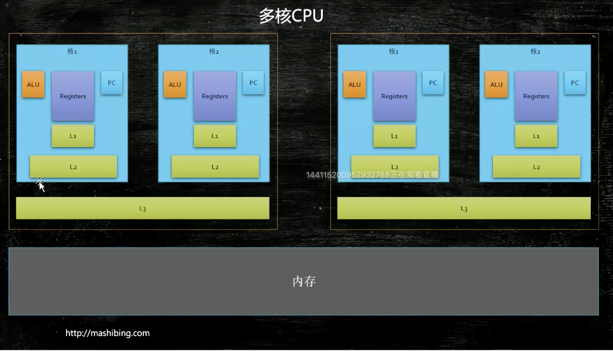
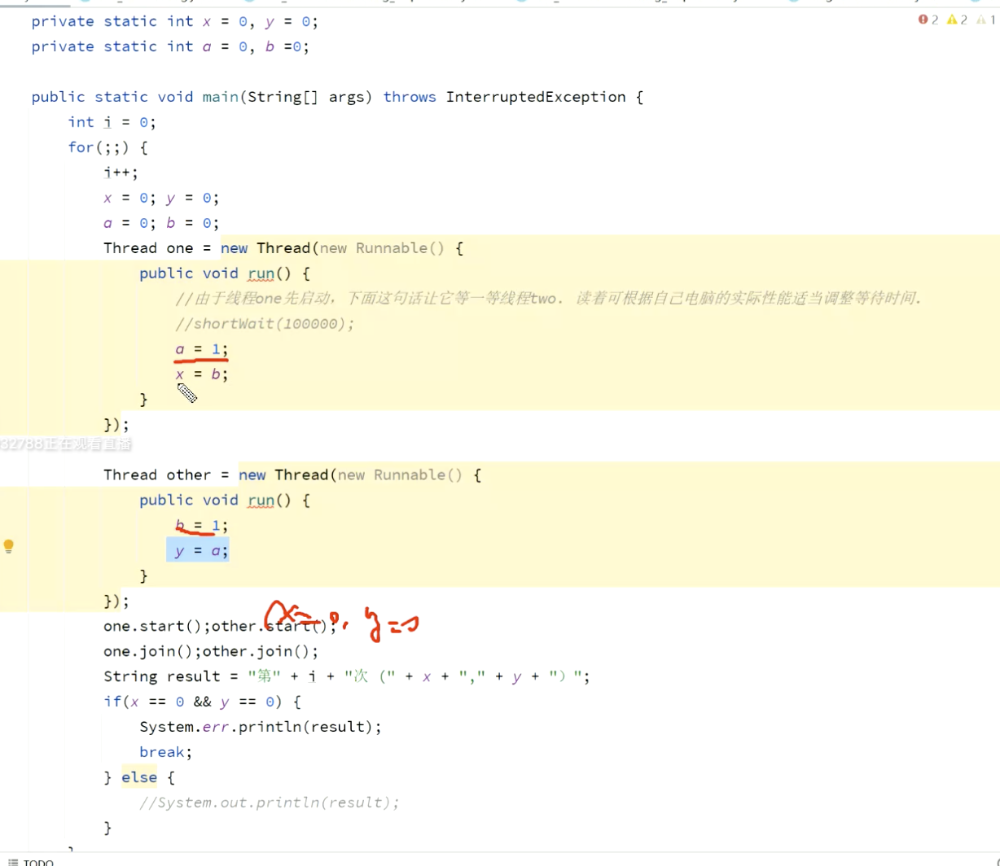
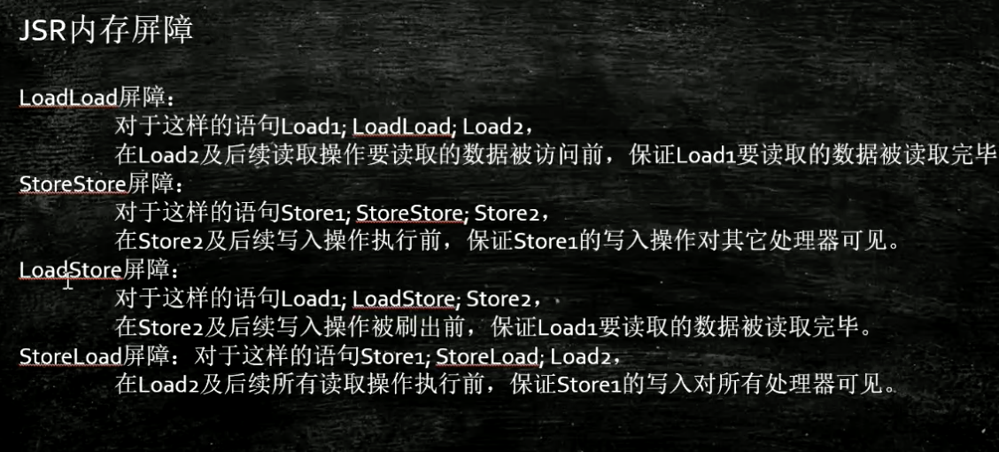

ringbuffer  缓存一致性协议

可见性

有序性

一致性

指令重排序 是为了提高cpu执行效率 

第一条内存取数据，第二条 add 执行，可以先执行第二条 在执行第一条

什么时候允许发生重排序： 两条指令发生排序后，不影响最终一致性

happen before 不允许重排序

volatile 保证了可见性，并且禁止重排序

内存屏障  ll  ls  ss sl

valatile 在两条执行之间加入内存屏障，防止指令重排序

单例类 双重锁验证 ，加volatile  是因为 new 一个对象，会有三条执行，  分配内存，执行构造方法，添加引用。 这三条执行可能会有重排序，导致对象并没有完全初始化，，但是引用已经不为null 了

cpu 一行cache 大小为 64 字节

