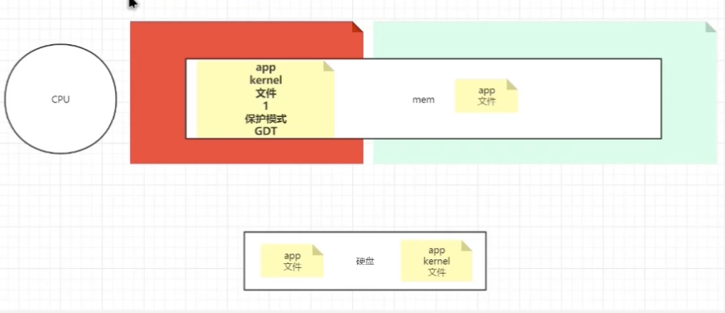
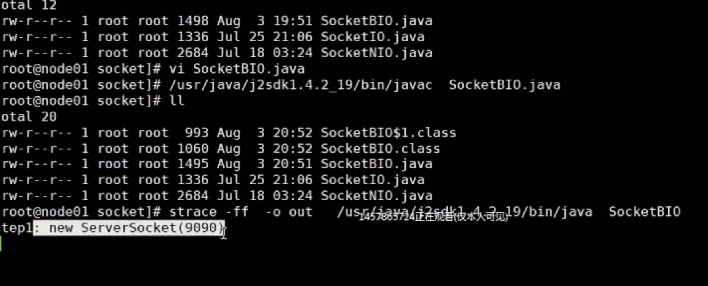
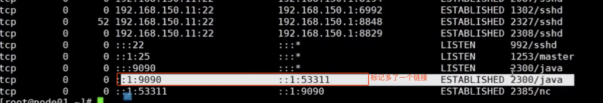
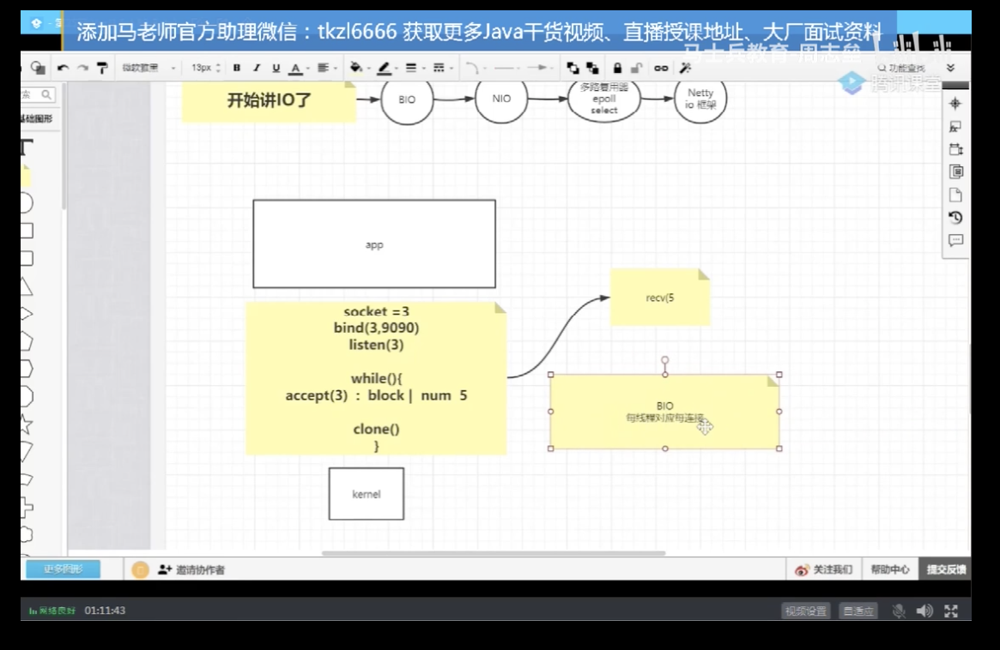
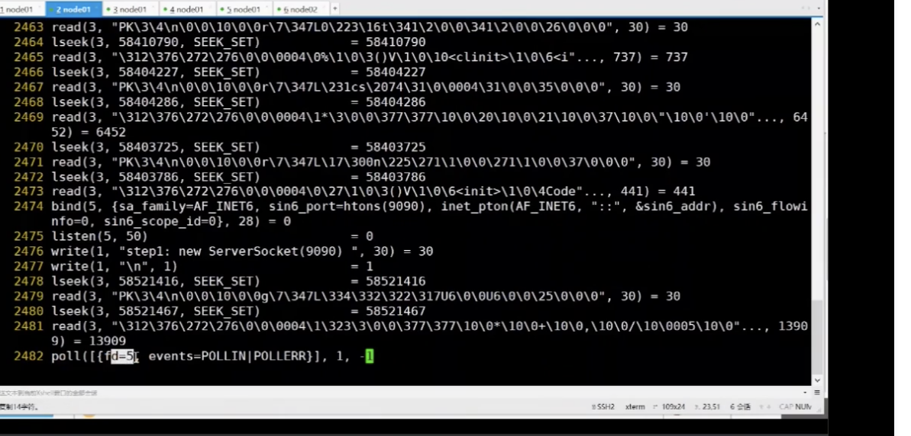

保护模式

内核向下管理硬件，向上给app提供系统调用

时钟中断  通过晶振器 

内核调用 用户态切换到 内核态

## IO

BIO

NIO

io多路复用epoll select

Netty io 框架

strace 查看应用程序的内核系统调用  -o  输出到 文件

Netstat  -natp 查看端口

nc  localhost:9090

java new Thread 调用的是 内核的clone 

单一线程不能处理 多个客户端并发连接问题

BIO  每线程对应每连接

man 2  socket 

jdk 1.8 

  

1,4  accept

  

NiO java  叫 newIo

 