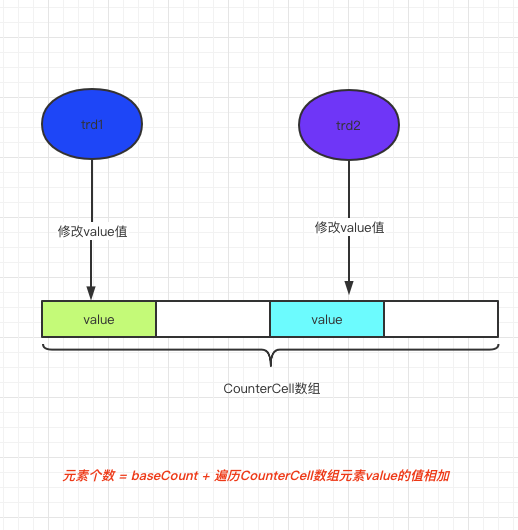

## JDK1.8 ConcurrentHashMap 源码分析

#### 构造方法

```java
    //无参构造函数
    public ConcurrentHashMap() {
    }

    //指定数组长度的构造方法
    public ConcurrentHashMap(int initialCapacity) {
        if (initialCapacity < 0)
            throw new IllegalArgumentException();
        // 和jdk1.8hashmap一样，找到大于入参的最大2的幂次方数    
        int cap = ((initialCapacity >= (MAXIMUM_CAPACITY >>> 1)) ?
                   MAXIMUM_CAPACITY :
                   tableSizeFor(initialCapacity + (initialCapacity >>> 1) + 1));
        //扩容阈值
        this.sizeCtl = cap;
    }

    //根据指定的map 创建一个新的并发类map
    public ConcurrentHashMap(Map<? extends K, ? extends V> m) {
        this.sizeCtl = DEFAULT_CAPACITY;
        putAll(m);
    }
```

   

### put 方法

```java

    final V putVal(K key, V value, boolean onlyIfAbsent) {
        // concurrentHashMap 的key和value 均不能为空
        if (key == null || value == null) throw new NullPointerException();
        //计算key的hashcode的值
        int hash = spread(key.hashCode());
        // 用来存储链表的长度
        int binCount = 0;
        //自旋操作
        for (Node<K,V>[] tab = table;;) {
            Node<K,V> f; int n, i, fh;
            //如果数组还没有初始化，就初始化table
            if (tab == null || (n = tab.length) == 0)
                tab = initTable();
            //数组对应的计算出的下标的位置元素为null,说明链表长度为0，直接放到数组的第一个元素即可
            else if ((f = tabAt(tab, i = (n - 1) & hash)) == null) {
               //了防止并发场景下，多个线程同时计算到第一个位置为null，保证只有一个线程更新成功
                if (casTabAt(tab, i, null,
                             new Node<K,V>(hash, key, value, null)))
                    break;                   // no lock when adding to empty bin
            }
            //如果节点的hash值为MOVED,说明数组正在扩容，则该线程帮助扩容
            else if ((fh = f.hash) == MOVED)
                tab = helpTransfer(tab, f);
            else {
                //如果以上条件都没有满足，说明放入的位置是一个链表，那么就遍历链表，放到链表的尾端
                V oldVal = null;
                // 对节点加锁，防止多线程同时往链表里添加元素
                synchronized (f) {
                    // 确定链表头没有被修改过
                    if (tabAt(tab, i) == f) {
                        if (fh >= 0) {
                            binCount = 1;
                            //遍历链表 binCount  记录链表的长度
                            for (Node<K,V> e = f;; ++binCount) {
                                K ek;
                                //如果hashi值相同且key值相同，则覆盖原值
                                if (e.hash == hash &&
                                    ((ek = e.key) == key ||
                                     (ek != null && key.equals(ek)))) {
                                    oldVal = e.val;
                                    if (!onlyIfAbsent)
                                        e.val = value;
                                    break;
                                }
                                Node<K,V> pred = e;
                                //如果没有找到key值相同的元素，就加到链表尾端
                                if ((e = e.next) == null) {
                                    pred.next = new Node<K,V>(hash, key,
                                                              value, null);
                                    break;
                                }
                            }
                        }
                       //如果已经树化结构，就加入到树
                        else if (f instanceof TreeBin) {
                            Node<K,V> p;
                            binCount = 2;
                            if ((p = ((TreeBin<K,V>)f).putTreeVal(hash, key,
                                                           value)) != null) {
                                oldVal = p.val;
                                if (!onlyIfAbsent)
                                    p.val = value;
                            }
                        }
                    }
                }
             
                if (binCount != 0) {
                    //计算链表的长度是否达到树化的阈值，如果达到，就树化
                    if (binCount >= TREEIFY_THRESHOLD)
                        treeifyBin(tab, i);
                   //返回旧的值，没有新增元素只是替换，所有总的元素数量不用增加
                    if (oldVal != null)
                        return oldVal;
                    break;
                }
            }
        }
        //因为增加了新的值，所以需要增加ConcurrentHashMap元素数量
        addCount(1L, binCount);
        return null;
    }
```


### 数组的初始化

```java

    /**
     * Initializes table, using the size recorded in sizeCtl.
     */
    private final Node<K,V>[] initTable() {
        Node<K,V>[] tab; int sc;
       //自旋操作
        while ((tab = table) == null || tab.length == 0) {
            //sc 小于0 说明已经有线程在初始化数组了，此时需要让出cpu，后续再次竞争
            if ((sc = sizeCtl) < 0)
                Thread.yield(); // lost initialization race; just spin
            // 先把sizeCtl值改为-1,标记正在初始化数组，cas 执行成功，则初始化数组，否则，自旋一次
            else if (U.compareAndSwapInt(this, SIZECTL, sc, -1)) {
                try {
                    if ((tab = table) == null || tab.length == 0) {
                        int n = (sc > 0) ? sc : DEFAULT_CAPACITY;
                        @SuppressWarnings("unchecked")
                        //创建指定长度的数组
                        Node<K,V>[] nt = (Node<K,V>[])new Node<?,?>[n];
                        table = tab = nt;
                        // 计算扩容阈值为数组长度的0.75倍
                        sc = n - (n >>> 2);
                    }
                } finally {
                    sizeCtl = sc;
                }
                break;
            }
        }
        return tab;
    }
```


### 增加ConcurrentHashMap 的元素数量

#### countCell

```java
   @sun.misc.Contended static final class CounterCell {
        volatile long value;
        CounterCell(long x) { value = x; }
    }
```

​      增加ConcurrentHashMap 首先会去修改baseCount的值，baseCount为ConcurrentHashMap的一个属性，如果修改成功就不做处理了，否则，就通过线程计算出线程对应的CounterCell[] 数组的下标，将数组该下标对用的元素的value 值增加1。



```java
  private final void addCount(long x, int check) {
        CounterCell[] as; long b, s;
        // 如果countcell 没有初始化，并发条件下，多个线程会同时修改basecount的值，但是只有一个线程修改成功，导致失败的线程需要创建countcell，countcell中分段保存了当前conrueentHashmap中的元素数量
        if ((as = counterCells) != null ||
            !U.compareAndSwapLong(this, BASECOUNT, b = baseCount, s = b + x)) {
            CounterCell a; long v; int m;
            boolean uncontended = true;
            //如果countcell数组还没有初始化，或者当前线程计算出的下标在countcell 对应的值为null，或者多个线程计算出的下标相同，那么cas只会有一个线程成功，那么就需要初始化或者增加countcell 元素。         
            if (as == null || (m = as.length - 1) < 0 ||
                (a = as[ThreadLocalRandom.getProbe() & m]) == null ||
                !(uncontended =
                  U.compareAndSwapLong(a, CELLVALUE, v = a.value, v + x))) {
                //初始化或者增加countcell中的元素。
                fullAddCount(x, uncontended);
                return;
            }
            if (check <= 1)
                return;
            //计算出ConcurrentHashmap中的元素的数量
            s = sumCount();
        }
        if (check >= 0) {
            Node<K,V>[] tab, nt; int n, sc; 
            //如果元素的数量大于扩容的阈值，此时需要进行数组的扩容
            while (s >= (long)(sc = sizeCtl) && (tab = table) != null &&
                   (n = tab.length) < MAXIMUM_CAPACITY) {
                int rs = resizeStamp(n);
                if (sc < 0) {
                    if ((sc >>> RESIZE_STAMP_SHIFT) != rs || sc == rs + 1 ||
                        sc == rs + MAX_RESIZERS || (nt = nextTable) == null ||
                        transferIndex <= 0)
                        break;
                    if (U.compareAndSwapInt(this, SIZECTL, sc, sc + 1))
                        transfer(tab, nt);
                }
                //如果CAS成功将，sizeCtl 初始化为rs << RESIZE_STAMP_SHIFT) + 2，并开始进行元素转移和扩容操作
                else if (U.compareAndSwapInt(this, SIZECTL, sc,
                                             (rs << RESIZE_STAMP_SHIFT) + 2))
                    //开始扩容
                    transfer(tab, null);
                s = sumCount();
            }
        }
    }
```


### 扩容

```java
 private final void transfer(Node<K,V>[] tab, Node<K,V>[] nextTab) {
        // n等于老的数组的长度 
        int n = tab.length, stride;
        // 根据cpu 核心数量计算单个儿线程扩容的步长，最小步长为16
        if ((stride = (NCPU > 1) ? (n >>> 3) / NCPU : n) < MIN_TRANSFER_STRIDE)
            stride = MIN_TRANSFER_STRIDE; // subdivide range
        if (nextTab == null) {            // initiating
            try {
                @SuppressWarnings("unchecked")
                //初始化一个老数组长度2倍的新的node数组
                Node<K,V>[] nt = (Node<K,V>[])new Node<?,?>[n << 1];
                nextTab = nt;
            } catch (Throwable ex) {      // try to cope with OOME
                sizeCtl = Integer.MAX_VALUE;
                return;
            }
            nextTable = nextTab;
            //transferIndex 初始化为 老的数组长度，比如默认 16
            transferIndex = n;
        }
        //新的数组长度，加入老的为16，那么新的为32
        int nextn = nextTab.length;、
        // 标识正在转移的节点，hash值为MOVED，其他线程在代用put方法时候，如果计算结果节点hash值为moved，线程会帮助扩容
        ForwardingNode<K,V> fwd = new ForwardingNode<K,V>(nextTab);
        //标识单个线程是否需要继续往前找，需要转移的节点
        boolean advance = true;
        //标识整个ConCurrentHashMap 节点转移是否已经结束
        boolean finishing = false; // to ensure sweep before committing nextTab
        for (int i = 0, bound = 0;;) {
            Node<K,V> f; int fh;
            while (advance) {
                int nextIndex, nextBound;
                if (--i >= bound || finishing)
                    advance = false;
                // 修改nextIndex 的值为 transferIndex
                else if ((nextIndex = transferIndex) <= 0) {
                    i = -1;
                    advance = false;
                }
               //计算单个线程要转移节点的起始位置和结束为止，并修改transferIndex的值，假设步长为2，老的数组长度为4，那么transferIndex的值为4，线程1初始化新的数组后，第一次循环，修改transferIndex值为2，bound的值为2，i值为3，那么线程1转移的元素就为2，3两个节点，线程2 因为transferIndex的值已经发生了变化，变为2，那么，线程二计算出的bound 值为0，i值为1。也就是说 线程1转移2，3两个节点，线程二转移0，1两个节点。在线程1迁移完设定的节点后，会重新计算bound和i，协助迁移其他节点
                else if (U.compareAndSwapInt
                         (this, TRANSFERINDEX, nextIndex,
                          nextBound = (nextIndex > stride ?
                                       nextIndex - stride : 0))) {
                    bound = nextBound;
                    i = nextIndex - 1;
                    advance = false;
                }
            }
            //数组中所有的节点都已经迁移或者正在被其他线程迁移，当前线程已经无事可做
            if (i < 0 || i >= n || i + n >= nextn) {
                int sc;
                if (finishing) {
                    nextTable = null;
                    table = nextTab;
                    sizeCtl = (n << 1) - (n >>> 1);
                    return;
                }
                //修改sizeCtl的值减一，标识扩容线程数量减一
                if (U.compareAndSwapInt(this, SIZECTL, sc = sizeCtl, sc - 1)) {
                    //和sizeCtl的初始值比较，如果相等，说明所有的线程都已经迁移完成，整个数组和链表的元素都已经转移完成，那么就重新校验一次后返回，否则表示当前线程已经迁移完成，单后还有线程在继续迁移，当前线程返回。
                    if ((sc - 2) != resizeStamp(n) << RESIZE_STAMP_SHIFT)
                        return;
                    finishing = advance = true;
                    i = n; // recheck before commit
                }
            }
            //如果要转移的节点为null，修改该节点的值为fwd，表示迁移完成，防止其他线程再次迁移改节点
            else if ((f = tabAt(tab, i)) == null)
                advance = casTabAt(tab, i, null, fwd);
            //如果当前要迁移的节点已经迁移完成，那么就寻找下一个要迁移的节点
            else if ((fh = f.hash) == MOVED)
                advance = true; // already processed
            else {
                //对要迁移的节点加锁，防止在迁移过程中该节点处有put操作
                synchronized (f) {
                    if (tabAt(tab, i) == f) {
                        Node<K,V> ln, hn;
                        if (fh >= 0) {
                            int runBit = fh & n;
                            Node<K,V> lastRun = f;
                            for (Node<K,V> p = f.next; p != null; p = p.next) {
                                int b = p.hash & n;
                                if (b != runBit) {
                                    runBit = b;
                                    lastRun = p;
                                }
                            }
                            if (runBit == 0) {
                                ln = lastRun;
                                hn = null;
                            }
                            else {
                                hn = lastRun;
                                ln = null;
                            }
                            for (Node<K,V> p = f; p != lastRun; p = p.next) {
                                int ph = p.hash; K pk = p.key; V pv = p.val;
                                if ((ph & n) == 0)
                                    ln = new Node<K,V>(ph, pk, pv, ln);
                                else
                                    hn = new Node<K,V>(ph, pk, pv, hn);
                            }
                           //将链表放到新的数组元素上
                            setTabAt(nextTab, i, ln);
                            setTabAt(nextTab, i + n, hn);
                            //修改老的table元素节点的hash值为fwd，标识改节点已经迁移完成
                            setTabAt(tab, i, fwd);
                           //寻找下一个待迁移的节点
                            advance = true;
                        }
                        //如果节点是树形结构，则遍历树节点
                        else if (f instanceof TreeBin) {
                            TreeBin<K,V> t = (TreeBin<K,V>)f;
                            TreeNode<K,V> lo = null, loTail = null;
                            TreeNode<K,V> hi = null, hiTail = null;
                            int lc = 0, hc = 0;
                            for (Node<K,V> e = t.first; e != null; e = e.next) {
                                int h = e.hash;
                                TreeNode<K,V> p = new TreeNode<K,V>
                                    (h, e.key, e.val, null, null);
                                if ((h & n) == 0) {
                                    if ((p.prev = loTail) == null)
                                        lo = p;
                                    else
                                        loTail.next = p;
                                    loTail = p;
                                    ++lc;
                                }
                                else {
                                    if ((p.prev = hiTail) == null)
                                        hi = p;
                                    else
                                        hiTail.next = p;
                                    hiTail = p;
                                    ++hc;
                                }
                            }
                            ln = (lc <= UNTREEIFY_THRESHOLD) ? untreeify(lo) :
                                (hc != 0) ? new TreeBin<K,V>(lo) : t;
                            hn = (hc <= UNTREEIFY_THRESHOLD) ? untreeify(hi) :
                                (lc != 0) ? new TreeBin<K,V>(hi) : t;
                            setTabAt(nextTab, i, ln);
                            setTabAt(nextTab, i + n, hn);
                            setTabAt(tab, i, fwd);
                            advance = true;
                        }
                    }
                }
            }
        }
    }
```


### ConcurrentHashMap 元素数量的计算过程

```java
  // See LongAdder version for explanation
    private final void fullAddCount(long x, boolean wasUncontended) {
        int h;
        if ((h = ThreadLocalRandom.getProbe()) == 0) {
            ThreadLocalRandom.localInit();      // force initialization
            h = ThreadLocalRandom.getProbe();
            wasUncontended = true;
        }
        boolean collide = false;                // True if last slot nonempty
        for (;;) {
            CounterCell[] as; CounterCell a; int n; long v;
            //如果counterCells 已经初始化过了
            if ((as = counterCells) != null && (n = as.length) > 0) {
                //计算要放入的index位置的元素是否为null，如果为null构造一个value为1 的CounterCell，并设置cellBusy为1，放到CounterCells计算出的下边位置
                if ((a = as[(n - 1) & h]) == null) {
                    if (cellsBusy == 0) {            // Try to attach new Cell
                        CounterCell r = new CounterCell(x); // Optimistic create
                        if (cellsBusy == 0 &&
                            U.compareAndSwapInt(this, CELLSBUSY, 0, 1)) {
                            boolean created = false;
                            try {               // Recheck under lock
                                CounterCell[] rs; int m, j;
                                if ((rs = counterCells) != null &&
                                    (m = rs.length) > 0 &&
                                    rs[j = (m - 1) & h] == null) {
                                    rs[j] = r;
                                    created = true;
                                }
                            } finally {
                                cellsBusy = 0;
                            }
                            if (created)
                                break;
                            continue;           // Slot is now non-empty
                        }
                    }
                    collide = false;
                }
                else if (!wasUncontended)       // CAS already known to fail
                    wasUncontended = true;      // Continue after rehash
                //如果计算出的下标位置的元素不为null，则尝试通过CAS,将下标位置的元素的value值上X
                else if (U.compareAndSwapLong(a, CELLVALUE, v = a.value, v + x))
                    break;
                else if (counterCells != as || n >= NCPU)
                    collide = false;            // At max size or stale
                else if (!collide)
                    collide = true;
                //如果counterCells 已经初始化，但是以上条件都没有满足，此时就粗腰对countcells 扩容
                else if (cellsBusy == 0 &&
                         U.compareAndSwapInt(this, CELLSBUSY, 0, 1)) {
                    try {
                        if (counterCells == as) {// Expand table unless stale
                            //库容为原来长度的2倍
                            CounterCell[] rs = new CounterCell[n << 1];
                            //原来数组的元素迁移到扩容后的数组里
                            for (int i = 0; i < n; ++i)
                                rs[i] = as[i];
                            counterCells = rs;
                        }
                    } finally {
                        cellsBusy = 0;
                    }
                    collide = false;
                    continue;                   // Retry with expanded table
                }
                h = ThreadLocalRandom.advanceProbe(h);
            }
            // 如果counterCells 还没有初始化，则初始化一个长度为2的counterCells
            // cellsBusy 标识counterCells 是否已经被其他线程占用
            //如果没有被其他线程占用，通过cas设置值为1，标识占用了countercells
            else if (cellsBusy == 0 && counterCells == as &&
                     U.compareAndSwapInt(this, CELLSBUSY, 0, 1)) {
                boolean init = false;
                try {                           // Initialize table
                    if (counterCells == as) {
                        //首次进入，初始化长度二2的数组
                        CounterCell[] rs = new CounterCell[2];
                        // 初始话一个CounterCell,并设置值为1，并通过线程hash和数组长度减一计算出，值需要放置在哪个index下，并赋值到数组中
                        rs[h & 1] = new CounterCell(x);
                        counterCells = rs;
                        init = true;
                    }
                } finally {
                   //初始化完成后，设置cellsBusy为0，标识线程不在占用countercells
                    cellsBusy = 0;
                }
                if (init)
                    break;
            }
            else if (U.compareAndSwapLong(this, BASECOUNT, v = baseCount, v + x))
                break;                          // Fall back on using base
        }
    }

```


### ConcurrentHashMap get 操作

```java
public V get(Object key) {
        Node<K,V>[] tab; Node<K,V> e, p; int n, eh; K ek;
        //根据key值计算hashcode的值
        int h = spread(key.hashCode());
        //根据hash值计算下标
        if ((tab = table) != null && (n = tab.length) > 0 &&
            (e = tabAt(tab, (n - 1) & h)) != null) {
            //判断链表头结点是否和key值相同，如果相同则不用后续遍历，直接返回即可
            if ((eh = e.hash) == h) {
                if ((ek = e.key) == key || (ek != null && key.equals(ek)))
                    return e.val;
            }
            //eh 是节点的hash值，如果小于0，如果为-1 说明数组正在进行扩容，节点为 ForwardingNode，调用ForwardingNode的find 操作
            //如果是 -2 ，说明节点已经树化，调用TreeBin 的find
            else if (eh < 0)
                return (p = e.find(h, key)) != null ? p.val : null;
            //遍历链表元素，查看是否和key值相同
            while ((e = e.next) != null) {
                if (e.hash == h &&
                    ((ek = e.key) == key || (ek != null && key.equals(ek))))
                    return e.val;
            }
        }
        return null;
    }

// ForwardingNode 的find 操作
static final class ForwardingNode<K,V> extends Node<K,V> {
        final Node<K,V>[] nextTable;
        ForwardingNode(Node<K,V>[] tab) {
            super(MOVED, null, null, null);
            this.nextTable = tab;
        }
        Node<K,V> find(int h, Object k) {
            // 把 tab指向库容后的table
            outer: for (Node<K,V>[] tab = nextTable;;) {
                Node<K,V> e; int n;
                //判断首节点是否相同
                if (k == null || tab == null || (n = tab.length) == 0 ||
                    (e = tabAt(tab, (n - 1) & h)) == null)
                    return null;
                for (;;) {
                    int eh; K ek;
                    if ((eh = e.hash) == h &&
                        ((ek = e.key) == k || (ek != null && k.equals(ek))))
                        return e;
                    if (eh < 0) {
                        // 如果节点让是是ForwardingNode，则修改table的值后继续循环
                        if (e instanceof ForwardingNode) {
                            tab = ((ForwardingNode<K,V>)e).nextTable;
                            continue outer;
                        }
                        else
                            return e.find(h, k);
                    }
                    if ((e = e.next) == null)
                        return null;
                }
            }
        }
    }
```

