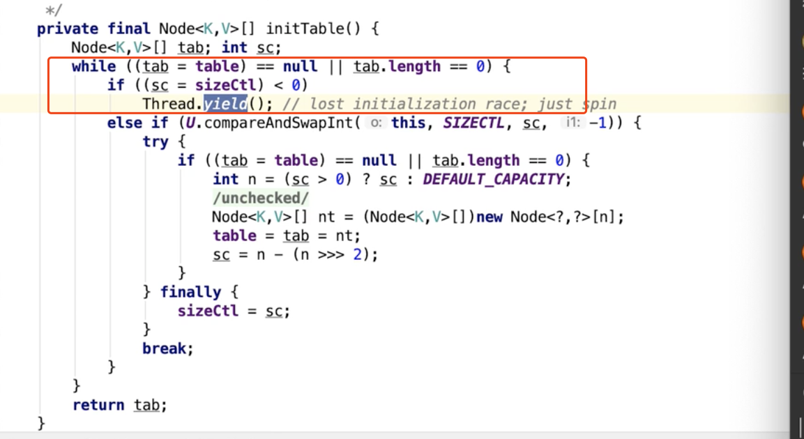
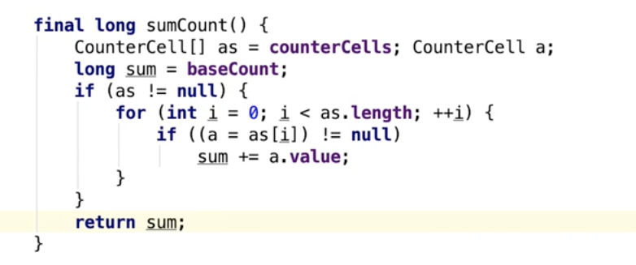
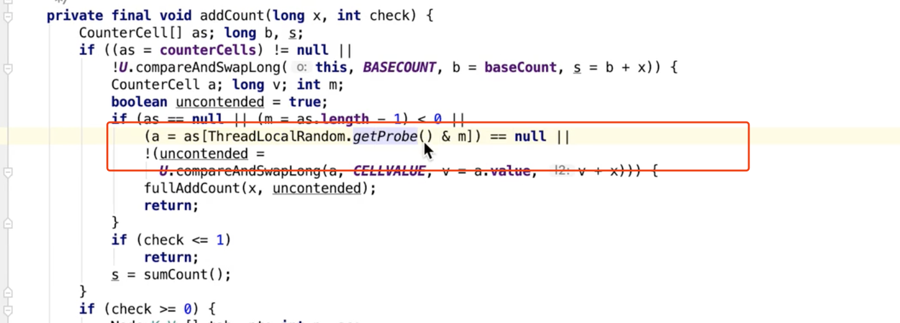
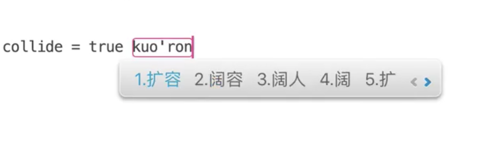

jdk1.8

put 时候 ，会对链表里的第一个节点进行加锁

并发情况下 红黑树 根节点会变化 所以用treebin

treeBin 就是红黑树

sizeCtl  默认= 0

sizeCtl = -1  表示正在初始化

sizeCtl ==  初始化完成后 ，扩容阈值

放弃cpu执行，然后和其他线程竞争执行

有可能导致cpu 100

baseCount  和 cellCount

****

每个线程生成一个随机数

改不了一个 改另一个

两次循环 hash值对应的位置都不是空的，才扩容

basecount+ countCells

remove  addcount -1 -1

LongAddr

finish = true 代表当前线程 任务做完了，并且没有其他事情可以做了

 advance  代表当前线程需不需要继续往前找 

节点链表转移的时候是不能put的

 

yuque.com/renyong-jmovm/ufz238/doh8wb