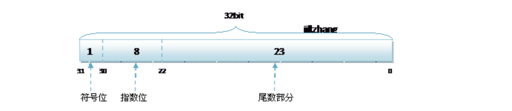
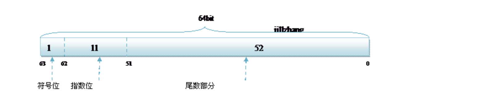
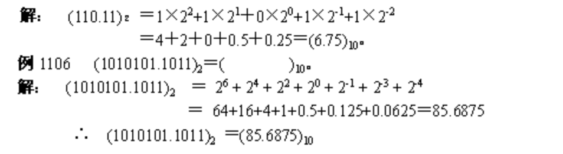
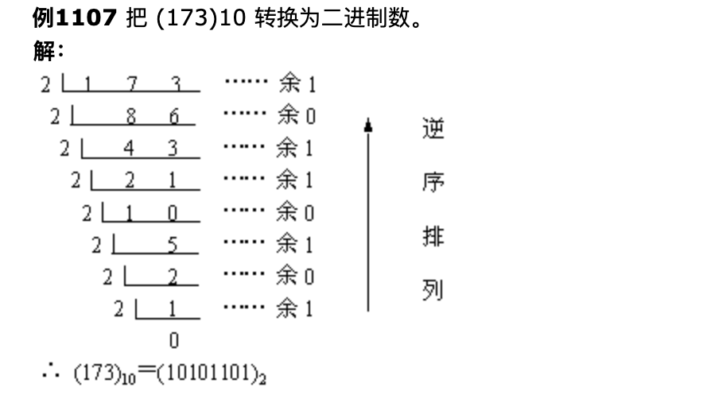
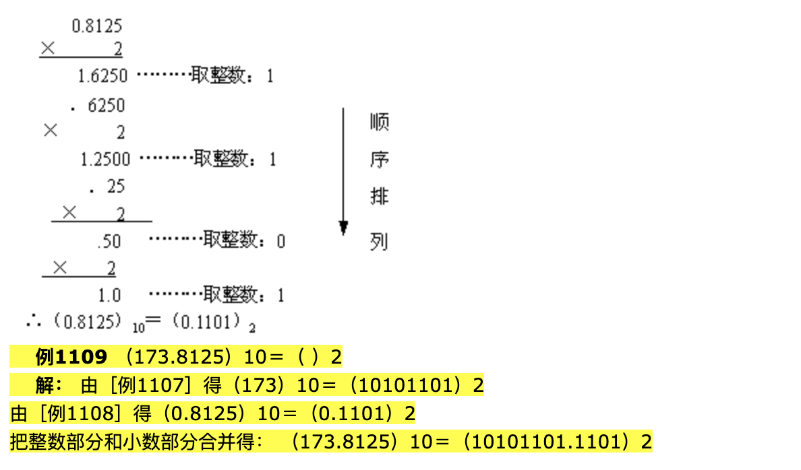

### float和double 二进制表示

#### 说明：

> 在java语言中，对于单精度和双精度的数据分别用float和double表示，其中float在java语言中占用4个字节32bye，double在java语言中占用8个字节。64位。我们知道计算机是只认识0，1数据的。float和double分分别用二进制怎么表示呢。

#### float和double二级制表示

1. float型占用32位，对应的存储方式如下：

   

2. double型占用64位，对应存储方式如下：

   

----

### 二进制数转化为十进制数

> 由二进制数转换成十进制数的基本做法是，把二进制数首先写成加权系数展开式，然后按十进制加法规则求和。这种做法称为"按权相加"法。

### 十进制小数转化为二进制小数

> 十进制数转换为二进制数时，由于整数和小数的转换方法不同，所以先将十进制数的整数部分和小数部分分别转换后，再加以合并。

1. **十进制整数转换为二进制整**

   >  十进制整数转换为二进制整数采用"除2取余，逆序排列"法。具体做法是：用2去除十进制整数，可以得到一个商和余数；再用2去除商，又会得到一个商和余数，如此进行，直到商为零时为止，然后把先得到的余数作为二进制数的低位有效位，后得到的余数作为二进制数的高位有效位，依次排列起来。

   

2. 十进制小数转化为二进制小数

>     十进制小数转换成二进制小数采用"乘2取整，顺序排列"法。具体做法是：用2乘十进制小数，可以得到积，将积的整数部分取出，再用2乘余下的小数 部分，又得到一个积，再将积的整数部分取出，如此进行，直到积中的小数部分为零，或者达到所要求的精度为止。 
>     然后把取出的整数部分按顺序排列起来，先取的整数作为二进制小数的高位有效位，后取的整数作为低位有效位。

### 二进制小数表示成二进制

> R32.24和R64.53的存储方式都是用科学计数法来存储数据的，比如8.25用十进制的科学计数法表示就为:8.25  * 10，而120.5用科学技术发表示就是1.205 * 10的平方。从上变得算法可以得到8.25用二进制小数表示为1000.01。用二进制的科学计数法表示为1.00001*2的三次方。120.5用二进制小数表示为111000.1，用二级制的科学计数法表示为1.110001 * 2的五次方。任何一个数用科学计数法表示都为1.xxx*。尾数部分就可以表示为xxxx,第一位都是1，干嘛还要表示呀？可以将小数点前面的1省略，所以23bit的尾数部分，可以表示的精度却变成了24bit，道理就是在这里，那24bit能精确到小数点后几位呢，我们知道9的二进制表示为1001，所以4bit能精确十进制中的1位小数点，24bit就能使float能精确到小数点后6位，而对于指数部分，因为指数可正可负，8位的指数位能表示的指数范围就应该为:-127-128了，所以指数部分的存储采用移位存储，存储的数据为元数据+127，下面就看看8.25和120.5在内存中真正的存储方式。

从上图可以看出

​     8.25用二进制单精度表示就为100000100001000000000000000000。有的数据无法完整转化为二进制数据，所以在double或者float进行运算时候，会出现精度丢失问题。