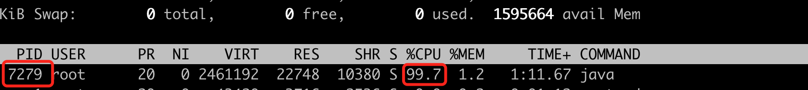
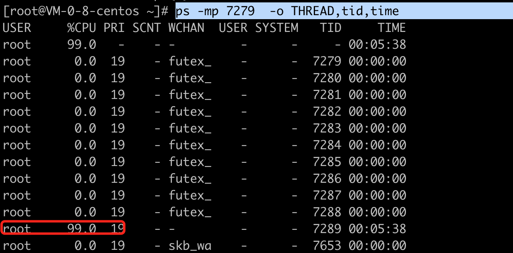
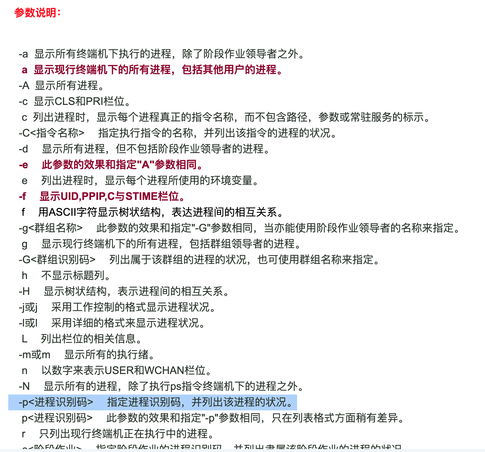
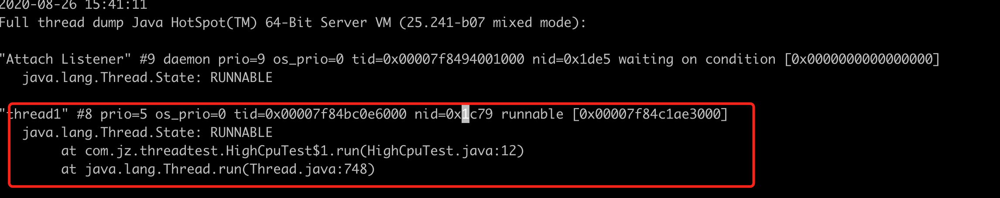

##  查询那个线程占用的cpu过高

示例代码：

    ```java
package com.jz.threadtest;

public class HighCpuTest {

    public static void main(String[] args) {

        Thread trd = new Thread(new Runnable() {
            @Override
            public void run() {
                while(true){
                    int a = 1+1000;
                }
            }
        },"thread1");

        trd.start();

        try {
            trd.join();
        } catch (InterruptedException e) {
            e.printStackTrace();
        }
    }

}

    ```


部署在linux服务器上后：

  ```
java -cp Test-1.0-SNAPSHOT.jar com.jz.threadtest.HighCpuTest
  ```

 

通过top命令查询占用cpu过高的进程的pid




通过jstack命令保存改pid对应的堆栈信息

```
jstack 7279 > 2.txt
```

 

通过ps命令查询进程内部的线程状态：

```
ps -mp 7279  -o THREAD,tid,time
```






将 7289 转化为16进制   1c79


在2.txt 中查找



定位到线程名和方法