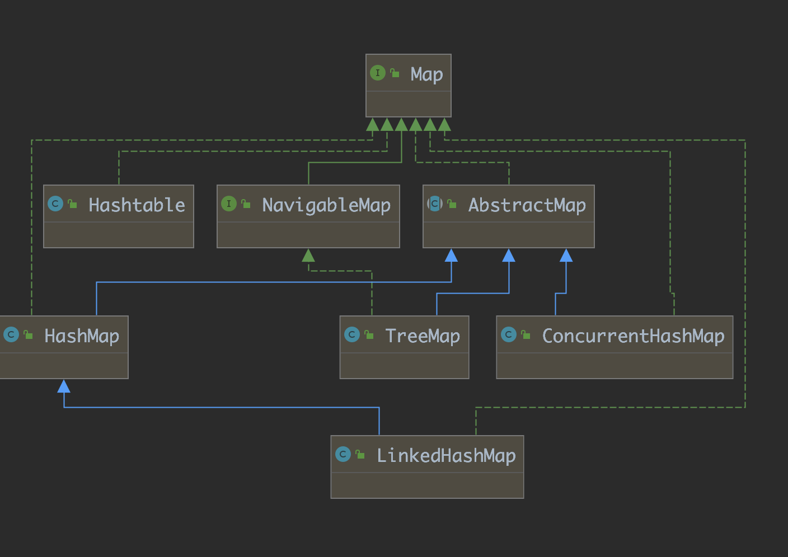
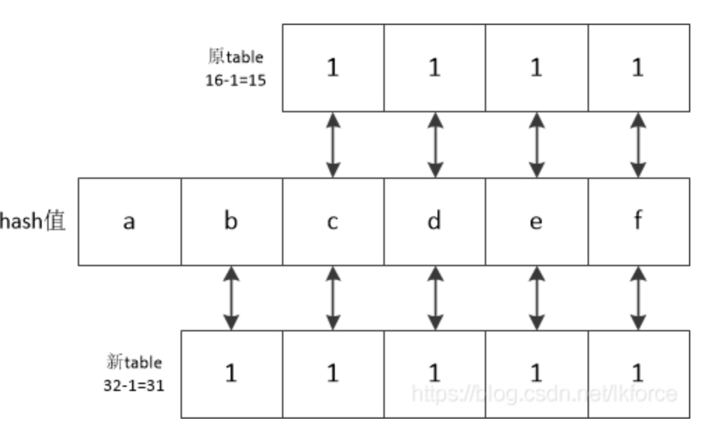
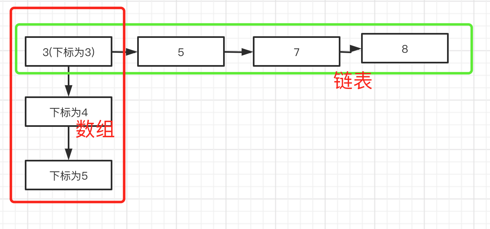
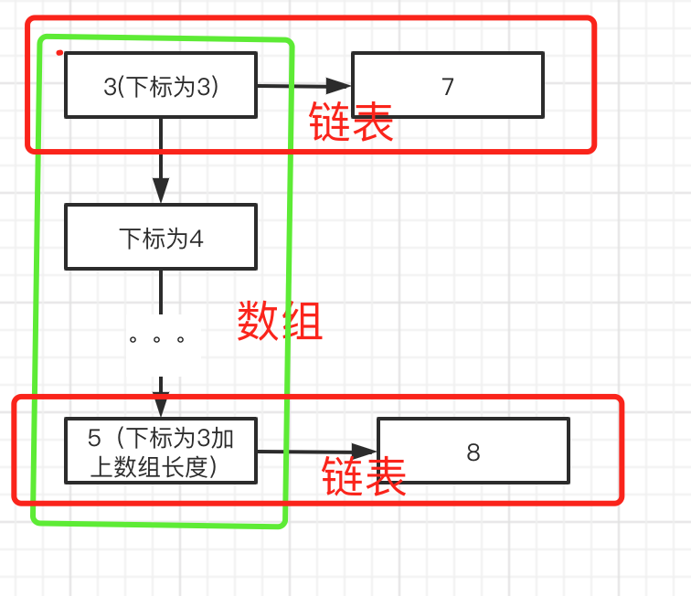

# java HashMap 相关

###  1. Map 继承关系图




### 2. 各个Map实现类的作用和区别

1. HashMap:  最常用的Map类型，非线程安全，内部基于数组和链表实现，java8 中链表达到一定长度后，会变更为红黑树。
2. TreeMap:  有序map，key的值默认按照key的自然顺序排序。
3. LinkedHashMap:  继承与HashMap，通过维护一个双向链表，保证了元素的迭代顺序。 该迭代顺序可以是插入顺序或者访问殊勋。
4. ConCurrentHashMap:  在java 的并发包下，基于分段锁实现多线程操作的线程安全。
5. HashTable： 线程安全的Map，但是因为所有线程同时竞争一把锁，导致多线程环境下效率低下。

#### 3. HashMap 源码分析

 HashMap中几个静态变量的作用

```java
/**
     * The default initial capacity - MUST be a power of two.
     */
    static final int DEFAULT_INITIAL_CAPACITY = 1 << 4; // aka 16

    /**
     * The maximum capacity, used if a higher value is implicitly specified
     * by either of the constructors with arguments.
     * MUST be a power of two <= 1<<30.
     */
    static final int MAXIMUM_CAPACITY = 1 << 30;

    /**
     * The load factor used when none specified in constructor.
     */
    static final float DEFAULT_LOAD_FACTOR = 0.75f;

    /**
     * The bin count threshold for using a tree rather than list for a
     * bin.  Bins are converted to trees when adding an element to a
     * bin with at least this many nodes. The value must be greater
     * than 2 and should be at least 8 to mesh with assumptions in
     * tree removal about conversion back to plain bins upon
     * shrinkage.
     */
    static final int TREEIFY_THRESHOLD = 8;

/**
     * The bin count threshold for untreeifying a (split) bin during a
     * resize operation. Should be less than TREEIFY_THRESHOLD, and at
     * most 6 to mesh with shrinkage detection under removal.
     */
    static final int UNTREEIFY_THRESHOLD = 6;

    /**
     * The smallest table capacity for which bins may be treeified.
     * (Otherwise the table is resized if too many nodes in a bin.)
     * Should be at least 4 * TREEIFY_THRESHOLD to avoid conflicts
     * between resizing and treeification thresholds.
     */
    static final int MIN_TREEIFY_CAPACITY = 64;


```

DEFAULT_INITIAL_CAPACITY : 默认的HashMap的容量，默认为16，必须为2的N次方，可通过public HashMap(int initialCapacity)  指定长度。

MAXIMUM_CAPACITY： HashMap的最大容量，必须为2的N次方。

DEFAULT_LOAD_FACTOR:  默认的加载因子。作用是当HashMap的size大于 HashMap的容量乘以加载因子时，会触发HashMap的扩容。比如容量为16，加载因子为0.75，当调用put方法，判断hashMap的长度大于 HashMap的容量乘以加载因子时候，触发HashMap扩容。

TREEIFY_THRESHOLD： jdk8 以后，HashMap 是由数组Node<K,V>[] tab 和 链表组成的，当key的hash值相同时，会将值放在链表后边。当链表的长度大于 TREEIFY_THRESHOLD 后，会将链表转化为红黑树存储。

UNTREEIFY_THRESHOLD:  在HashMap 扩容后，如果红黑树的节点的数量少于  UNTREEIFY_THRESHOLD，会转化为链表。

MIN_TREEIFY_CAPACITY： 在HashMap的容量大于改值的时候切 链表的长度大约TREEIFY_THRESHOLD 才会转化为红黑树。

 

#### 3.1 HashMap put 操作

初始化一个HashMap，初始容量为16，加载因子为0.75 （HashMap长度达到12时候，会触发HashMap扩容）

```java
  public HashMap() {
        this.loadFactor = DEFAULT_LOAD_FACTOR; // all other fields defaulted
    }
```

调用put方法增加元素：

```java
  public V put(K key, V value) {
        return putVal(hash(key), key, value, false, true);
    }
```

最终的put方法:

```java
final V putVal(int hash, K key, V value, boolean onlyIfAbsent, boolean evict) {
        Node<K,V>[] tab; 
        Node<K,V> p; 
        int n, i;
        //如果当前的数组为null，或者数组的长度为0，触发扩容操作，返回扩容后数组的长度
        if ((tab = table) == null || (n = tab.length) == 0)
            n = (tab = resize()).length;
        //  (n - 1) & hash  计算key的hash值应该存在数组的哪个下标下
        // tab[i = (n - 1) & hash] 取出下标下的值，判断是否为null
        // 如果为null，说明不存在hash冲突，数组在该下标还不存在数据，则直接新建一个node，并赋值给数组元素。
        if ((p = tab[i = (n - 1) & hash]) == null)
            tab[i] = newNode(hash, key, value, null);
        //存在Hash冲突，需要将数据存放在链表里。通过next指针指向该value对应的node   
        else {
            Node<K,V> e; K k;
            //如果hash结果相同并且equal相同，则说明已经找到了key相同的元素，后续会将value值覆盖
            if (p.hash == hash &&    
                ((k = p.key) == key || (key != null && key.equals(k))))
                e = p;
            // 如果已经是红黑树结构，则将元素放到红黑树里    
            else if (p instanceof TreeNode)
                e = ((TreeNode<K,V>)p).putTreeVal(this, tab, hash, key, value);
            else {
                 //遍历链表
                for (int binCount = 0; ; ++binCount) {
                    //节点的next为空，说明已经到了链表的最后一个元素，则新建一个节点，并将next指向该节点 （链表的add操作）
                    if ((e = p.next) == null) {
                        p.next = newNode(hash, key, value, null);
                        // 如果链表的长度大于 TREEIFY_THRESHOLD，需要将链表转化为红黑树结构
                        if (binCount >= TREEIFY_THRESHOLD - 1) // -1 for 1st
                            treeifyBin(tab, hash);
                        break;
                    }
                    //如果找到key值相同的接口，则后续进行value覆盖操作。
                    if (e.hash == hash &&
                        ((k = e.key) == key || (key != null && key.equals(k))))
                        break;
                    p = e;
                }
            }
            // hashmap中已经存在相同的key值，则将value 覆盖。
            if (e != null) { // existing mapping for key
                V oldValue = e.value;
                if (!onlyIfAbsent || oldValue == null)
                    e.value = value;
                afterNodeAccess(e);
                return oldValue;
            }
        }

        ++modCount;
        //如果size大于设置的扩容的阈值，触发HashMap的扩容操作。
        if (++size > threshold)
            resize();
        afterNodeInsertion(evict);
        return null;
    }
```


#### 3.2 HashMap 的 扩容操作

```java
  final Node<K,V>[] resize() {
        //扩容前的数组
        Node<K,V>[] oldTab = table;
        // 原始数组的长度
        int oldCap = (oldTab == null) ? 0 : oldTab.length;
        // 老的扩容的阈值
        int oldThr = threshold;
        // 新的数组长度，新的扩容阈值
        int newCap, newThr = 0;
        // 老的数组有值
        if (oldCap > 0) {
             //大于最大长度，不在扩容，并将扩容阈值设置为最大值，返回老的数组
            if (oldCap >= MAXIMUM_CAPACITY) {
                threshold = Integer.MAX_VALUE;
                return oldTab;
            }
            // 否则 数据长度扩展为旧的2倍，扩容阈值也扩展旧的2倍
            else if ((newCap = oldCap << 1) < MAXIMUM_CAPACITY &&
                     oldCap >= DEFAULT_INITIAL_CAPACITY)
                newThr = oldThr << 1; // double threshold
        }
        // 老的数组长度为0，但是扩容阈值大于0，新的数据长度等于老的扩容阈值
        else if (oldThr > 0) // initial capacity was placed in threshold
            newCap = oldThr;
        else { 
        // 老的数组长度为0，切扩容阈值也为0，则使用默认值             
            newCap = DEFAULT_INITIAL_CAPACITY;
            // 扩容阈值等于 默认数组容量乘以加载因子  16*0.75
            newThr = (int)(DEFAULT_LOAD_FACTOR * DEFAULT_INITIAL_CAPACITY);
        }
        if (newThr == 0) {
            float ft = (float)newCap * loadFactor;
            newThr = (newCap < MAXIMUM_CAPACITY && ft < (float)MAXIMUM_CAPACITY ?
                      (int)ft : Integer.MAX_VALUE);
        }
        //设置扩容阈值为计算后新的阈值
        threshold = newThr;
        @SuppressWarnings({"rawtypes","unchecked"})
        // 初始化新的数组
        Node<K,V>[] newTab = (Node<K,V>[])new Node[newCap];
        // 修改table指向新的数组
        table = newTab;
        if (oldTab != null) {
            // 将老的数组数据 复制到新的数组里边 
            for (int j = 0; j < oldCap; ++j) {
                Node<K,V> e;
                // 值不为null，重新计算改数据在新数组的下标，并赋值
                if ((e = oldTab[j]) != null) {
                    oldTab[j] = null;
                    //链表长度为1，直接赋值
                    if (e.next == null)
                        newTab[e.hash & (newCap - 1)] = e;
                     // 如果是红黑树结构 
                    else if (e instanceof TreeNode)
                        ((TreeNode<K,V>)e).split(this, newTab, j, oldCap);
                    else { // preserve order
                        // 链表中的数据重新计算在新数组中的位置，见下边详解
                        Node<K,V> loHead = null, loTail = null;
                        Node<K,V> hiHead = null, hiTail = null;
                        Node<K,V> next;
                        do {
                            next = e.next;
                            if ((e.hash & oldCap) == 0) {
                                if (loTail == null)
                                    loHead = e;
                                else
                                    loTail.next = e;
                                loTail = e;
                            }
                            else {
                                if (hiTail == null)
                                    hiHead = e;
                                else
                                    hiTail.next = e;
                                hiTail = e;
                            }
                        } while ((e = next) != null);
                        if (loTail != null) {
                            loTail.next = null;
                            newTab[j] = loHead;
                        }
                        if (hiTail != null) {
                            hiTail.next = null;
                            newTab[j + oldCap] = hiHead;
                        }
                    }
                }
            }
        }
        return newTab;
    }

```

 

​      正常情况下，计算节点在table中的下标的方法是：hash&(oldTable.length-1)，扩容之后，table长度翻倍，计算table下标的方法是hash&(newTable.length-1)，也就是hash&(oldTable.length*2-1)，于是我们有了这样的结论：**这新旧两次计算下标的结果，要不然就相同，要不然就是新下标等于旧下标加上旧数组的长度**。

> 比如



​    hash值的每个二进制位用abcde来表示，那么，hash和新旧table按位与的结果，最后4位显然是相同的，唯一可能出现的区别就在第5位，也就是hash值的b所在的那一位，如果b所在的那一位是0，那么新table按位与的结果和旧table的结果就相同，反之如果b所在的那一位是1，则新table按位与的结果就比旧table的结果多了10000（二进制），而这个二进制10000就是旧table的长度16。

​    

比如链表数据为 3-->5-->7-->8。假如，3 和 7 满足 (e.hash & oldCap) == 0。5 和8 不满足，那么计算流程为:

1.  初始 e指向3，e.next 指向5。

2. 3 满足 (e.hash & oldCap) == 0，loHead 指向3，loTail 指向 3。（第一次循环）

3. 第二次循环，e 指向 5，e.next 指向7，此时e 不满足 (e.hash & oldCap) == 0，hiHead 指向 5，hiTail 指向5。

4. 第三次循环，e 指向7，e.next 指向 8，此时e 满足(e.hash & oldCap) == 0，且loTail != null, loTail此时指向3，loTail.next = e 后 变为 3-->7,loTail指向7。

5. 第四次循环，e指向8，e.next为null，此时e 不满足 (e.hash & oldCap) == 0，且 hiTail ！=null,hiTail 指向5，hiTail.next = e;后 边为

   5->8,hiTail 指向8.

6. loTail != null, newTable[num] = loHead 指向3，链表为3-->7;

7. hiTail != null, newTable[num + 数组长度] = hihead,指向5， 链表为5-->8;

经过计算后，老的hashmap数据变为：

老的



新的：




hashmap在扩容后，对应的各个node 需要重新计算位置。


### 4. LinkedHashMap

LinkedHashMap 继承自HashMap, 可以保证遍历顺序和插入顺序一致，内部维护了一个双向链表来保证插入的有序性。

LinkedHashMap 内部为 Entry 数组，Entry 继承自HashMap的Node 类，维护了一个头指针和未指针。重写了HashMap的newNode方法，当插入元素时候，维护节点的前项指针和尾指针。

LinkedHashMap的节点数据结构

```java
   
    static class Entry<K,V> extends HashMap.Node<K,V> {
        Entry<K,V> before, after;
        Entry(int hash, K key, V value, Node<K,V> next) {
            super(hash, key, value, next);
        }
    }
```

重写了newNode方法，newNode 是在put 时候调用的

```java
final V putVal(int hash, K key, V value, boolean onlyIfAbsent, boolean evict) 
```


### 5. TreeMap

TreeMap 内部通过红黑树实现，红黑树结构天然支持排序，默认情况下通过Key值的自然顺序进行排序。

TreeMapree中当未实现 Comparator 接口时，key 不可以为null；当实现 Comparator 接口时，若未对null情况进行判断，则key不可以为null，反之亦然。

```java
package com.jz.test;


import java.util.Comparator;
import java.util.TreeMap;

class StuT  implements  Comparable<StuT>{
    private String name;
    public String getName() {
        return name;
    }
    public void setName(String name) {
        this.name = name;
    }
    @Override
    public int compareTo(StuT o) {
        if(null == this){
            return 0;
        }
        if(o == null){
            return 1;
        }
        return name.compareTo(o.getName());
    }
}
public class TreeMapTest {
    public static void main(String[] args) {
        Comparator<StuT> comparator =(s1,s2)->{
            //注释掉后 回报空指针异常
            if(null == s1 || null == s2){
                return 1;
            }
            return s1.getName().compareTo(s2.getName());
        };
        TreeMap treeMap = new TreeMap(comparator);
        StuT stu = new StuT();
        stu.setName("11");
        treeMap.put(stu,1);

        StuT stu1 = new StuT();
        stu1.setName("22");
        treeMap.put(stu1,2);

        treeMap.put(null,3);

        System.out.println(treeMap);

    }

    //输出结果 {com.jz.test.StuT@5387f9e0=1, com.jz.test.StuT@6e5e91e4=2, null=3}

}
```

