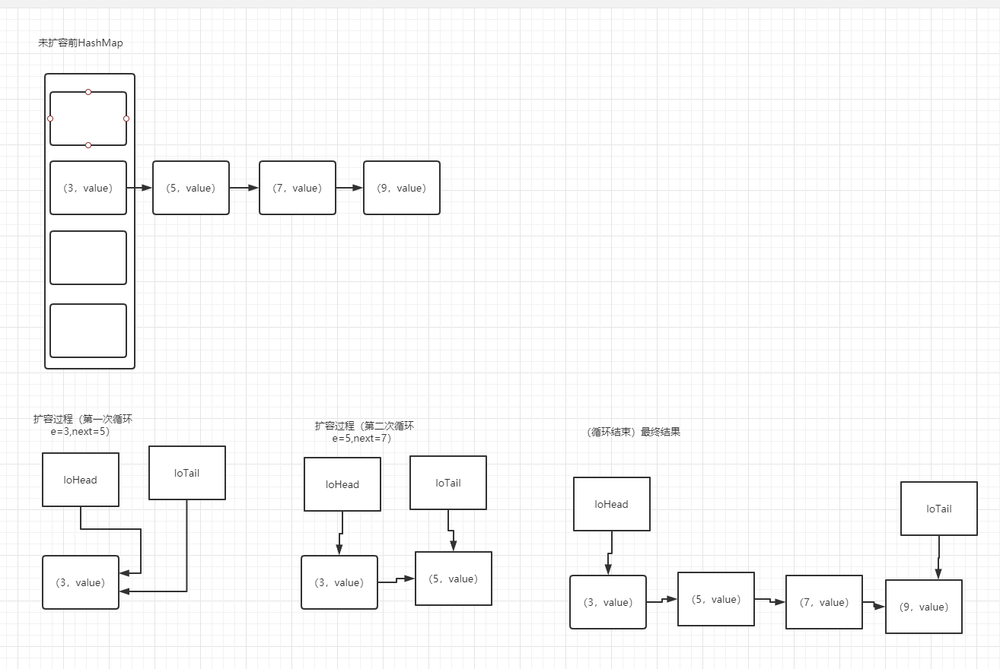
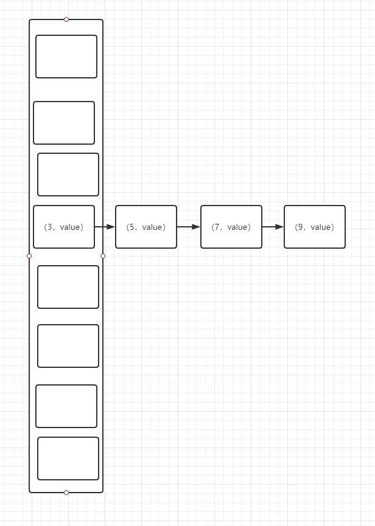

#  dJDK8  HashMap 源码分析

​    jdk8 和jdk7 的HashMap 的结构基本相同，都为数组 加链表的形式，不同的是，jdk8 在链表长度大于固定值得时候，链表会转化为一颗红黑树，来增加查询效率，HashMap的扩容方式也发生了变化。

HashMap 的  几个属性介绍： 

```java

    /**
     * The default initial capacity - MUST be a power of two.
     */
    //hashmap 数组的默认长度 为16。
    static final int DEFAULT_INITIAL_CAPACITY = 1 << 4; // aka 16

    /**
     * The maximum capacity, used if a higher value is implicitly specified
     * by either of the constructors with arguments.
     * MUST be a power of two <= 1<<30.
     */
     //HashMap 数组的最大长度
    static final int MAXIMUM_CAPACITY = 1 << 30;

    /**
     * The load factor used when none specified in constructor.
     */
     //加载因子， 扩容的阈值= 数组的长度 * 加载因子
    static final float DEFAULT_LOAD_FACTOR = 0.75f;

    /**
     * The bin count threshold for using a tree rather than list for a
     * bin.  Bins are converted to trees when adding an element to a
     * bin with at least this many nodes. The value must be greater
     * than 2 and should be at least 8 to mesh with assumptions in
     * tree removal about conversion back to plain bins upon
     * shrinkage.
     */
     // 当链表的长度 大于8 是，会树化
    static final int TREEIFY_THRESHOLD = 8;

    /**
     * The bin count threshold for untreeifying a (split) bin during a
     * resize operation. Should be less than TREEIFY_THRESHOLD, and at
     * most 6 to mesh with shrinkage detection under removal.
     */
     // 当树的结点数量小于6时，会转化为链表
    static final int UNTREEIFY_THRESHOLD = 6;

```


HashMap 中Node 结点的属性

```java
   static class Node<K,V> implements Map.Entry<K,V> {
        // key的hash值
        final int hash;
       
        final K key;
        V value;
        //下一个结点
        Node<K,V> next;

        Node(int hash, K key, V value, Node<K,V> next) {
            this.hash = hash;
            this.key = key;
            this.value = value;
            this.next = next;
        }

        public final K getKey()        { return key; }
        public final V getValue()      { return value; }
        public final String toString() { return key + "=" + value; }

        public final int hashCode() {
            return Objects.hashCode(key) ^ Objects.hashCode(value);
        }

        public final V setValue(V newValue) {
            V oldValue = value;
            value = newValue;
            return oldValue;
        }

        public final boolean equals(Object o) {
            if (o == this)
                return true;
            if (o instanceof Map.Entry) {
                Map.Entry<?,?> e = (Map.Entry<?,?>)o;
                if (Objects.equals(key, e.getKey()) &&
                    Objects.equals(value, e.getValue()))
                    return true;
            }
            return false;
        }
    }
```


  HashMap 初始化

```java
   public HashMap() {
        // 默认的加载因子
        this.loadFactor = DEFAULT_LOAD_FACTOR; 
    }
    
     public HashMap(Map<? extends K, ? extends V> m) {
        this.loadFactor = DEFAULT_LOAD_FACTOR;
        putMapEntries(m, false);
    }
```

HashMap 增加元素

```java
   public V put(K key, V value) {
        return putVal(hash(key), key, value, false, true);
    }
    
    
      final V putVal(int hash, K key, V value, boolean onlyIfAbsent,boolean evict) {
        Node<K,V>[] tab; Node<K,V> p; int n, i;
        // 如果是首次put，数组还没有初始化，初始化数组  
        if ((tab = table) == null || (n = tab.length) == 0)
            n = (tab = resize()).length;
        // 根据数组长度和hash值计算要存在的数组的下标，如果存在在该数组下标的元素为null，则初始化一个node，存放在这里          
        if ((p = tab[i = (n - 1) & hash]) == null)
            tab[i] = newNode(hash, key, value, null);
        else {
            //如果数组对应的下表的元素不为null，说明存在了hash冲突，那么就增加结点到链表里。
            Node<K,V> e; K k;
            //如果链表头结点和要放入的node的key相同，就直接覆盖key的value值
            if (p.hash == hash &&
                ((k = p.key) == key || (key != null && key.equals(k))))
                e = p;
            // 如果链表已经树化，就把结点放到红黑树里
            else if (p instanceof TreeNode)
                e = ((TreeNode<K,V>)p).putTreeVal(this, tab, hash, key, value);
            else {
                //遍历链表查询是否存在key相同的结点，
                for (int binCount = 0; ; ++binCount) {
                    //如果到最后一个元素也没有相同的key，就把结点加入到链表尾部
                    if ((e = p.next) == null) {
                        // 把节点加入到链表尾部
                        p.next = newNode(hash, key, value, null);
                        // 链表的长度已经超过了7，那么需要把该链表树形化
                        if (binCount >= TREEIFY_THRESHOLD - 1) // -1 for 1st
                            treeifyBin(tab, hash);
                        break;
                    }
                    // 找到相同的元素，直接value值覆盖
                    if (e.hash == hash &&
                        ((k = e.key) == key || (key != null && key.equals(k))))
                        break;
                    p = e;
                }
            }
            // 存在相同的key，把value 值改为新的vlaue，并返回就得value值
            if (e != null) { // existing mapping for key
                V oldValue = e.value;
                if (!onlyIfAbsent || oldValue == null)
                    e.value = value;
                afterNodeAccess(e);
                return oldValue;
            }
        }
        ++modCount;
        // HashMap的数量加一，如果大于扩容阈值，就出发库扩容操作  
        if (++size > threshold)
            resize();
        afterNodeInsertion(evict);
        return null;
    }
```

HashMap 扩容

```java
final Node<K,V>[] resize() {
        Node<K,V>[] oldTab = table;
        //老的数组大小
        int oldCap = (oldTab == null) ? 0 : oldTab.length;
        // 老的扩容阈值大小
        int oldThr = threshold;
        int newCap, newThr = 0;
        // 如果老的数组长度大于0，说明已经初始化过，则扩容后的数组长度为老的数组长度*2,扩容因子
        if (oldCap > 0) {
            if (oldCap >= MAXIMUM_CAPACITY) {
                threshold = Integer.MAX_VALUE;
                return oldTab;
            }
            else if ((newCap = oldCap << 1) < MAXIMUM_CAPACITY &&
                     oldCap >= DEFAULT_INITIAL_CAPACITY)
                newThr = oldThr << 1; // double threshold
        }
        else if (oldThr > 0) // initial capacity was placed in threshold
            newCap = oldThr;
        else {               // zero initial threshold signifies using defaults
            // 第一次进入数组还没有初始化，那么数组长度和扩容阈值 均取默认值
            newCap = DEFAULT_INITIAL_CAPACITY;
            newThr = (int)(DEFAULT_LOAD_FACTOR * DEFAULT_INITIAL_CAPACITY);
        }
         //计算新的扩容阈值
        if (newThr == 0) {
            float ft = (float)newCap * loadFactor;
            newThr = (newCap < MAXIMUM_CAPACITY && ft < (float)MAXIMUM_CAPACITY ?
                      (int)ft : Integer.MAX_VALUE);
        }
        threshold = newThr;
        @SuppressWarnings({"rawtypes","unchecked"})
        // 根据新的数组长度初始化新的数组
        Node<K,V>[] newTab = (Node<K,V>[])new Node[newCap];
        table = newTab;
        if (oldTab != null) {
            //遍历老的数组和链表，并根据新的数组长度重新计算
            for (int j = 0; j < oldCap; ++j) {
                Node<K,V> e;
                if ((e = oldTab[j]) != null) {
                    oldTab[j] = null;
                    // 如果老的链表长度为1，那么重新计算后直接放到新的数组中
                    if (e.next == null)
                        newTab[e.hash & (newCap - 1)] = e;
                    // 如果已经树化了，就遍历树结点计算
                    else if (e instanceof TreeNode)
                        ((TreeNode<K,V>)e).split(this, newTab, j, oldCap);
                    else { // preserve order
                        //遍历链表，重新计算链表中个个结点的位置
                        Node<K,V> loHead = null, loTail = null;
                        Node<K,V> hiHead = null, hiTail = null;
                        Node<K,V> next;
                        do {
                            next = e.next;
                            if ((e.hash & oldCap) == 0) {
                                if (loTail == null)
                                    loHead = e;
                                else
                                    loTail.next = e;
                                loTail = e;
                            }
                            else {
                                if (hiTail == null)
                                    hiHead = e;
                                else
                                    hiTail.next = e;
                                hiTail = e;
                            }
                        } while ((e = next) != null);
                        if (loTail != null) {
                            loTail.next = null;
                            newTab[j] = loHead;
                        }
                        if (hiTail != null) {
                            hiTail.next = null;
                            newTab[j + oldCap] = hiHead;
                        }
                    }
                }
            }
        }
        return newTab;
    }
```

   JDK8 和jdk7 在hashmap 链表遍历重新计算不同的地方在于， jdk7 是基于头插法计算的，那么重新计算后的链表事倒叙的。jdk8 的链表通过尾插发计算后，讲头部放到数组里得到的结果。

```java
                        Node<K,V> loHead = null, loTail = null;
                        Node<K,V> hiHead = null, hiTail = null;
                        Node<K,V> next;
                        do {
                            next = e.next;
                            if ((e.hash & oldCap) == 0) {
                                if (loTail == null)
                                    loHead = e;
                                else
                                    loTail.next = e;
                                loTail = e;
                            }
                            else {
                                if (hiTail == null)
                                    hiHead = e;
                                else
                                    hiTail.next = e;
                                hiTail = e;
                            }
                        } while ((e = next) != null);
                        if (loTail != null) {
                            loTail.next = null;
                            newTab[j] = loHead;
                        }
                        if (hiTail != null) {
                            hiTail.next = null;
                            newTab[j + oldCap] = hiHead;
                        }
```





执行完

  if (hiTail != null) {
                            hiTail.next = null;
                            newTab[j + oldCap] = hiHead;
                        } 代码块后，将链表头指向放到数组的位置





因数组的库容是2的倍数扩容，切元素的下标位置计算是通过 hash & *（len-1）计算的，所以元素在扩容后的数组存放的位置只有两个一个是原来的位置，一个是原来的位置加上老数组长度的位置。

0000 1110
0000 0011
0000 0010


0000 1110
0000 0111
0000 0110