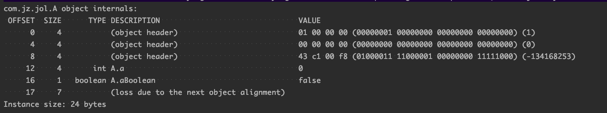

## synchronized

1.  Synchronized 可以加在代码块上，传入一个对象。可以加在非静态方法体上，也可以加在静态方法体。 记载代码块上，锁住的是入参传入的一个对象，加在非静态方法体上，锁住的是类的实例数据，加在静态方法体上，锁住的对象类的class 对象。

2. jdk1.6之前，synchronized 是重量级锁，加锁过程会涉及到cpu 从用户态到内核态的切换过程，成本比较大，jdk1.5之后，对改关键字进行了大幅度的优化，引入了偏斜锁，轻量级锁，重量级锁。

3. ​    synchronized是基于JVM内置锁实现，通过内部对象Monitor(监视器锁)实现，java中每个对象都有一个内置对象Monitor(监视器锁)。基于进入与退出Monitor对象实现方法与代码块同步，监视器锁的实现依赖底层操作系统的Mutex lock（互斥锁）实现，它是一个重量级锁性能较低。当然，JVM内置锁在1.5之后版本做了重大的优化，如锁粗化（LockCoarsening）、锁消除（Lock Elimination）、轻量级锁（LightweightLocking）、偏向锁（Biased Locking）、适应性自旋（Adaptive Spinning）等技术来减少锁操作的开销，，内置锁的并发性能已经基本与Lock持平。

   synchronized关键字被编译成字节码后会被翻译成monitorenter 和monitorexit 两条指令分别在同步块逻辑代码的起始位置与结束位置。

​        

4. jvm对对象整体的加锁过程:


## 对象头


### 指针压缩

```java
class A{

    private  int  a;

    private  boolean aBoolean;

    public int getA() {
        return a;
    }

    public void setA(int a) {
        this.a = a;
    }

    public boolean isaBoolean() {
        return aBoolean;
    }

    public void setaBoolean(boolean aBoolean) {
        this.aBoolean = aBoolean;
    }
}
```

  在jvm启动加入  -XX:+UseCompressedOops 开启指针压缩， -XX:-UseCompressedOops 关闭指针压缩。

   可通过-XX:+PrintFlagsFinal 属性，查看设置的启动参数是否生效。

#### 查看对象的内存布局

 可通过joi 查看一个对象的内存布局情况

```java
  <dependency>
        <groupId>org.openjdk.jol</groupId>
        <artifactId>jol-core</artifactId>
        <version>0.13</version>
  </dependency>
  
  public class JolTest {
    public static void main(String[] args) {
        A a   = new A();
        System.out.println(ClassLayout.parseInstance(a).toPrintable());
    }
}
```


1. 开启指针压缩

   在64位的操作系统中，jdk8 中默认是开启指针压缩（和内存大小有关系),开启指针压缩后，A对象占用的内存情况为：

​    

开启指针压缩后，对象头占用了12个字节，int a  占用了 4个字节,aBoolean 占用了一个字节，另外加上7个字节的对齐长度。

2. 关闭指针压缩：

   

  关闭指针压缩后，对象头占用了16个字节，int a 占用了4个字节, aBoolean 占用了1个字节，另外加上3个字节的对齐长度。


#### 对象的基本布局：

当new 一个对象的时候，对象的内存中的布局为 ：


​       在开启指针压缩的情况下，对象头 在64位操作系统中 占用了 96个字节，在32位操作系统中占用了64个字节。中间部分为 类中自己定义的一些属性，后部分为对齐填充数据（默认按照8byte对齐)。


### 对象头

 Java 的对象头主要有两部分构成，一部分是mark word，另一部分是klass pointer。

​                                   

```java
object header
    Common structure at the beginning of every GC-managed heap object. (Every oop points to an object header.) Includes fundamental information about the heap object's layout, type, GC state, synchronization state, and identity hash code. Consists of two words. In arrays it is immediately followed by a length field. Note that both Java objects and VM-internal objects have a common object header format.（对象头由两个word组成，每个GC管理堆对象的开头都存在这样一个公共结构。（每个oop都指向一个对象头）包含有关堆对象的布局、类型、GC状态、同步状态和哈希值的基本信息。在数组中，后面紧接着是一个长度字段。注意Java对象和VM内部对象都有一个通用的对象头格式。）
    
klass pointer
   The second word of every object header. Points to another object (a metaobject) which describes the layout and behavior of the original object. For Java objects, the "klass" contains a C++ style "vtable".（
   klass word为对象头的第二个word,主要指向对象的元数据）
   
mark word
     The first word of every object header. Usually a set of bitfields including synchronization state and identity hash code. May also be a pointer (with characteristic low bit encoding) to synchronization related information. During GC, may contain GC state bits.(每个对象头的第一个word。通常是一组位字段，包括同步状态和标识哈希值。也可以是指向同步相关信息的指针（具有特征性的低位编码）。在GC期间，可以包含GC状态位)
     
     
```

 可以看到 klass pointer 主要存储的是指向对象元数据的指针，mark word 主要存储的是 对象的同步表示，hash值，以及锁信息，和gc 信息（age ）。

### synchronized 与对象头

##### 在无锁情况下对象头的mark word结构信息为:

​        

​             

```java
public static void main(String[] args) {
    A a   = new A();
    //必须显示计算后，对象头中才会存储hashcode，否则对象头中的hashcode 都是0
    System.out.println(Integer.toHexString(a.hashCode()));
    System.out.println(ClassLayout.parseInstance(a).toPrintable());
}
```

 输出结果：

```java
a 的 hashcode: 6e8cf4c6
a 的内存布局: com.jz.jol.A object internals:
 OFFSET  SIZE      TYPE DESCRIPTION                               VALUE
      0     4           (object header)                           01 c6 f4 8c (00000001 11000110 11110100 10001100) (-1930115583)
      4     4           (object header)                           6e 00 00 00 (01101110 00000000 00000000 00000000) (110)
      8     4           (object header)                           43 c1 00 f8 (01000011 11000001 00000000 11111000) (-134168253)
     12     4       int A.a                                       0
     16     1   boolean A.aBoolean                                false
     17     7           (loss due to the next object alignment)
Instance size: 24 bytes

```

 可以看到在计算hashcode后，对象头的mark word中保存了hashcode信息，偏斜锁锁的标识为0，锁状态为01。


##### 偏向锁状态下对象头的mark word 的结构信息

​      偏向锁发生在这个锁从头到尾都只有一个线程在访问，此时会给对象加一把偏斜锁。 mark  word 的结构信息为： 前54为存放的获得锁的线程的id的标识，2位存放epoch信息，1位没有使用，4位对象的gc年龄，1为偏斜锁标识，2位当前锁的状态。


验证：

```java
public class JolTest {
    public static void main(String[] args) {
        A a   = new A();
        System.out.println("before lock:");
        System.out.println(ClassLayout.parseInstance(a).toPrintable());
        System.out.println("-----------------------------------------------------------");
        synchronized(a){
            System.out.println("locking:");
            System.out.println(ClassLayout.parseInstance(a).toPrintable());
            System.out.println("--------------------------------------------------------");
        }
        System.out.println("after lock:");
        System.out.println(ClassLayout.parseInstance(a).toPrintable());
    }
}
```

输出结果：

```java
before lock:
com.jz.jol.A object internals:
 OFFSET  SIZE      TYPE DESCRIPTION                               VALUE
      0     4           (object header)                           01 00 00 00 (00000001 00000000 00000000 00000000) (1)
      4     4           (object header)                           00 00 00 00 (00000000 00000000 00000000 00000000) (0)
      8     4           (object header)                           43 c1 00 f8 (01000011 11000001 00000000 11111000) (-134168253)
     12     4       int A.a                                       0
     16     1   boolean A.aBoolean                                false
     17     7           (loss due to the next object alignment)
Instance size: 24 bytes
Space losses: 0 bytes internal + 7 bytes external = 7 bytes total

----------------------------------------------------------------------------------
locking:
com.jz.jol.A object internals:
 OFFSET  SIZE      TYPE DESCRIPTION                               VALUE
      0     4           (object header)                           90 b9 a4 0d (10010000 10111001 10100100 00001101) (228899216)
      4     4           (object header)                           00 70 00 00 (00000000 01110000 00000000 00000000) (28672)
      8     4           (object header)                           43 c1 00 f8 (01000011 11000001 00000000 11111000) (-134168253)
     12     4       int A.a                                       0
     16     1   boolean A.aBoolean                                false
     17     7           (loss due to the next object alignment)
Instance size: 24 bytes
Space losses: 0 bytes internal + 7 bytes external = 7 bytes total

------------------------------------------------------------------------------------
after lock:
com.jz.jol.A object internals:
 OFFSET  SIZE      TYPE DESCRIPTION                               VALUE
      0     4           (object header)                           01 00 00 00 (00000001 00000000 00000000 00000000) (1)
      4     4           (object header)                           00 00 00 00 (00000000 00000000 00000000 00000000) (0)
      8     4           (object header)                           43 c1 00 f8 (01000011 11000001 00000000 11111000) (-134168253)
     12     4       int A.a                                       0
     16     1   boolean A.aBoolean                                false
     17     7           (loss due to the next object alignment)
Instance size: 24 bytes
Space losses: 0 bytes internal + 7 bytes external = 7 bytes total
```


​       可以看到输出的结果锁的状态为（001->000->001）即为 无锁->轻量级锁->无锁，并没有出现预期的偏斜锁，出现该问题的原因是: **jdk8虚拟机在启动的时候会延迟开启偏向锁（时间约为4300ms）,便于测试，可以通过设置JVM参数关闭偏向锁的延迟加载。IDEA设置方式：Run-->Edit Configurations->VM Options -XX:+UseBiasedLocking  -XX:BiasedLockingStartupDelay=0，再次运行可得结果如下：**


```java
 before lock:

WARNING: Unable to attach Serviceability Agent. You can try again with escalated privileges. Two options: a) use -Djol.tryWithSudo=true to try with sudo; b) echo 0 | sudo tee /proc/sys/kernel/yama/ptrace_scope

com.jz.jol.A object internals:
 OFFSET  SIZE      TYPE DESCRIPTION                               VALUE
      0     4           (object header)                           05 00 00 00 (00000101 00000000 00000000 00000000) (5)
      4     4           (object header)                           00 00 00 00 (00000000 00000000 00000000 00000000) (0)
      8     4           (object header)                           43 c1 00 f8 (01000011 11000001 00000000 11111000) (-134168253)
     12     4       int A.a                                       0
     16     1   boolean A.aBoolean                                false
     17     7           (loss due to the next object alignment)
Instance size: 24 bytes
Space losses: 0 bytes internal + 7 bytes external = 7 bytes total

//此时占用 thread 和 epoch 的 位置的均为0，说明当前偏向锁并没有偏向任何线程。此时这个偏向锁正处于可偏向状态，准备好进行偏向了！你也可以理解为此时的偏向锁是一个特殊状态的无锁

locking:
com.jz.jol.A object internals:
 OFFSET  SIZE      TYPE DESCRIPTION                               VALUE
      0     4           (object header)                           05 c8 80 f6 (00000101 11001000 10000000 11110110) (-159332347)
      4     4           (object header)                           99 7f 00 00 (10011001 01111111 00000000 00000000) (32665)
      8     4           (object header)                           43 c1 00 f8 (01000011 11000001 00000000 11111000) (-134168253)
     12     4       int A.a                                       0
     16     1   boolean A.aBoolean                                false
     17     7           (loss due to the next object alignment)
Instance size: 24 bytes
Space losses: 0 bytes internal + 7 bytes external = 7 bytes total

//synchronized(a)，对a加锁后，对象a偏向了某个线程，所以56位表示的是线程的ID标识，所以显然此时对象a已经成为偏向锁。

after lock:
com.jz.jol.A object internals:
 OFFSET  SIZE      TYPE DESCRIPTION                               VALUE
      0     4           (object header)                           05 c8 80 f6 (00000101 11001000 10000000 11110110) (-159332347)
      4     4           (object header)                           99 7f 00 00 (10011001 01111111 00000000 00000000) (32665)
      8     4           (object header)                           43 c1 00 f8 (01000011 11000001 00000000 11111000) (-134168253)
     12     4       int A.a                                       0
     16     1   boolean A.aBoolean                                false
     17     7           (loss due to the next object alignment)
Instance size: 24 bytes
//退出同步代码块，依然是偏向锁 

         关闭偏斜锁延迟加载后，锁的状态为（101->101->101),   (无锁可偏向->有锁已偏向->有锁已偏向)。当状态为有锁已偏向状态时，mark word  前54位存放的线程id的标识。
```


##### 轻量级锁状态下，对象头的结构

​        轻量级锁发生在多个线程访问对象，但是没有资源竞争，线程与线程之间交替执行，不会存在资源竞争。轻量级锁的mark word 信息为：前62位存放在持有锁的线程栈的指针地址，后边两位存放在当前锁的状态（00 代表轻量级锁）

​          

​              

​    验证：

```java
 public static void main(String[] args) throws InterruptedException {
        A a   = new A();
        System.out.println("before lock: ");
        System.out.println(ClassLayout.parseInstance(a).toPrintable());
        Thread trd1 = new Thread(new Runnable() {
            @Override
            public void run() {
                synchronized (a){
                    System.out.println("-------------------------------------------------------");
                    System.out.println("trd1 locking: ");
                    System.out.println(ClassLayout.parseInstance(a).toPrintable());
                }
            }
        });
        Thread trd2 = new Thread(new Runnable() {
        @Override
        public void run() {
            synchronized (a){
                System.out.println("-------------------------------------------------------");
                System.out.println("trd2 locking: ");
                System.out.println(ClassLayout.parseInstance(a).toPrintable());
            }
        }
    });
    //trd1 和 trd2 不存在资源竞争情况，交替执行，trd1执行结束后，再执行trd2
    trd1.start();
    trd1.join();
    trd2.start();
    Thread.sleep(1000);
}
```

​      输出结果:

 ```java
before lock: 
# WARNING: Unable to attach Serviceability Agent. You can try again with escalated privileges. Two options: a) use -Djol.tryWithSudo=true to try with sudo; b) echo 0 | sudo tee /proc/sys/kernel/yama/ptrace_scope
com.jz.jol.A object internals:
 OFFSET  SIZE      TYPE DESCRIPTION                               VALUE
      0     4           (object header)                           05 00 00 00 (00000101 00000000 00000000 00000000) (5)
      4     4           (object header)                           00 00 00 00 (00000000 00000000 00000000 00000000) (0)
      8     4           (object header)                           43 c1 00 f8 (01000011 11000001 00000000 11111000) (-134168253)
     12     4       int A.a                                       0
     16     1   boolean A.aBoolean                                false
     17     7           (loss due to the next object alignment)
Instance size: 24 bytes
Space losses: 0 bytes internal + 7 bytes external = 7 bytes total
//无锁状态下，锁为101，threadid 标识和ep均为0
-----------------------------------------------------------------------------------------
trd1 locking: 
com.jz.jol.A object internals:
 OFFSET  SIZE      TYPE DESCRIPTION                               VALUE
      0     4           (object header)                           05 f8 13 a4 (00000101 11111000 00010011 10100100) (-1542195195)
      4     4           (object header)                           d3 7f 00 00 (11010011 01111111 00000000 00000000) (32723)
      8     4           (object header)                           43 c1 00 f8 (01000011 11000001 00000000 11111000) (-134168253)
     12     4       int A.a                                       0
     16     1   boolean A.aBoolean                                false
     17     7           (loss due to the next object alignment)
Instance size: 24 bytes
Space losses: 0 bytes internal + 7 bytes external = 7 bytes total
//线程1 锁标识为101,即为偏斜锁
--------------------------------------------------------------------------------------------
trd2 locking: 
com.jz.jol.A object internals:
 OFFSET  SIZE      TYPE DESCRIPTION                               VALUE
      0     4           (object header)                           60 69 74 0a (01100000 01101001 01110100 00001010) (175401312)
      4     4           (object header)                           00 70 00 00 (00000000 01110000 00000000 00000000) (28672)
      8     4           (object header)                           43 c1 00 f8 (01000011 11000001 00000000 11111000) (-134168253)
     12     4       int A.a                                       0
     16     1   boolean A.aBoolean                                false
     17     7           (loss due to the next object alignment)
Instance size: 24 bytes
//线程二 偏斜锁已经偏向了线程1，所以不能在偏向线程二，因此线程2的锁标识为00，即为轻量级锁  
 ```

##### 重量级锁状态下 mark word 标识

​           当发生多个线程之间的资源竞争情况，轻量级锁就会膨胀为重量级锁，重量级锁 偏斜锁标识为0，锁状态为10。

​              

 验证：

```java
     public static void main(String[] args) throws InterruptedException {
        CountDownLatch countDownLatch = new CountDownLatch(1);
        A a   = new A();
        System.out.println("before lock: ");
        System.out.println(ClassLayout.parseInstance(a).toPrintable());
        Thread trd1 = new Thread(new Runnable() {
            @Override
            public void run() {
                try {
                    countDownLatch.await();
                } catch (InterruptedException e) {
                    e.printStackTrace();
                }
                synchronized (a){
                    System.out.println("-------------------------------------------------------");
                    System.out.println("trd1 locking: ");
                    System.out.println(ClassLayout.parseInstance(a).toPrintable());
                }
            }
        });
    Thread trd2 = new Thread(new Runnable() {
        @Override
        public void run() {
            try {
                countDownLatch.await();
            } catch (InterruptedException e) {
                e.printStackTrace();
            }
            synchronized (a){
                System.out.println("-------------------------------------------------------");
                System.out.println("trd2 locking: ");
                System.out.println(ClassLayout.parseInstance(a).toPrintable());
            }
        }
    });
    trd1.start();
    trd2.start();
    countDownLatch.countDown();
    Thread.sleep(3000);
}
  
```

​     通过设置CountDownLatch 来保证trd1 和 trd2 同时 去竞争锁，这时候锁就会膨胀为重量锁。

  输出结果：

  ```java
before lock: 
# WARNING: Unable to attach Serviceability Agent. You can try again with escalated privileges. Two options: a) use -Djol.tryWithSudo=true to try with sudo; b) echo 0 | sudo tee /proc/sys/kernel/yama/ptrace_scope
com.jz.jol.A object internals:
 OFFSET  SIZE      TYPE DESCRIPTION                               VALUE
      0     4           (object header)                           05 00 00 00 (00000101 00000000 00000000 00000000) (5)
      4     4           (object header)                           00 00 00 00 (00000000 00000000 00000000 00000000) (0)
      8     4           (object header)                           43 c1 00 f8 (01000011 11000001 00000000 11111000) (-134168253)
     12     4       int A.a                                       0
     16     1   boolean A.aBoolean                                false
     17     7           (loss due to the next object alignment)
Instance size: 24 bytes
Space losses: 0 bytes internal + 7 bytes external = 7 bytes total
//初始状态为无锁可偏斜状态
---------------------------------------------------------------------------
trd1 locking: 
com.jz.jol.A object internals:
 OFFSET  SIZE      TYPE DESCRIPTION                               VALUE
      0     4           (object header)                           5a 65 03 d8 (01011010 01100101 00000011 11011000) (-670866086)
      4     4           (object header)                           c7 7f 00 00 (11000111 01111111 00000000 00000000) (32711)
      8     4           (object header)                           43 c1 00 f8 (01000011 11000001 00000000 11111000) (-134168253)
     12     4       int A.a                                       0
     16     1   boolean A.aBoolean                                false
     17     7           (loss due to the next object alignment)
Instance size: 24 bytes
Space losses: 0 bytes internal + 7 bytes external = 7 bytes total
//存在资源竞争情况，锁变为重量级锁
-------------------------------------------------------------------------
trd2 locking: 
com.jz.jol.A object internals:
 OFFSET  SIZE      TYPE DESCRIPTION                               VALUE
      0     4           (object header)                           5a 65 03 d8 (01011010 01100101 00000011 11011000) (-670866086)
      4     4           (object header)                           c7 7f 00 00 (11000111 01111111 00000000 00000000) (32711)
      8     4           (object header)                           43 c1 00 f8 (01000011 11000001 00000000 11111000) (-134168253)
     12     4       int A.a                                       0
     16     1   boolean A.aBoolean                                false
     17     7           (loss due to the next object alignment)
Instance size: 24 bytes
//存在资源竞争情况，锁变为重量级锁
  ```


## 总结：

​      

​      

​      


​      Synchronized  锁的状态一共有 无锁可偏斜状态 （初始状态）， 偏向锁（锁从头到尾一直只有一个线程持有），轻量级锁（锁被多个线程持有，但是线程之间不存在资源竞争，交替执行），重量级锁（线程之间存在资源竞争关系）。

​        

https://www.cnblogs.com/vincentYw/p/11972571.html

https://blog.csdn.net/lengxiao1993/article/details/81568130