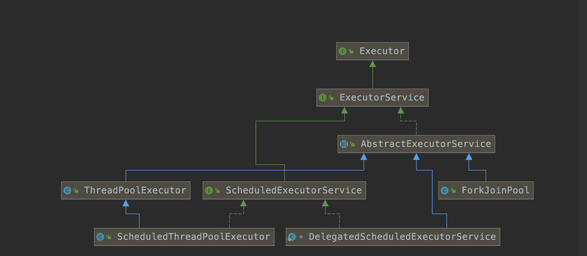

## 线程池

#### 线程池继承关系

​       


## ThreadPoolExector 核心参数：

1.  核心线程数

2. 最大线程数

3. 缓冲队列

4. 空闲线程存活时间

5. 存活时间单位

6. 拒绝策略

     6.1  抛出异常，RejectedExecutionException

     6.2  使用CallerRunsPolicy，将任务交给调用execute的线程执行

     6.3 自定义拒绝策略，实现RejectedExecutionHandler

     6.4  直接丢弃  DisCardPolicy 和 DiscardOldesPolicy

7. 线程工厂

## Executors 创建线程

1.  ThreadPoolExecutor (newCachedThreadPool,newSingleThreadExecutor,newFixedThreadPool)

   ​      1.1  newCachedThreadPool 核心线程数为0，最大线程数无限大，缓冲队列为SynchronousQueue，会导致无限创建线程

   ​      1.2  newSingleThreadExecutor 核心线程为1，最大线程1，缓冲队列LinkedBlockingQueue，会导致oom

   ​      1.3  newFixedThreadPool  核心线程为入参，最大线程入参，缓冲队列LinkedBlockingQueue，会导致oom

2. ForkJoinPool

3. ScheduledExecutorService

## 线程池线程的创建顺序

1.  线程池线程数量小于核心线程数量，不管有没有空闲线程都创建核心线程
2.  线程数量大于核心线程，则往缓冲队列里放置
3. 缓冲队列满了，则创建非核心线程
4. 线程数量超过最大值，则执行拒绝策略


## 线程异常处理

1.   

```
为线程设置异常处理器。具体做法可以是以下几种：
（1）Thread.setUncaughtExceptionHandler设置当前线程的异常处理器；
（2）Thread.setDefaultUncaughtExceptionHandler为整个程序设置默认的异常处理器；
如果当前线程有异常处理器（默认没有），则优先使用该UncaughtExceptionHandler类；否则，如果当前线程所属的线程组有异常处理器，则使用线程组的
UncaughtExceptionHandler；否则，使用全局默认的DefaultUncaughtExceptionHandler；如果都没有的话，子线程就会退出。
注意：子线程中发生了异常，如果没有任何类来接手处理的话，是会直接退出的，而不会记录任何日志。
所以，如果什么都不做的话，是会出现子线程任务既没执行成功，也没有任何日志提示的“诡异”现象的。
设置当前线程的异常处理器：
```

2 .  使用 future.get 捕获异常

  实现callable接口，线程池submit，返回future对象，调用get方法，捕获异常


