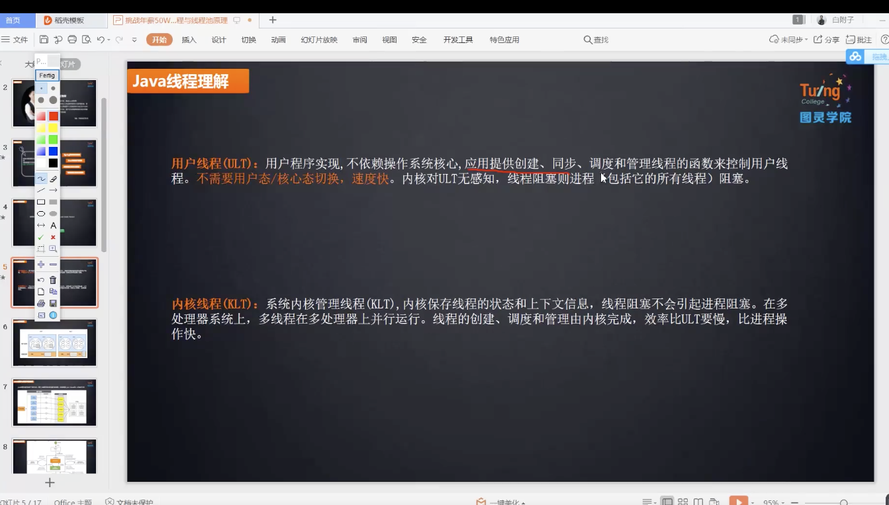
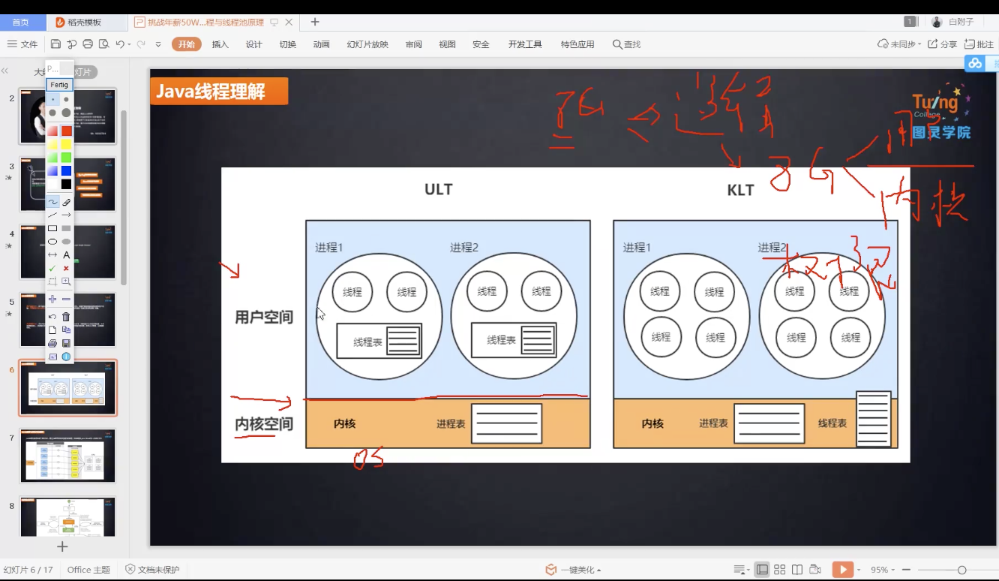
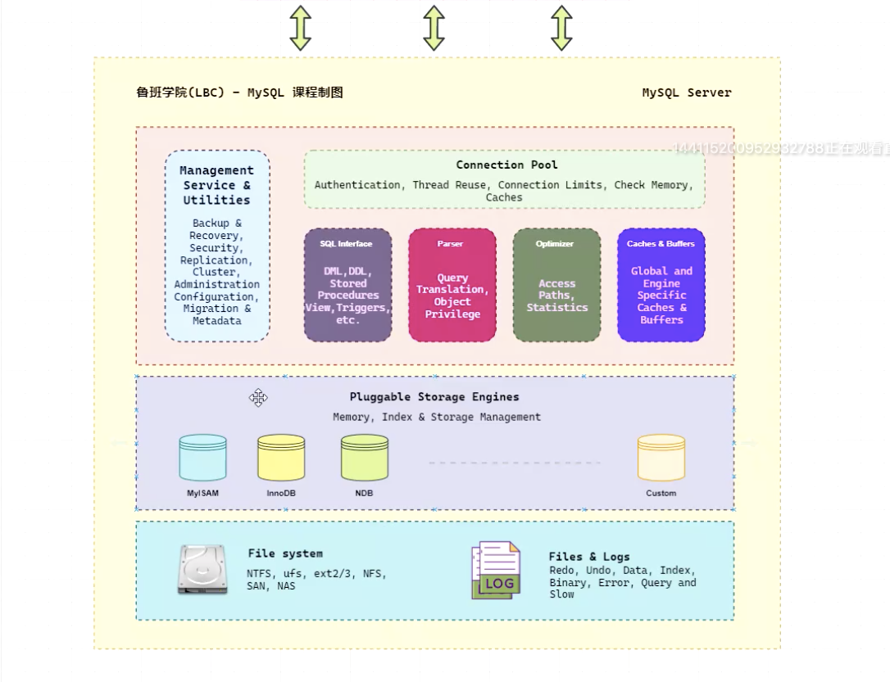
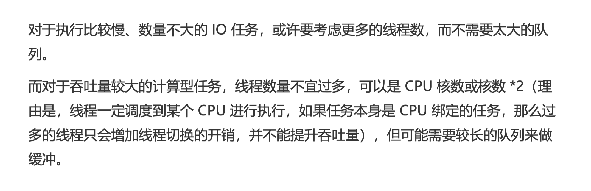

两种线程模型：

用户级线程 和 内核级 线程（ULT 和 KLt）

市面上的jvm都是klt模型

### 线程池默认的工作行为

1. 不会初始化corePoolSize 个线程，有任务来了才创建线程
2. 当核心线程满了以后，不会立即扩容线程池，而是把任务堆积到工作队列中
3. 当工作队列满了以后扩容线程池，一直到线程个数达到了maximumPoolSize为止。
4. 如果队列已满并且已经达到了最大线程还有任务进来，按照拒绝策略执行。
5. 当线程数大于核心线程数，线程等待keepAliveTime后还没有任务需要处理，收缩线程到核心线程数。

> 可以在声明线程后，立即调用prestartAllCoreThreads 方法，来启动所有核心线程。
>
> 传入true给allowCoreThreadTimeOut方法，来让线程池在空闲时候同样回收核心线程数。

==**java8中的 parallel straem功能，可以让我们很方便的并行处理结合中的元素，其背后是共享同一个ForkJoinPool，默认并行度cpu核心数量-1。对于CPU绑定的任务来说，使用这样的配置比较合适，但是如果集合操作涉及同步IO操作的话（比如数据库操作，外部服务调用等）,建议自定义一个ForkJoinPool (或者普通线程池)**==

