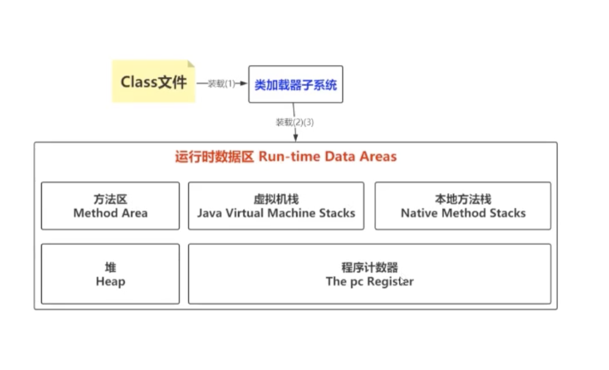

双亲委派机制 

​        加载

​        链接  验证 准备 解析

​        初始化

​         方法区：

​               permspace ---> 永久待  jdk1.7

​               MateSpace --> 元空间  jdk1.8

​               方法区存储的静态变量，常量 和类信息

 Matesapce  MaxMatespace

栈的深度设置很大，会导致创建的线程变少，因为一个线程 运行都需要栈帧

GCRoot:  

​    虚拟机栈中的本地变量表

​     static  成员变量，常量，本地方法栈中的变量，类加载器，java线程这些可以作为gc root

cms： 追求的是低停顿时间

G1:

  

​           G1 内存重新布局，引出了 Regin，对堆重新进行了布局，理论存在Young，Old，Eden ，物理上已经不是隔离的了。

​           

​      可以有选择性的设置停顿时间

 

 查看程序用的那个收集器：

### jvm 参数

   修改jvm参数： 

PrintFlagFinal  中 显示出的堆大小单位是字节

### 命令

jps： 查看当前java 进程

jinfo:  查看jvm 参数 （jinfo -flag UseG1GC PID）

​           修改jvm 参数  （jinfo -flag name = value PID）

Jstat:  jstat -class PID  1000 10 （查看类信息，每1000ms 打印一次，一共打印10次）

​           jstat gc

jstack： 查看线程堆栈信息  （如果线程发生问题了，方便排查）（比如java代码里有死锁， ）  

jmap： 生成堆内存快照

​              jmap -heap pid

​              jmap -dump;format =heap。hprof  pid

jvm 在oom 时候 自动生成dump 文件

​      

    ### 工具

arthas

 

oom --> 排查那个对象占用的内存空间比较大  （MAT）

  

垃圾回收发生的时机是什么时候

Minor gc,Major gc， full gc

FullGc = MinorGc + MajorGc

1 。Edgen 区或者s区不够用了  发生Minor Gc

2 。 老年代空间不够用了  发生major gc， 伴随着 Minor gc

3.  发放区空间不够用了
4. system.gc -> 手动gc 

G1 日志

 

GcEasy  工具可以查看gc 日志

 gc 调优的目的

   尽可能的提高吞吐量，保证gc 停顿时间比较小

G1  

不要手动设置young 区代销，g1 为了尽可能达到设置的停顿时间会动态调整新生代和老年代的大小

设置停顿时间又可能会增加gc 次数

还要一些其他的jvm 参数

  ConcGCThreads =n  增加垃圾回收并发标记数量

 

### G1 和 cms 的区别

​     cms: 整体采用标记清除  会产生空间碎片

​     G1： 标记整理

   收集方式： Gargage  fIRST   优先会收集垃圾比较多的区域 

### 高并发场景下如何进行调优

full gc 频繁 可以适当调整  young 去适当增加 （让对象啊新生代回收不用放到老年代）

 

 