vis

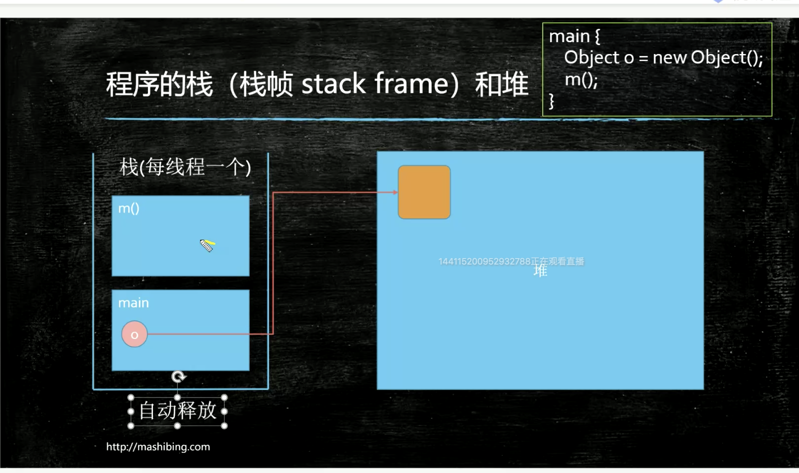

栈空间方法结束后会自动释放

内存泄漏 -> 内存溢出

什么是垃圾：

   没有引用指向的内存，就定位为垃圾

引用计数：

​    无法解决循环引用

   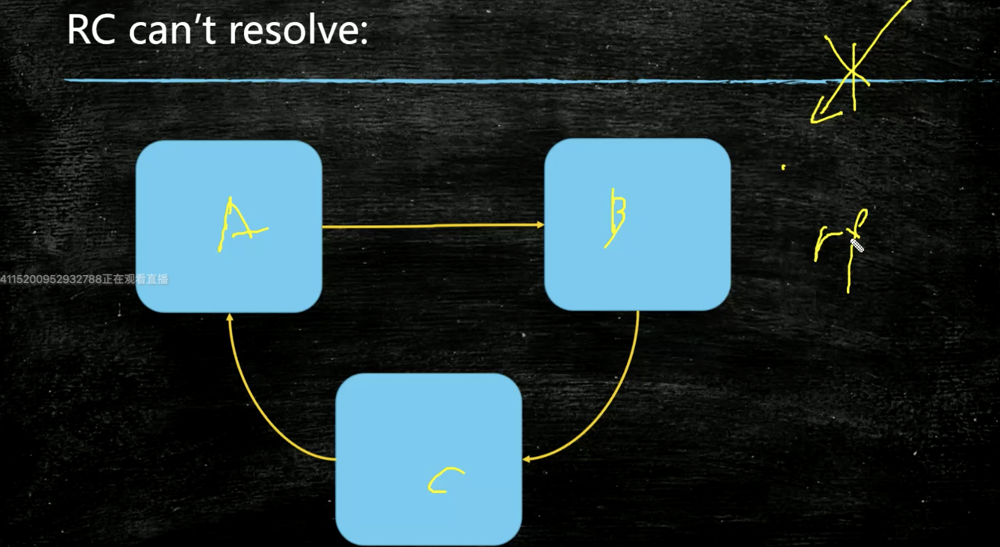

Root Searching

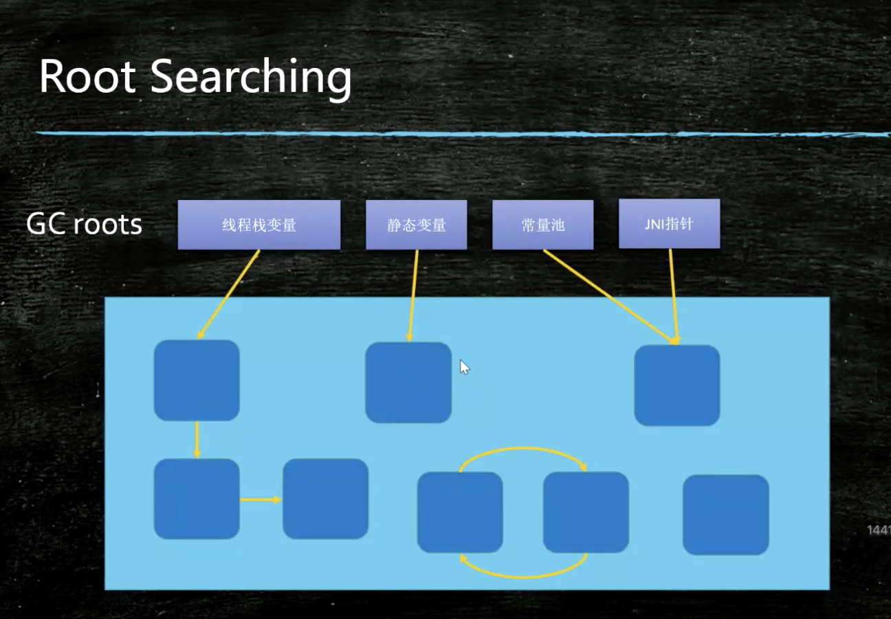

Gc 算法

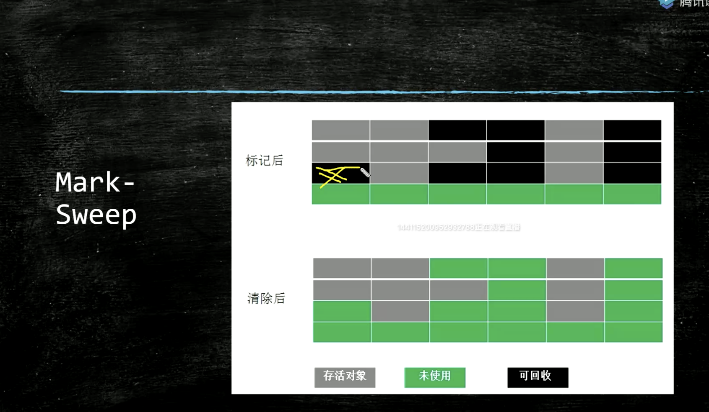

内存碎片化严重，时间长了，无法分配大量连续内存

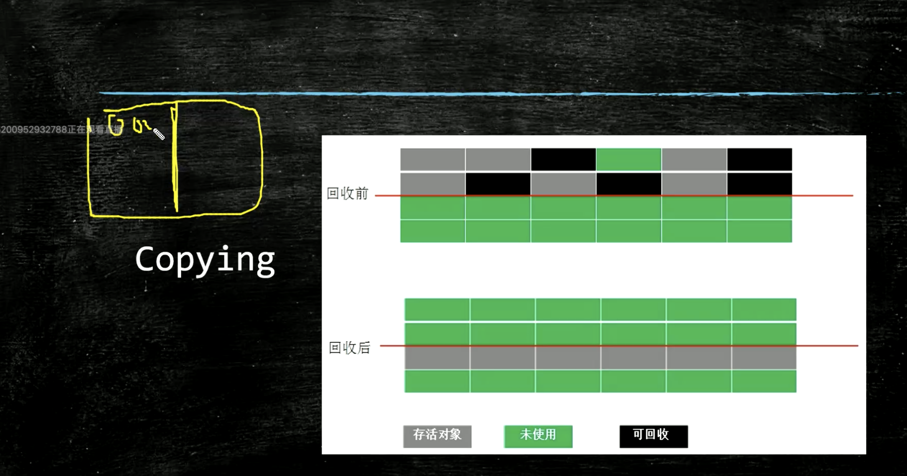

内存浪费

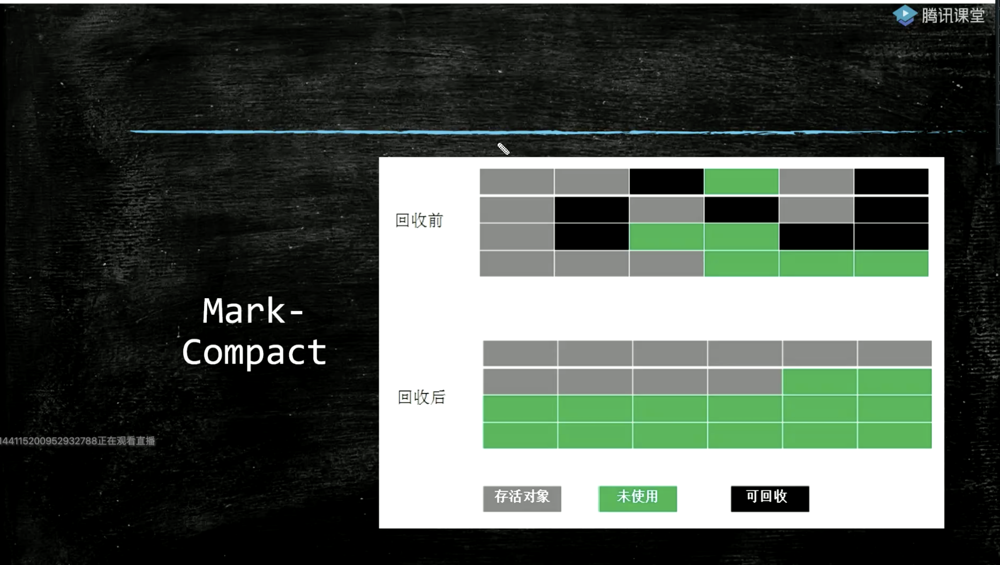

效率低

垃圾回收器：

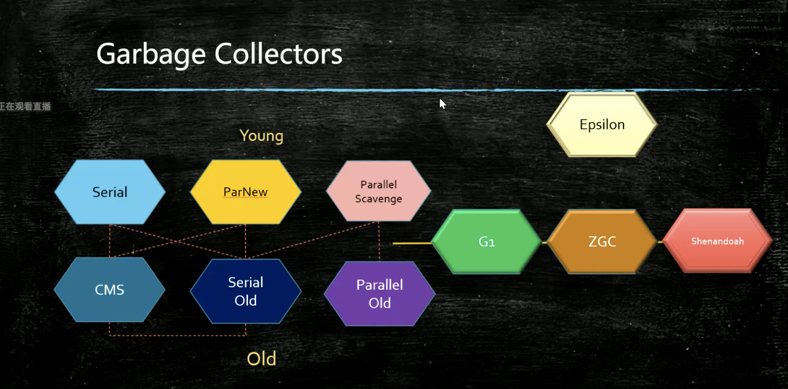

内存分带模型

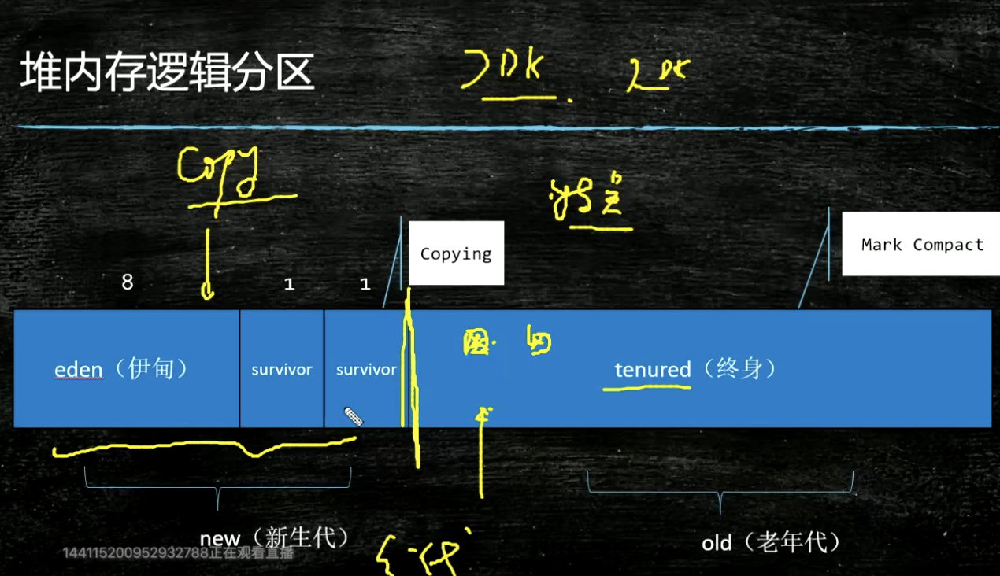

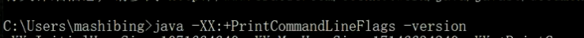

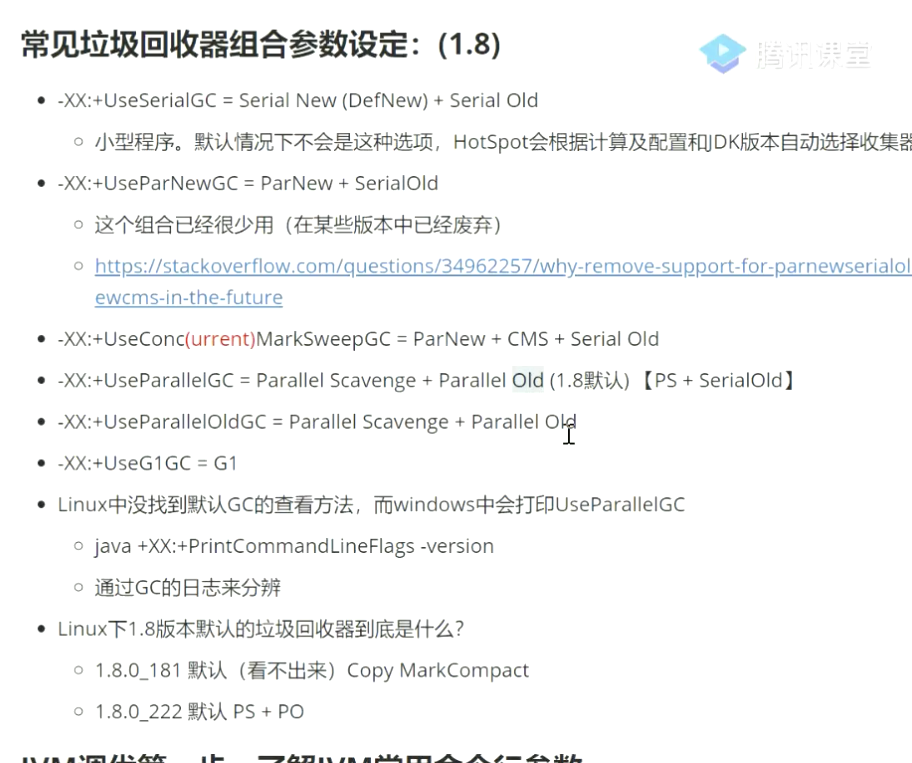

CMS   concurrentgc  没有stw

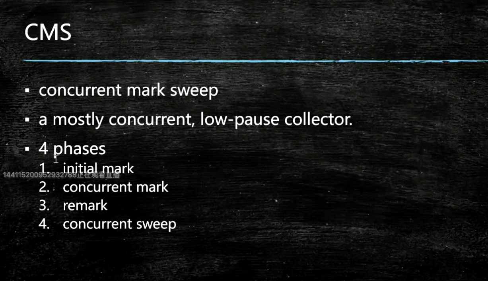

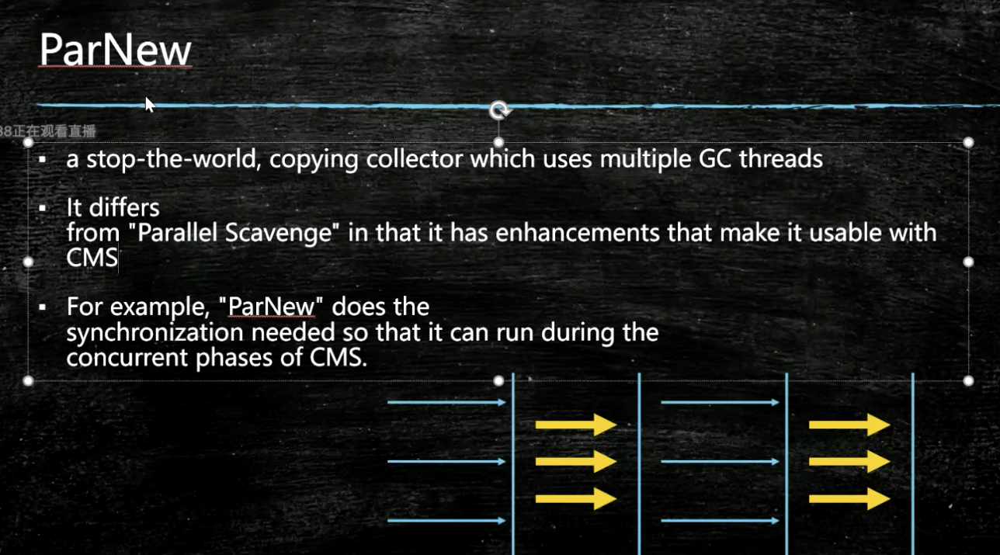

cms

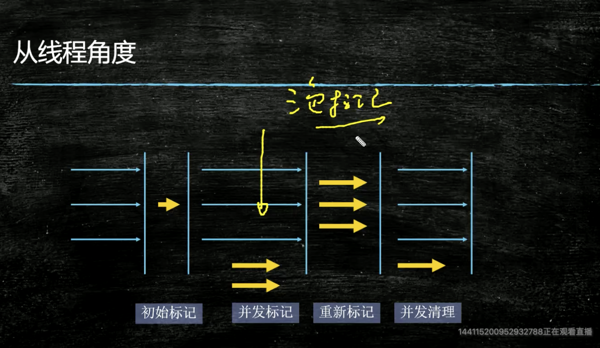

三色标记算法

并发标记

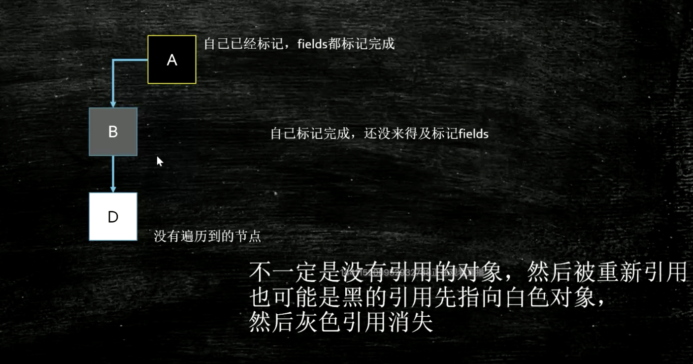

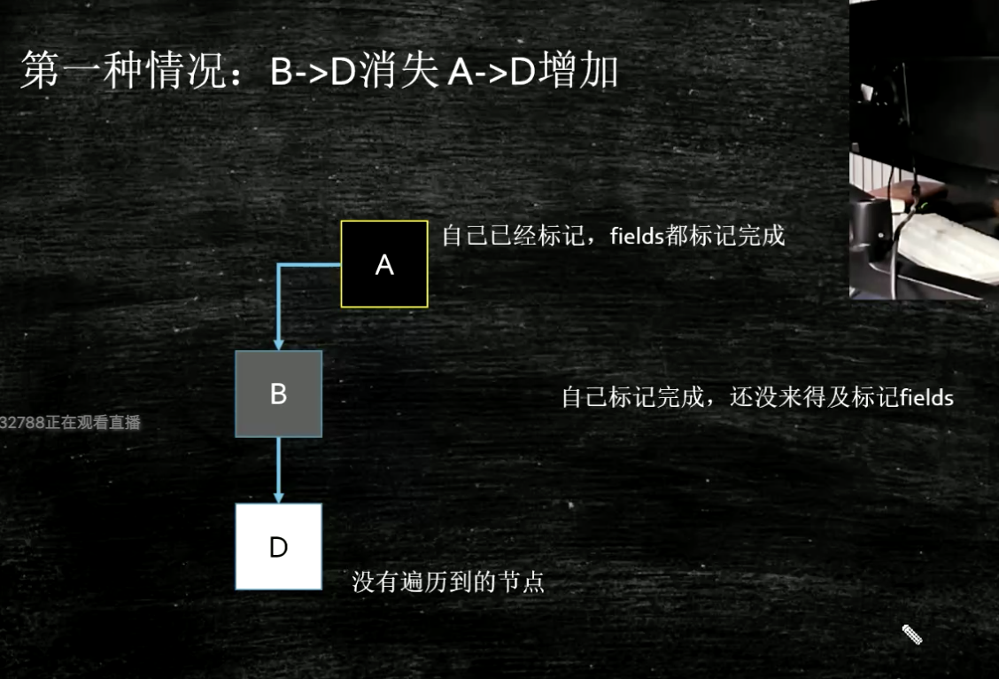

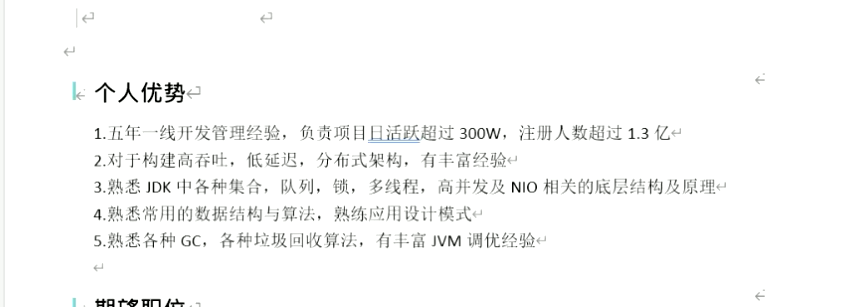

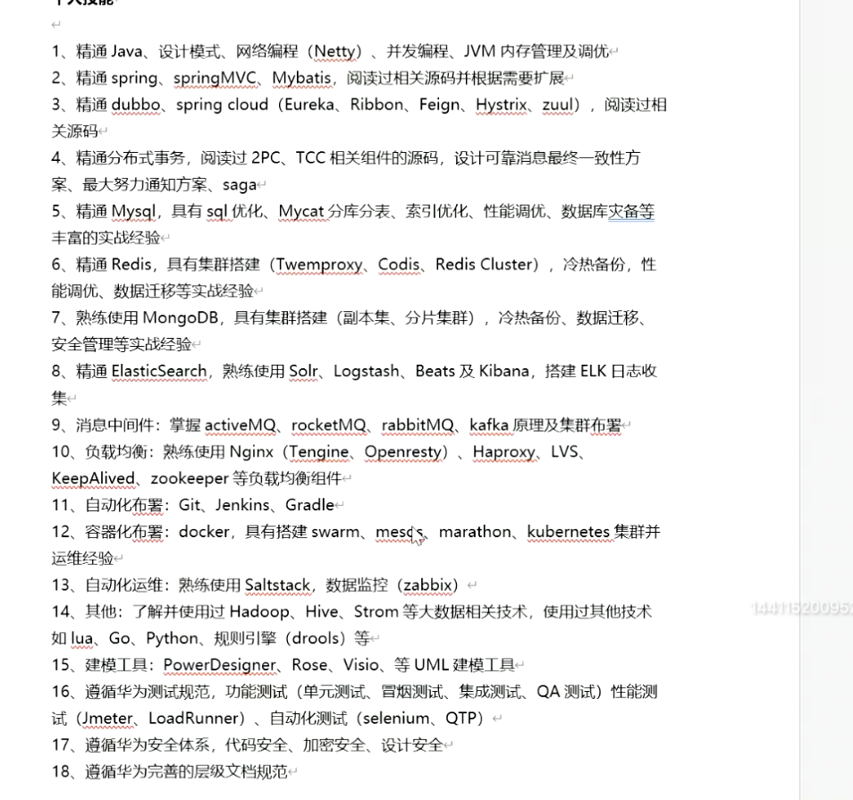

