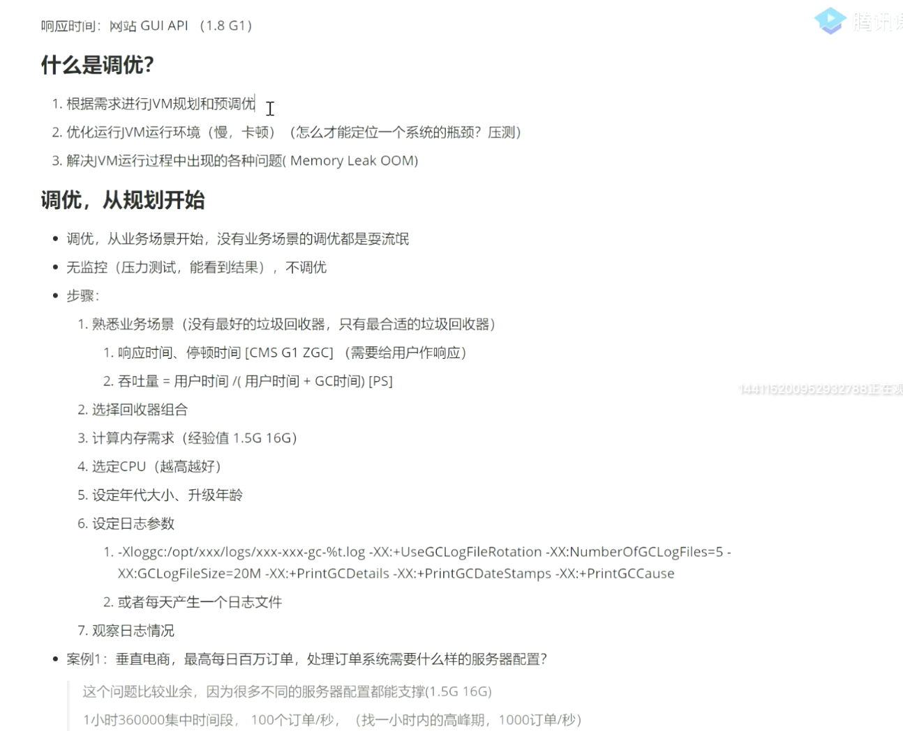
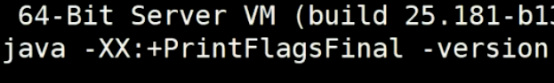
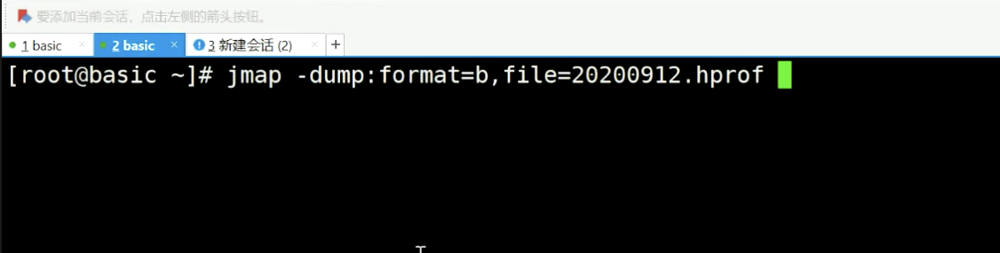
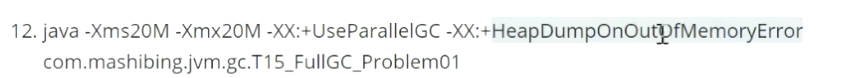
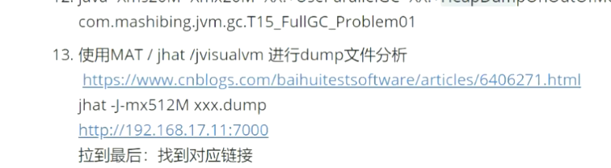

1  用的哪个垃圾回收期

​                 

最小堆内存和最大堆内存设置一样 不用内存抖动 防止 变大变小

java 命令  会启动一个jvm

jps
jinfo + pid  java进程的一些信息

Jstat -gc pid

jstack + pid  会把 进程所有的线程显示出来

Top 找进程

top -hp   找线程

1  vm thread  是否频繁gc

2  业务线程  

频繁full gc：  先看每次gc 的数量

   

jmap  查看堆内存中 占用情况，产生堆转储文件

jmap -histo pid | head 20

生产环境不能执行jmap 命令，会导致jvm 卡死

产生堆内存转储文件：

设置参数 产生oom 会自动产生 堆内存转储文件

压测

负载均衡把机器摘出来

tcp dump 测试环境压测

arthas

