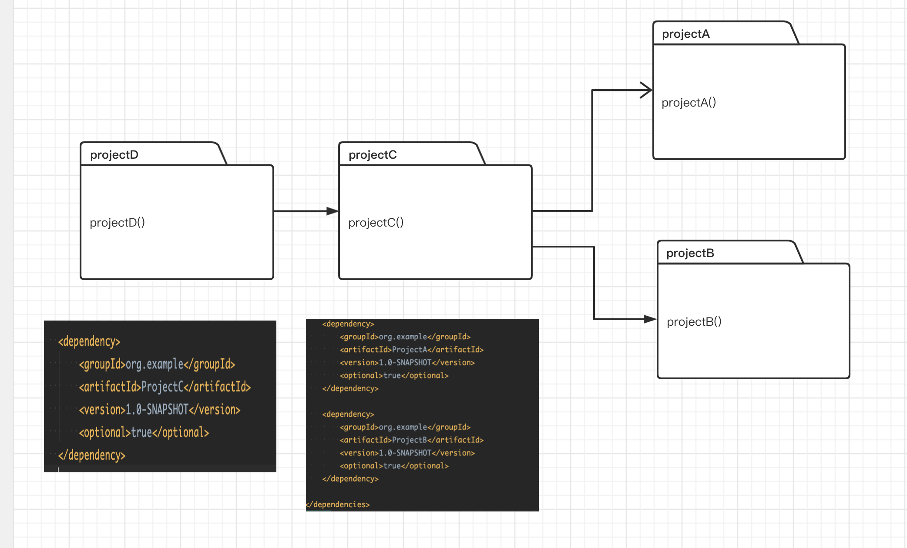
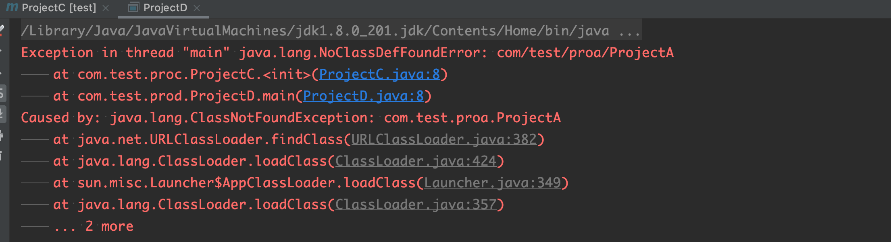

# maven optional 的作用

#####   在Maven 的 pom 文件中,会经常看到如下的代码：

```xml
   <dependencies>
        <dependency>
            <groupId>org.example</groupId>
            <artifactId>ProjectA</artifactId>
            <version>1.0-SNAPSHOT</version>
            <optional>true</optional>
        </dependency>

        <dependency>
            <groupId>org.example</groupId>
            <artifactId>ProjectB</artifactId>
            <version>1.0-SNAPSHOT</version>
            <optional>true</optional>
        </dependency>

    </dependencies>
```

###  option 的含义是可选依赖, 具体的作用是

         

​          projectC  依赖了 projectA和 projectB ，projectD 依赖的 projectC。由于projectC 使用了projectA和projectB的方法，因此如果C 没有依赖A 和B ，编译会报错。projectD 依赖了projectC,但是projetA和projectB 中的类对于projectD 来说都是可选依赖，因此在projectD  中使用A和B 的类和方法，编译会报如下错。

​    


<font color=#000000 size=4>要想使用A和B 中的方法，必须显式依赖A 和B</font> 。

​         到这也就很好理解为什么 Maven 为什么要设计 optional 关键字了，假设一个关于数据库持久化的项目(Project C), 为了适配更多类型的数据库持久化设计，比如 Mysql 持久化设计(Project A) 和 Oracle 持久化设计(Project B)，当我们的项目(Project D) 要用的 Project C 的持久化设计，不可能既引入 mysql 驱动又引入 oracle 驱动吧，所以我们要显式的指定一个，就是这个道理了

