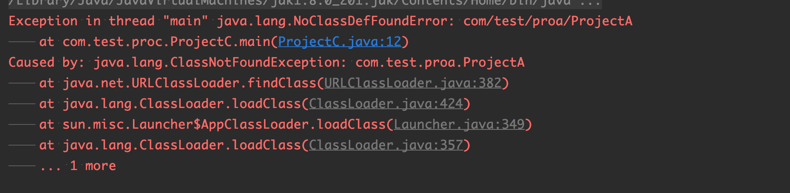
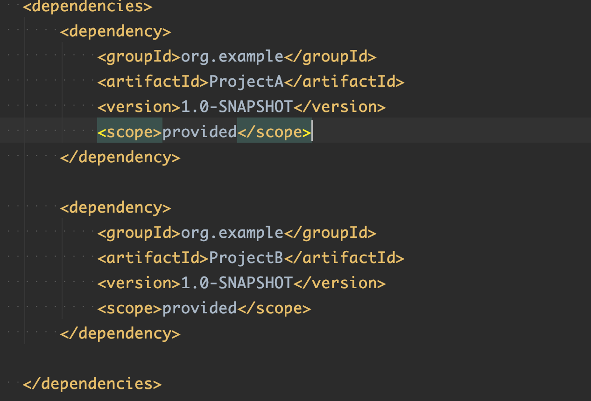
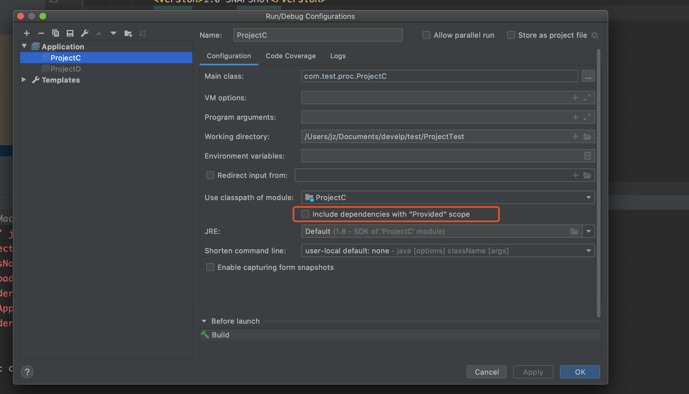

###  mavne  scope 的含义

1.   ##### Complie(编译)

​        compllie 是默认的范围，如果没有提供一个范围，那么该依赖的范围就是编译范围，编译范围依赖在所有的classpath 中可用，同时它们可以被打包。

2. ##### Provided(已提供)

   ​      provided 只有在当JDK 或者一个容器已提供该依赖之后才使用。例如， 如果你开发了一个web 应用，你可能在编译 classpath需要可用的Servlet API 来编译一个servlet，但是你不会想要在打包好的WAR 中包含这个Servlet API；这个Servlet API JAR 由你的应用服务器或者servlet 容器提供。已提供范围的依赖在编译classpath （不是运行时）可用。它们不是传递性的，也不会 被打包。事实上该依赖理论上可以参与编译，测试，运行等周期。相当于compile，但是打包阶段做了exclude操作

   

   在idea中，scope 为provided 的，编译可能会报错

   

   

    ### 解决方法：

   

   把选项勾选上即可。

3. ##### runtime (运行时)

   ​       表示被依赖项目无需参与项目的编译，不过后期的测试和运行周期需要其参与。与compile相比，跳过了编译而已。例如JDBC驱动，适用运行和测试阶段

4. ##### test

​         依赖的项目仅仅参与测试接单，包括测试代码的编译与执行，不参与打包

5. ##### system

   ​      从参与度来说，和provided相同，不过被依赖项不会从maven仓库下载，而是从本地文件系统拿。需要添加systemPath的属性来定义路径

## **scope的依赖传递**

>  A依赖B，B依赖C。当前项目为A，只当B在A项目中的scope，那么c在A中的scope是如何得知呢？当C是test或者provided时，C直接被丢弃，A不依赖C；（排除传递依赖）否则A依赖C，C的scope继承与B的scope

