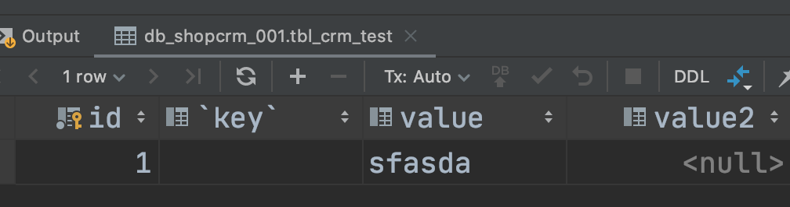
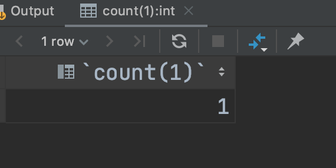
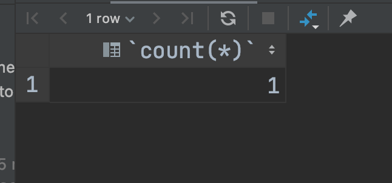
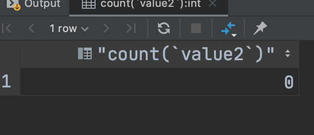

###  mysql count(1) 和count(*) 的区别


### 执行效率:

> 表总的数据量10659977 行数据, count 的查询时间

   ```sql
select SQL_NO_CACHE count(*) from tbl_crm_customer_giftDetail;  ###0.643s
select SQL_NO_CACHE count(1) from tbl_crm_customer_giftDetail;  ###0.651s
select SQL_NO_CACHE count(itemID) from tbl_crm_customer_giftDetail; ### 0.786s
select SQL_NO_CACHE count(giftItemID) from tbl_crm_customer_giftDetail; ### 0.818s
   ```


###  查询结果的区别：

   

  select count(1) from tbl_crm_test  结果：

  


```
select count(*) from tbl_crm_test 的结果：
```



```
select count(`value2`) from tbl_crm_test  的结果：
```

  


### 总结：

> count(id)：InnoDB引擎会遍历整张表，把每一行的id值都取出来，返回给server层。server层拿到id后，判断是不可能为空的，就按行累加。
>
> count(1)：InnoDB引擎遍历整张表，但不取值。server层对于返回的每一行，放一个数字1进去，判断是不可能为空的，按行累加。
>
> count(字段)：
> 如果这个“字段”是定义为not null的话，一行行地从记录里面读出这个字段，判断不能为null，按行累加；
> 如果这个字段定义允许为null，那么执行的时候，判断到有可能是null，还要把值取出来再判断一下，不是null才累加。
>
> count(*)：不会把全部字段取出来，而是专门做了优化，不取值。count(*)肯定不是null，按行累加。
>
> 按照效率排序的话，count(字段)<count(主键id)<count(1)≈count(*);


   
