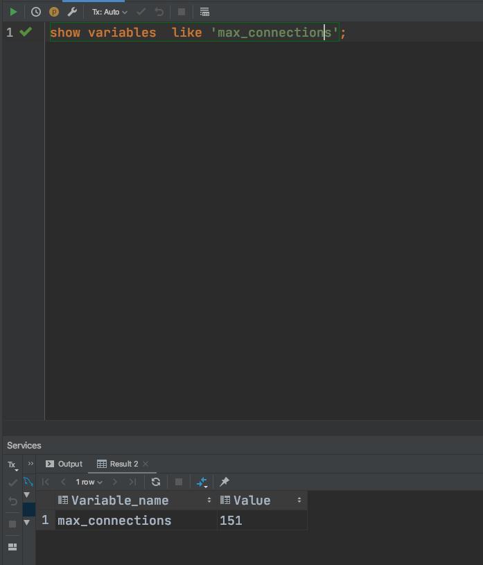

 慢sql：  某一条sql 一直很慢  或者一条sql  偶尔很慢

union 会去重

union all 不会去重

const  主键索引或者唯一索引  并且是等值 常量

Index 代表索引扫描 不用回表

分页页码越大，查询越慢 可以使用主键大小查询

隐式类型转换

//查询链接

Show global status like 'Thread%';

show processlist;

Mysql 默认最大的链接数 

 

 

查询缓存开关：

show variables like 'query_cache%'l

查询优化器：

查询查询优化器的每种方式的耗时，默认关闭状态

 

  线程把buffer pool 写入到DB file

  buffer pool 写满以后 lru  最近最少使用算法

 

如果 修改的数据不在buffer pool 里，会将修改操作写入change buffer， (select  status like '%innodb_buffer_pool%') 得到的是 change buffer 占用 buffer pool 的比例。

 将changebuffer 写入到磁盘，成为merge 操作，merge 触发点为：

log  buffer  脏页（buffer pool中的数据还没有写到磁盘），此时数据库宕机，会将操作写入redo log，

先写日志 ，在存入磁盘

以为  redo log 是顺序io

但是写磁盘  随机io

log  buffer 是 redo log 的内存缓冲区

 

 Undo  log  回滚日志

redo log 重做日志  实现崩溃回复用的

一次更新操作流程：

binglog  以事件的形式记录ddl dml。用来做主从和 数据恢复

 

  redo log 成功，bin log失败 会导致数据不一致，会回滚。

  

 全文索引  是用来处理文本类型，比如 text，varchr 中使用like

 

二叉查找树 查找效率和树的深度有关系，在极端情况下，会退化为一个链表，查找效率变为o(n);

 通过左旋右旋 来保证二叉树平衡

表空调->segent->区 extent-> page(16k)->row

InnodDb 存储引擎的默认页为16K,  os文件系统 默认页为4k

  

 

  

红黑树 得约束是为了保证 从根节点到叶子节点的最长路径不大于最短路径的两倍

一般放在内存中使用，不放在磁盘中使用

索引的类型  hash 和B+ 树

hash 不能用来排序，和范围查询

MyISAM 数据和索引是分开存储的

辅助索引叶子节点为什么不存储具体数据，是因为数据存放的位置是会变的，但是主键不会变

没有聚集索引；

1  不包含null 值得 unique key

2  内置的6个字节点隐藏字段，作为主键 rowid,  select _rowid from t2,自增

在离散度很低的情况，需要扫描的行数还是很大

联合索引最左匹配原则

##### 覆盖索引

select  列表 from  where  已经使用了二级索引并且检索出的结果列包含在二级索引里边了，就不需要在回表了，叫做覆盖索引

##### 索引条件下推

将  索引的过滤在存储引擎过滤的，减小回表的数量，从而减小io操作

数据的过滤是在server层过滤

#### 创建索引

####   != ,<>,not in 能否用到索引

负向查询在有些时候可以用到索引。 

##### 推荐使用递增的id做主键

是为了减小B+数频繁的分裂和合并

 ### 前缀索引

-----------------------

## 事务和锁

修改 和删除 --- 不可重复读

新增-- 幻读

解读不可重复读和幻读：

间隙锁 主要阻塞插入

### 事务隔离级别

Read uncommited  不加锁

查看当前事务

### 

查看锁

查看等待锁

#### 避免死锁发生

连接池的大小设置；

​      

 

维护的连接池越大，维护的线程越多，cpu 上线文切换越频繁

异步复制

半同步复制  安装插件

全同步复制

  

dfsadfasdfsadfsdfsdfasdfasdfsdfsdfsdfwefwe'f'we