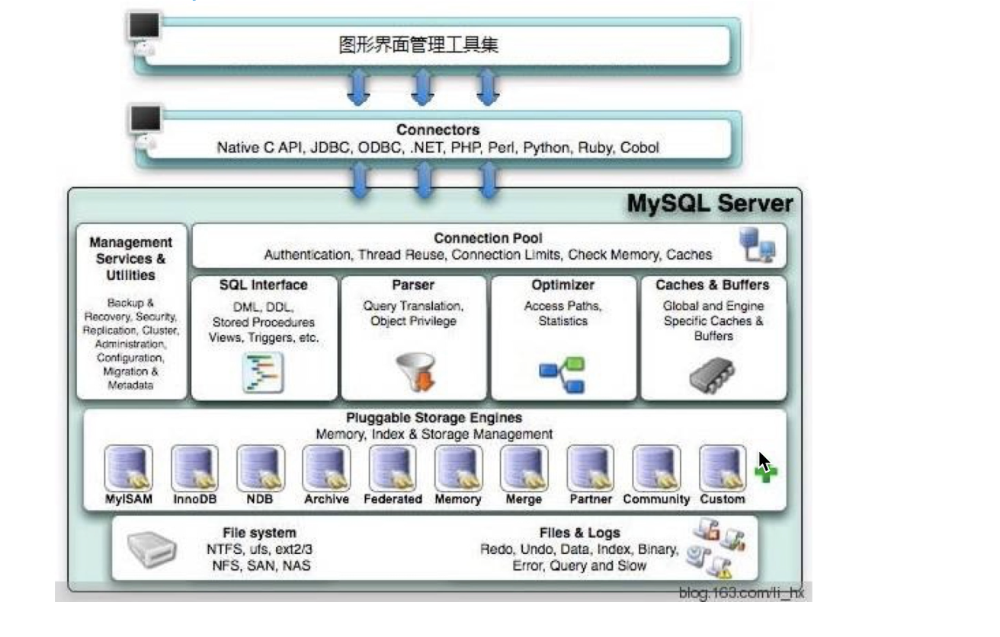

​        局部性原理 按页取值

​    Varchar 存储的是字符，字符有编码格式，编码不同，存储的字节数量不同

  除了blobs 类型外，表里的每一行数据的最大值不能超过65535

 null值判断 is null

一行的数据量过大，超过每页限制，会导致行溢出 ，compact 会存一部分真实数据，和记录下一页的地址

 dynamic 第一个不会存真实数据，只会指向数据的地址

 InnonDb  聚集存储方式  插入数据时候按照索引排序，所以查询出来的时候会按照主键排序，插入排序的目的是为了提高查询效率

MySym  堆表方式

页目录：

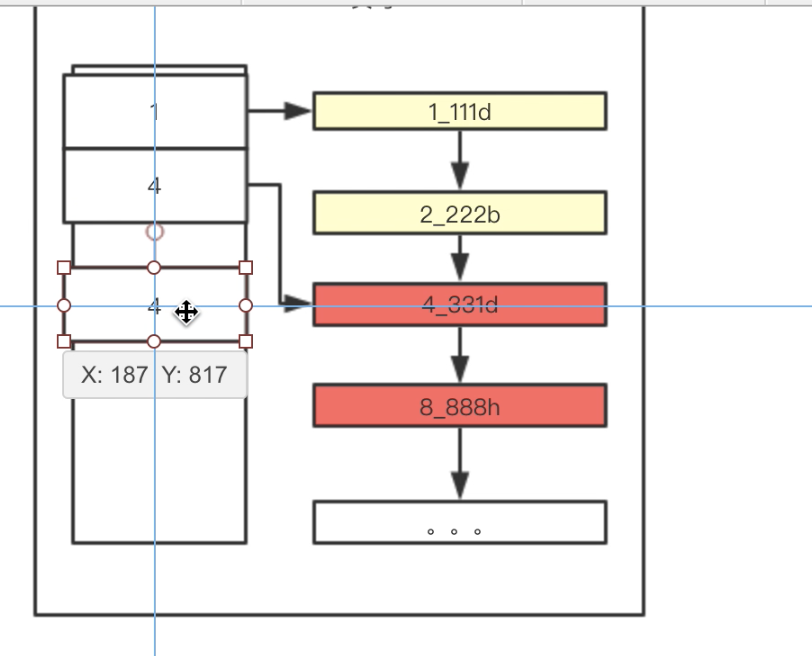

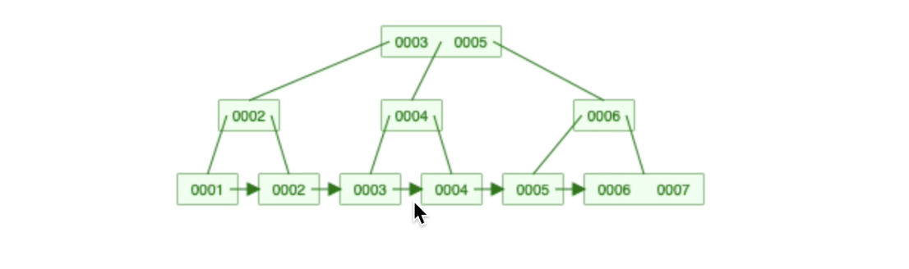

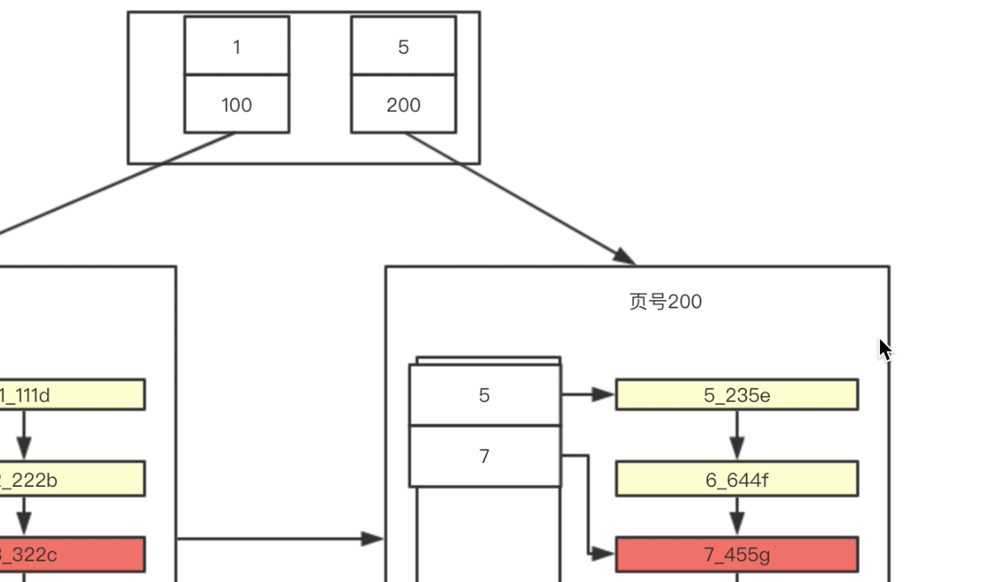

B+ 树叶子节点，存储了表的所有数据

1 节点有多个元素

2 元素有冗余

3 叶子节点有指向

存储数据时候 先放到第一页，如果第一页放不下，会开辟一个新的页，然后复制第一页的数据，然后再开辟新的一页，存入数据，后将第一页数据改为目录页

根页不变

Mysql utf-8   0-3个字节 存储不了符号表情，java里 utf-8 0-4个字节，所以要适用 utf-8mb4 格式存储

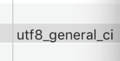

排序规则

主键不建议用很长的字符串原因是1， 字符串排序不定  2 字符串占用 行数据的大小，大致一页存储不了多少条记录

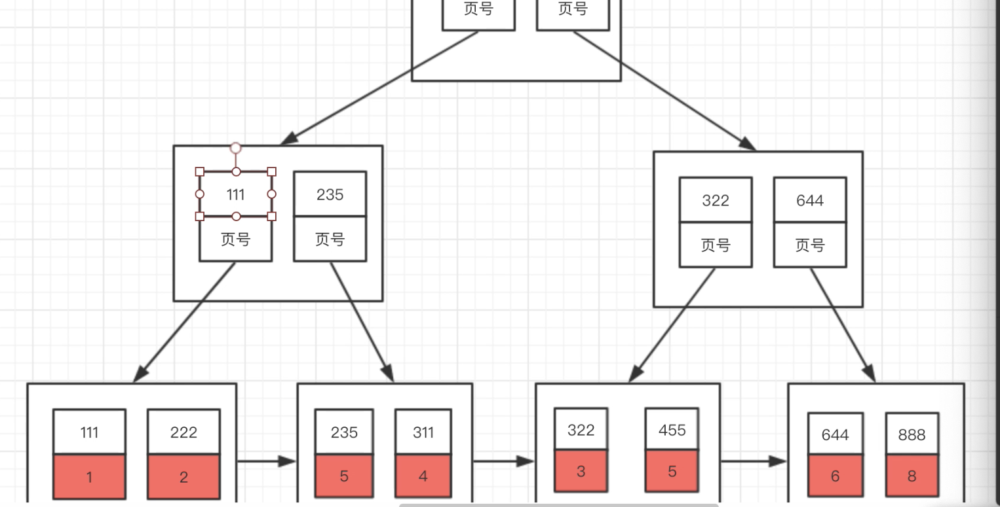

聚簇索引 叶子节点存储的是具体的数据

联合索引 叶子节点存储的是主键值

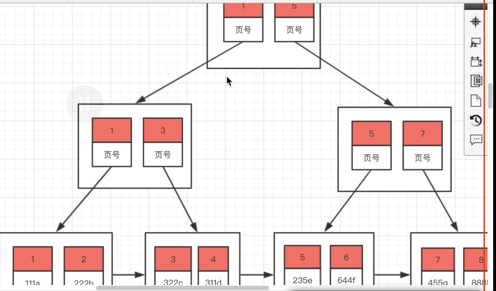 

最左前缀原则

like %101% 不能用到索引

like 101% 可以用到索引

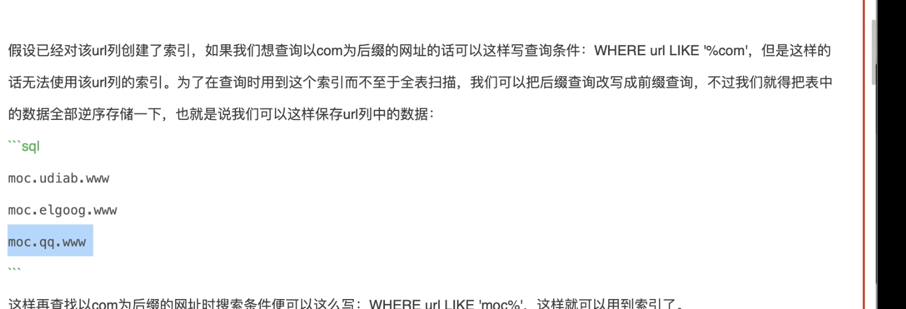

使用联合索引 需要回表到聚集索引 查询数据

通过辅助索引查询出的id 如果大于全表数据的80%，则会直接全表扫描

 为什么 查询遇到范围查询会截断

字符串比较时候，先比较第一个字符，如果第一个字符相同，在比较第二个字符

Group by  排序时候 能用到索引 ，就可以用到索引

 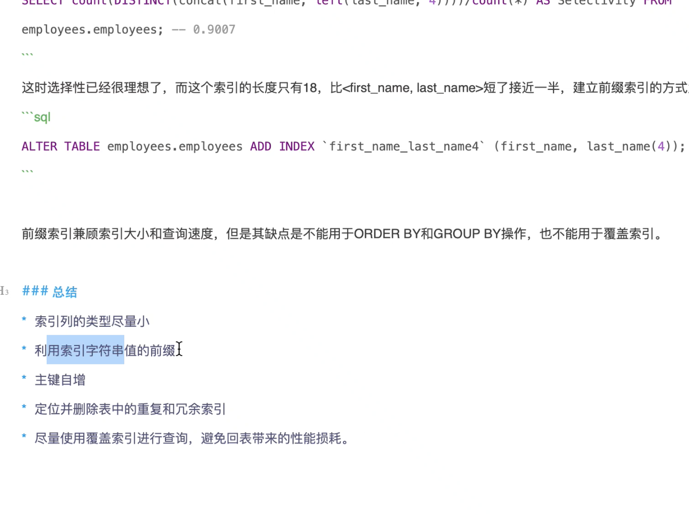

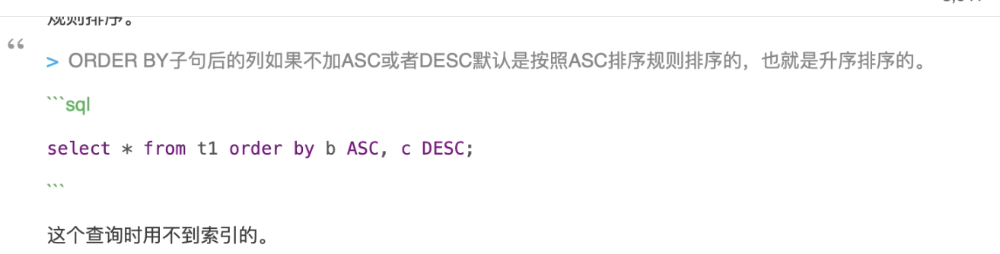

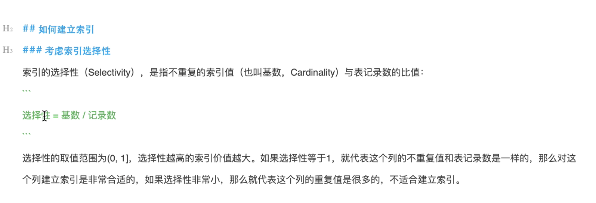

​    select *  from test1 where a>1 or b=11;  分别走索引

   select * from test1 where a>1 and b=11;  只会走一个索引

1. 走主键索引
2.  走全包扫描
3. 走联合索引

查询优化器会优化来决定走哪个索引

打开查询优化器：

  

 执行sql 

查询优化日志；  

