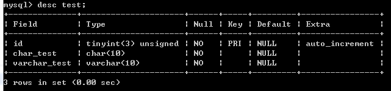
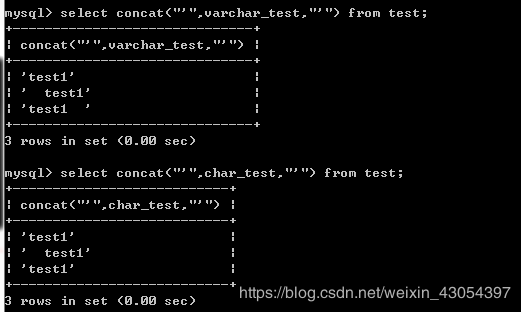

### mysql中char和varchar的区别

------


## 引言

在我们使用MySQl创建数据表结构时， 为了给字符串类型的数据定义数据类型， 一般我们使用的都是 char 或者 varchar ，但使用的过程中，比如模糊查询 ‘like’ 的使用时， 又感受到它们之间的不同， 那么它们到底有什么区别，特性以及适用范围呢？

## 一、char

char ： 定长字符串类型

##### 特点：

1. 存储空间固定。
2. 长度不够时内部存储使用**空格**填充。
3. 若字段本身末尾存在空格，检索出来自动截断末尾空格（因为分不清空格是字段含有的还是填充产生的）。
4. 若字段本身前端存在空格，是不会截断的。

例如： 当定义一个字段类型为 char(10)，插入的值为"abc"这一字符串时，它们占的空间一样是10个字节，因为剩余7个位置被空格填充。

##### 适用情况：

- 适合存储很短的或者长度接近同一个长度的字符串。
- char 比 varchar 在 存取上更具效率， 因为它是固定长度。
- 对于非常短的列，char比varchar在存储空间上也更有效率。

##### 测试：

- 创建表

  ```javascript
  	CREATE TABLE test (
  		id tinyint(3) unsigned NOT NULL AUTO_INCREMENT,
  		username char(10) NOT NULL,
  		PRIMARY KEY (id)
  	) ENGINE=InnoDB AUTO_INCREMENT=4 DEFAULT CHARSET=utf8
  12345
  ```

- 插入数据

  ```javascript
  	INSERT INTO test (username) VALUES('test1'),('test2  '),('test3    ');
  1
  ```

- 查询

  ```javascript
  	SELECT concat("'",username,"'") FROM test;
  1
  ```

  

  注： concat() 为字符串连接函数，类似与C语言中的 strcat() 函数

  所以由上图我们可以看出若字段本身末尾存在空格，检索出来自动截断末尾空格。

  ```javascript
  	INSERT INTO test(username) VALUES('  test1');
  	SELECT concat("'",username,"'") FROM test;
  12
  ```

  

  这里看出若字段本身前端存在空格，是不会截断的。

## 二、varchar

varchar：可变长字符串

##### 特点：

1. 存储空间不固定，根据字段长度决定。
2. 需要额外的1个或2个字节记录字符串的长度，字符串长度小于255字节使用1个字节，否则使用2个。
3. **最大长度**为 65535 字节（这里单位是字节而非字符)
4. 如果列可以为null，则需要额外的一个字节作为标志。
5. 最大长度 = 字段长度 + [长度记录：(1或2) B] + [null标志位：1B]

例如： 当定义一个字段类型为 varchar(10)，插入的值为"abc"这一字符串时，那么实际存储大小为3个字节，除此之外，varchar还需要使用1个额外字节（因为‘abc’字节数＜255）来记录字符串的长度。

##### 适用情况：

- 字符串列的最大长度比平均长度大很多。
- 使用了像 utf-8 这样复杂的字符集，每个字符都是用不同的字节数存储。

## 三、区别

- 取数据的时候，char类型会去掉末尾多余的空格，而varchar是不会的。
- 时间与空间效率
  - char的存取数度要比varchar要快得多
  - varchar 空间利用率要比char 更充分
- 存储方式：
  - char的存储方式是，对英文字符（ASCII）占用1个字节，对一个汉字占用两个字节
  - varchar的存储方式是，对每个英文字符占用2个字节，汉字也占用2个字节。
  - 两者的存储数据都非unicode的字符数据。

测试：

- 修改上面的test，使其具有char 和varchar 字段

```javascript
   ALTER TABLE test ADD varchar_test varchar(10) not null;  //添加字段
   ALTER TABLE test CHANGE username char_test varchar(10) not null;  /修改字段名
12
```



- 先清空表

  ```javascript
  	TRUNCATE test;
  1
  ```

- 插入数据

  ```javascript
  	INSERT INTO test(char_test, varchar_test) VALUES
  	('test1', 'test1'),
  	('  test1', '  test1'),
  	('test1  ', 'test1  ');
  1234
  ```

  

- 开始查询

  ```javascript
  	SELECT concat("'",varchar_test,"'") FROM test;
  	SELECT concat("'",char_test,"'") FROM test;
  
  ```


由图中可以看出 取数据的时候，char类型会去掉末尾多余的空格，而varchar是不会的。


所以，从空间上考虑，varcahr较合适；从效率上考虑，用char合适。如何使用，还需要根据实际情况查询