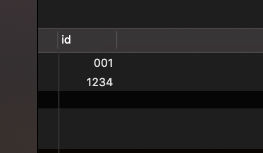

#### mysql 中字段指定的长度

> 在mysql中，创建表的时候需要指定字段的length值，那么不同类型的字段，length是否都代码的是字段的最大长度呢？


1.  CHAR、VARCAHR的长度是指字符的长度，例如CHAR[3]则只能放字符串"123"，如果插入数据"1234",则会—(报1406 - Data too long for column 'name' at row 1） VARCAHR同理。

2. TINYINT、SMALLINT、MEDIUMINT、INT和BIGINT的长度，其实和数据的大小无关！Length指的是显示宽度。

   举例如下:

   ````
   create table test(id int(3) zerofill);
   insert into test(id) values(1),(1234);
   select * from test;
   ````

   结果为：

   

   

​    可以看到当字段值为int类型并指定了长度为3 和zerofill属性时候，在读取数据时候，如果长度不够3位，则从做左到右填充为0。如果没有zerofill ，怎没有这样的效果。


3.  float,double和decimal类型的长度指的是全部数据位数(包含小数)，例如decimal(4,1)就表示全部数据位数为4位，小数1位。如果插入1234.9 ，则会报错。

   例如：

     ```
   alter table test add realnum decimal(4,1);
   insert into test(id,realnum) values(2,123.1);
   insert into test(id,realnum) values(2,1234);
   
   select * from test
     ```

在执行第一条insert时候成功，第二个insert则会报错。