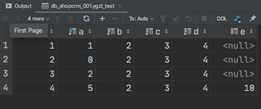
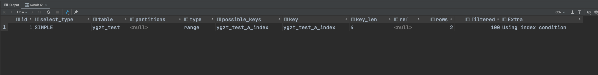
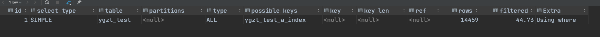
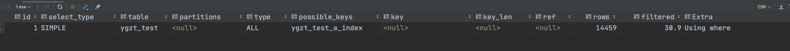
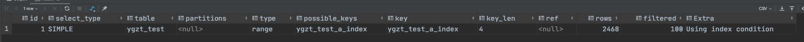
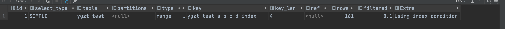
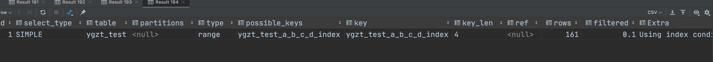
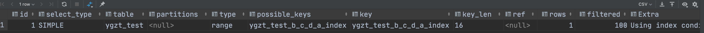
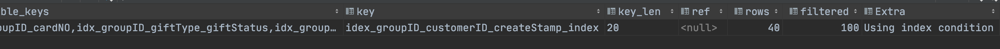
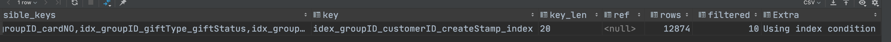

# Mysql 中范围查询 使用索引问题


### 建表语句：

```sql
create table db_shopcrm_001.ygzt_test
(
    id bigint unsigned auto_increment
        primary key,
    a  int not null,
    b  int not null,
    c  int not null,
    d  int not null,
    e  int null
)
    comment '测试' collate = utf8_unicode_ci;

create index ygzt_test_a_index
    on db_shopcrm_001.ygzt_test (a);


```


## 一. 单列索引


插入五条记录：




查询语句：

```sql
explain select * from  ygzt_test where a > 1; //结果为4条
```

结果：



可以看到使用了 range，对应的索引为ygzt_test_a_index。


插入10000条数据后，再次explain 结果：

```
explain select * from  ygzt_test where a > 1;//结果为14000条
```





修改查询语句：

```sql
explain select * from  ygzt_test where a > 10000;  //实际结果应为4300 条
```




继续修改查询语句：

```
explain select * from  ygzt_test where a >12000; //实际结果为2300条
```



可以看到使用了索引。


### 总结 (https://blog.csdn.net/varyall/article/details/82222474)

​      mysql 是否根据首次索引条件查询出的主键进行二次查找，也是要看查询出来的数据量级，如果数据量接近全表数据量的话，就会进行全表扫描，否则根据第一次查询出来的主键进行二次查询。


##  二.  组合索引

#### 1. 修改表的索引：

```sql
create index ygzt_test_a_b_c_d_index
	on ygzt_test (a, b, c, d);

drop index ygzt_test_a_index on ygzt_test;

explain select * from  ygzt_test where  a>1000 and  b=2  and d=4 and c=3   ;


```




调整顺序后：

```
explain select * from  ygzt_test where   b=2  and c=3 and d=4  and a >1000  ;
```




修改索引顺序为 b,c,d,a：

```
explain select * from  ygzt_test where  a>1000 and  b=2  and c=4 and d=3   ;
```




#### 二 

```sql
-- auto-generated definition
create table tbl_crm_customer_giftDetail
(
    itemID             bigint                                       not null comment '记录ID'
        primary key,
    userID             bigint         default 0                     not null comment '用户ID',
    customerID         bigint         default 0                     not null comment '人信息ID',
    cardID             bigint         default 0                     not null comment '会员ID',
    userInfo           varchar(1000)  default ''                    not null comment '用户信息Json格式  用户登录名，用户姓名，性别，手机号码，邮箱，头像图片路径，昵称',
    groupID            bigint         default 0                     not null comment '集团ID',
    groupName          varchar(100)   default ''                    not null comment '礼品名称',
    sysItemID          bigint         default 0                     not null comment '积分兑换明细itemID 或中奖明细itemID',
    eventItemID        bigint         default 0                     not null comment '活动记录ID',
    getWay             int            default 0                     not null comment '10：消费返券（2101）   20：商家摇奖（2102） 30:积分摇奖  40：积分兑换  50：订单抽奖 60：免费领取（2103）61：消费分享红包 62: 营销红包 70：商家赠送 （2104） 71：会员推荐奖励  80：商家支付（2105）  90：商家卖出（2106）, ''91'': ''会员摇奖'',''92'': ''免费领取'',''93'': ''积分兑换'',''94'': ''参与活动'',''95'': ''有奖竞猜'',''96'': ''套餐充值'',''97'': ''会员开卡送礼品'',''98'': ''会员生日赠送'',99：群发礼品,''100'': ''批量导入''  101:购买权益包 102:消费赠送',
    getRemark          varchar(250)   default ''                    null comment '获取描述',
    transID            bigint         default 0                     not null comment '挂单交易ID',
    transName          varchar(200)   default ''                    not null comment '用于挂单的礼品名称',
    voucherOrderkey    varchar(50)    default ''                    not null comment '用户购买时候的代金券所属订单KEY',
    giftItemID         bigint         default 0                     not null comment '礼品记录ID',
    giftName           varchar(100)   default ''                    not null comment '礼品名称',
    recirculable       tinyint        default 0                     not null comment '可流转（挂单）标志（0不能，1可以）',
    recirculeTimes     tinyint        default 0                     not null comment '流转次数',
    giftType           tinyint        default 10                    not null comment '礼品类型  10：商家代金券（电子礼品） 11：商家现金券（电子礼品） 12：商家抵扣券（电子礼品） 20：商家赠送菜品或套餐（电子礼品） 30：商家实物礼品  以上为groupID<>0时可选 50：平台点券（电子礼品） 52：平台返利（电子礼品） 60：平台定向代金券（电子礼品） 70：平台实物礼品  以上为groupID=0是可选',
    giftValue          decimal(12, 2) default 0.00                  not null comment '礼品数值或价值（电子礼品有效）',
    voucherPrice       decimal(12, 2) default 0.00                  not null comment '券购买价',
    EGiftEffectTime    bigint         default 0                     not null comment '生效时间（yyyyMMddHHssnn) 默认为0表示立即生效，有时间则要求在此时间后才能使用',
    validUntilDate     bigint         default 0                     not null comment '截止日期（有效期）',
    usingCityIDs       varchar(1000)  default '0'                   not null comment '可使用城市列表',
    supportOrderType   tinyint        default 2                     not null comment '促销或送适用的业务类型 0:堂食（常规预订+闪吃预订） 1：外送/自提  2：全部',
    isHolidaysUsing    tinyint        default 0                     not null comment '节假日使用限制（电子礼品有效）  0：不限制  1：非法定节假日,2.仅法定节假日',
    usingTimeType      varchar(30)    default '1,2,3,4,5'           not null comment '使用时段限制（电子礼品有效）  1：早餐   2：午餐   3：下午茶   4：晚餐   5：夜宵  例如：2,4表示午餐晚餐均能使用',
    isSameTimeUsing    tinyint        default 0                     not null comment '是否能与其它优惠同时使用（电子礼品有效）  0：不能与其他礼品同时使用  1：能与其他礼品同时使用',
    isOfflineCanUsing  tinyint        default 0                     not null comment '是否支持线下使用（电子礼品有效）',
    moneyLimitType     tinyint        default 0                     not null comment '消费金额限制类型（0：不限  1：每满  2：满）',
    moenyLimitValue    int            default 100                   not null comment '消费金额限制（默认为100元，此值必须大于0）',
    foodScope          tinyint        default 0                     not null comment ' 菜谱范围限制（0：不限  1 ： 仅可打折菜品）',
    foodNameList       varchar(6000)  default ''                    not null comment '菜品名称列表',
    isFoodCatNameList  tinyint        default 0                     not null comment '是否是分类名称【只用于菜品优惠券】',
    cardTransID        bigint         default 0                     not null comment '卡交易ID',
    usingCardID        bigint         default 0                     not null comment '使用礼品的cardID',
    usingTime          bigint         default 0                     not null comment '使用时间',
    usingShopID        int(20)        default 0                     not null comment '使用店铺ID',
    usingShopName      varchar(50)    default ''                    not null comment '使用店铺名称',
    sendShopID         bigint         default 0                     not null comment '赠送店铺ID',
    sendShopName       varchar(50)    default ''                    not null comment '赠送店铺名称',
    shareType          tinyint        default 0                     not null comment '优惠共享：0，不共享，1，与店铺线上优惠共享，2，与会员优惠共享，3，两种优惠都共享',
    usingRemark        varchar(150)   default ''                    not null comment '使用说明',
    moneyPayValue      decimal(10, 2) default 0.00                  not null comment '拉动现金卡值消费',
    givePayValue       decimal(10, 2) default 0.00                  not null comment '拉动赠送卡值消费',
    pointPayValue      decimal(10, 2) default 0.00                  not null comment '拉动积分消费',
    cashPayValue       decimal(10, 2) default 0.00                  not null comment '拉动现金消费',
    usingOrderKey      varchar(50)    default ''                    not null comment '使用时的订单Key',
    giftStatus         tinyint        default 1                     not null comment '礼品状态  1：可使用  2：已使用  3：已过期 4：已退订  11：已制卡 12：已售出 13：已作废 99:已删除',
    giftTransStatus    tinyint        default 0                     not null comment '挂单交易状态  0：非挂单交易状态  1：挂单交易状态 （只用券的挂单交易状态为0时，才能使用）',
    giftPWD            varchar(50)    default ''                    not null comment '券密码，用于线下消费验证',
    giftGroupTempPWD   varchar(50)    default ''                    not null comment '券组合使用临时密码',
    timeMillis         bigint         default 0                     not null comment '流转时间毫秒数',
    createTime         bigint         default 0                     not null comment '记录的创建时间',
    cardNO             varchar(80)    default '0'                   not null comment '礼品卡号',
    batchID            bigint         default 0                     not null comment '批次ID',
    batchNO            varchar(100)   default '0'                   not null comment '批次号',
    price              decimal(12, 2) default 0.00                  not null comment '建议售价',
    createBy           varchar(500)   default ''                    not null comment '创建人',
    seller             varchar(500)   default ''                    not null comment '销售人',
    sellTime           bigint         default 0                     not null comment '售出时间',
    payWayCode         varchar(200)   default '0'                   not null comment '支付方式编码',
    payWayName         varchar(50)    default ''                    not null comment '支付方式名称',
    useCardLevelID     bigint         default 0                     not null,
    operateRemark      varchar(2000)  default ''                    not null,
    rechargeToCardID   bigint         default 0                     not null comment '充值到CardID',
    rechargeToCardNO   varchar(80)    default ''                    not null comment '充值到CardNO',
    rechargeTime       bigint         default 0                     not null comment '充值时间',
    actionStamp        timestamp      default CURRENT_TIMESTAMP     not null on update CURRENT_TIMESTAMP comment '记录更新时间',
    createStamp        timestamp      default '0000-00-00 00:00:00' not null,
    isNeedCustomerInfo tinyint        default 0                     not null comment '是否需要客户信息 默认 0:不需要 1:需要',
    linkOrderNo        varchar(50)    default ''                    not null comment '核销时关联的账单号',
    subGroupID         bigint         default 0                     not null
)
    comment '用户礼品关联表';

create index idex_groupID_customerID_createStamp_index
    on tbl_crm_customer_giftDetail (groupID, customerID, createStamp);

create index idx_actionStamp
    on tbl_crm_customer_giftDetail (actionStamp);

create index idx_batchID
    on tbl_crm_customer_giftDetail (batchID);

create index idx_cardID_giftItemID_customerID
    on tbl_crm_customer_giftDetail (cardID, giftItemID, customerID);

create index idx_cardTransID
    on tbl_crm_customer_giftDetail (cardTransID);

create index idx_groupID_cardNO
    on tbl_crm_customer_giftDetail (groupID, cardNO);

create index idx_groupID_eventID
    on tbl_crm_customer_giftDetail (groupID, eventItemID);

create index idx_groupID_giftItemID_customerID
    on tbl_crm_customer_giftDetail (groupID, giftItemID, customerID);

create index idx_groupID_giftPWD
    on tbl_crm_customer_giftDetail (groupID, giftPWD);

create index idx_groupID_giftType_giftStatus
    on tbl_crm_customer_giftDetail (groupID, giftType, giftStatus);

create index idx_groupID_validUntilDate_giftStatus
    on tbl_crm_customer_giftDetail (groupID, validUntilDate, giftStatus);

create index idx_usingCardID
    on tbl_crm_customer_giftDetail (usingCardID);


```


查询语句：

```sql
explain  select * from tbl_crm_customer_giftDetail where  groupID=11157 AND createStamp between  '2020-08-10 00:00:00' and '2020-08-20 00:00:00' and customerID=6831500012422171541  ;

```



修改索引

```
drop index idex_groupID_customerID_createStamp_index on tbl_crm_customer_giftDetail;

create index idex_groupID_customerID_createStamp_index
	on tbl_crm_customer_giftDetail (groupID, createStamp, customerID);

explain  select * from tbl_crm_customer_giftDetail where  groupID=11157 AND createStamp between  '2020-08-10 00:00:00' and '2020-08-20 00:00:00' and customerID=6831500012422171541  ;
```




## 总结

### 建索引的几大原则

- 1.最左前缀匹配原则，非常重要的原则，
  - mysql会一直向右匹配直到遇到范围查询(>、<、between、like)就停止匹配，
  - 比如a = 1 and b = 2 and c > 3 and d = 4
    - 如果建立(a,b,c,d)顺序的索引，d是用不到索引的，
    - 如果建立(a,b,d,c)的索引则都可以用到，a,b,d的顺序可以任意调整（建立索引时他们三个的顺序）
- 2.=和in可以乱序，
  - 比如a = 1 and b = 2 and c = 3 建立(a,b,c)索引**可以任意顺序**，
  - mysql的查询优化器会帮你优化成索引可以识别的形式。
- 3.尽量选择区分度高的列作为索引，
  - 区分度的公式是count(distinct col)/count(*)，表示字段不重复的比例，
    - 比例越大我们扫描的记录数越少，唯一键的区分度是1，
    - 而一些状态、性别字段可能在大数据面前区分度就是0，
    - 那可能有人会问，这个比例有什么经验值吗？
      - 使用场景不同，这个值也很难确定，一般需要join的字段我们都要求是0.1以上，即平均1条扫描10条记录。
- 4.**索引列不能参与计算，保持列“干净”**，
  - 比如from_unixtime(create_time) = ’2014-05-29’就不能使用到索引，
  - 原因很简单，b+树中存的都是数据表中的字段值，但进行检索时，需要把所有元素都**应用函数才能比较，显然成本太大**。
    - 所以语句应该写成create_time = unix_timestamp(’2014-05-29’)
- 5.尽量的扩展索引，不要新建索引。
  - 比如表中已经有a的索引，现在要加(a,b)的索引，那么只需要修改原来的索引即可。