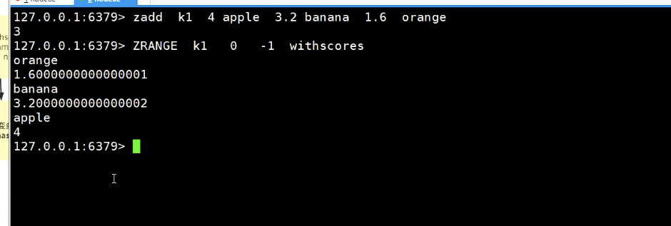
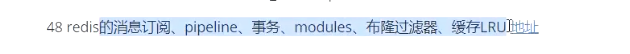

 

set  去重 无序

随机返回集合

正数 不会重复

负数 会重复

场景： 抽奖 随机事件

场景：

 1共同好友，推荐游戏

zset

默认从小到大

从大到小

OBJECT encoding 可以查看redis  每种数据类型内部存储的类型

zset 内部接口

ziplist，skiplist （最高层 64层）

aof 重写

开启aof 会断掉 rdb

redis 4.x 以后 可以采用混合模式

redis 默认 是弱一致性

paxos

cp ap  脑裂

codis  代理算法

