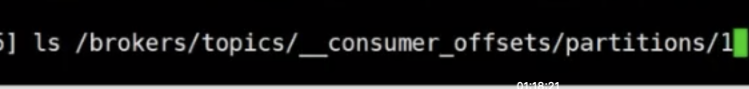

batchsize  设置批量发送大小

 Linger.ms 两次间隔时间

消费offset：  earlist  消费最早的消息

 

## offset  维护在哪里

老的版本维护在zk

新的版本维护在kafka里

/tmp/kafka-logs

##### 当前的消费者消费到哪里

 

自动提交 间隔时间越长，每个多少秒提交一下，如果取到数据后，消费者挂掉，此时还没有提交，导致消费者重启后，会重复消费

可以关闭自动提交，可通过consumer。commitSync同步提交，也可  consume.commit 异步提交

### 副本机制

副本数是有限制的，不能超过broker 的数量

每个broker上都有topic 的副本

#### 副本同步

isr  优质副本集

### 消息传播

HW  higth water  表述 数据在所有副本都同步了

LEO  log end offset  

remote leo  远程leo 副本的Leo

 ack 的值

# 数据丢失问题

