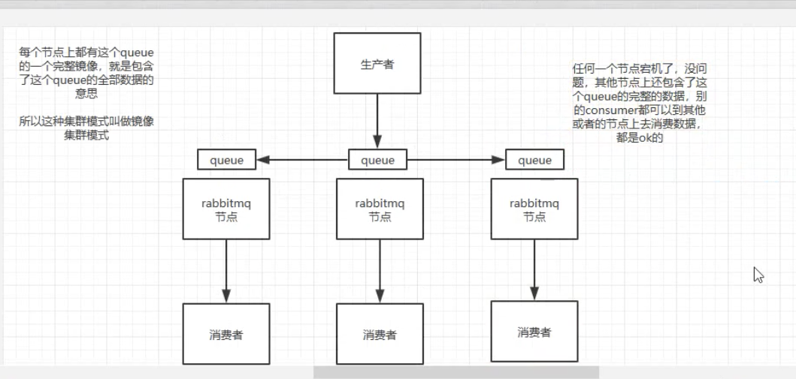
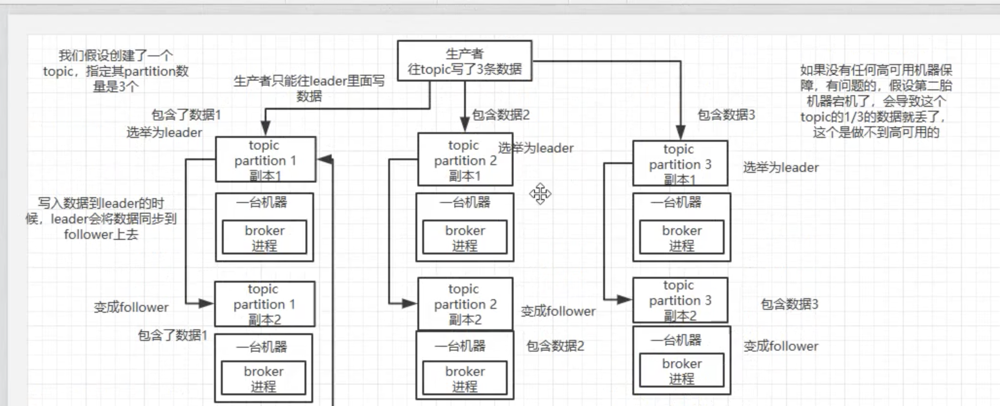

 ### rabbitmq 面试

解耦，异步，削峰


名词  

生产者，broker，exchange，queue，routingkey 消费者，


消息持久化: 

​    交换机持久化： 交换机类型（  direct  直连  topic 发布订阅，fanout 广播模式），是否持久化

​    队列类型:  是否持久化，是否排他队列，autoDelete （消费者断开后，自动删除 ）

   消费者消息持久化： BasicProperties - deliveryMode  2 持久化


TTL: 多久没有消费，消费就会过期

1. 队列ttl，设置队列的x-message-ttl
2. 单条消息的ttl  设置消息的 expiraction

通知指定了ttl，小的生效


死信队列：

​       死信交换机绑定的队列称为死信队列，

​     消息过期，消息被消费者拒绝消费，队列达到了最大长度（消息数量，字节数）消息会变为死信，消费者最终监听的是死信队列


延迟队列：

​        死信队列  或者 rabbit-delay-message-exchange 插件

​         死信队列实现延迟队列缺点：  

                 1. 用队列小设置ttl，需要设置很多个队列，5分钟，10分钟
                    2.  单条消息设置ttl，第一条10min，第二条 2min。如果第一条没有消费，第二条到期后，也不会消费。

​         rabbit-delay-message-exchange 实现延迟队列：

​        是通过延迟投递实现的， 


服务端流控：

​       x-max-length  服务端最大消息数量，超过后，队列头消费会被丢弃

​      x-max-length-bytes： 队列中存储的最大消息容量，超过这个容量会被丢弃。

​    

​      内存控制：

   1. vm_memory_high_watermark  使用内存超过40% ，会告警，并阻塞链接

   2. 磁盘控制，磁盘空间低于指定值，触发流控

   3. disk_free_limit.relative = 3.0

      disk_free_limit.absolute = 2GB


消费端限流：

1.  生产者生产数据过多，大量发给消费者，会导致消费者消费不过来，造成消费者压力，可以通过设置channel 最大unack 的数量，超过这个数据的消费没有ack，rabbitmq 就停止给消费者投递消息

​         channel 的 prefetch count 设置为 5。当消费者有 5 条消息没有给 Broker 发送 ACK 后，RabbitMQ 不再给这个消费者投递消息。


可靠性投递：

1. 生产者怎么知道消息发送到了broker （事务，confirm）

   服务端确认机制：  生产者发送消费给rabbitmq，服务端会返回一个应答，生产者收到应答，就知道消息发送成功

     事务 

     方式： channel.txSelect,channel.txCommit,channel.txRollBack

     缺点： 阻塞，一条消息没有发送完成，不能发送另一条消息

    confirm：

      设置confirmCallBack，channel.confirselect 。  

   1. 普通模式    channel.waitForConfirms()

   2. 批量确认： channel.waitForConfirmsOrDie();

   3. 异步确认：

      ```
      rabbitTemplate.setConfirmCallback(new RabbitTemplate.ConfirmCallback() {
      
      @Override
      
      public void confirm(CorrelationData correlationData, boolean ack, String cause) {
      
      if (!ack) {
      
      System.out.println("
      
      发送消息失败："
      
      + cause);
      
      throw new RuntimeException(" 发送异常：" + cause);
      
      }
      
      }
      
      });
      ```

      

2. exchange没有路由到queue 

      **mandatory**
   当mandatory标志位设置为true时，如果exchange根据自身类型和消息routeKey无法找到一个符合条件的queue，那么会调用basic.return方法将消息返回给生产者（Basic.Return + Content-Header + Content-Body）；当mandatory设置为false时，出现上述情形broker会直接将消息扔掉。

   

   **immediate**
   当immediate标志位设置为true时，如果exchange在将消息路由到queue(s)时发现对于的queue上么有消费者，那么这条消息不会放入队列中。当与消息routeKey关联的所有queue（一个或者多个）都没有消费者时，该消息会通过basic.return方法返还给生产者。

   概括来说，mandatory标志告诉服务器至少将该消息route到一个队列中，否则将消息返还给生产者；immediate标志告诉服务器如果该消息关联的queue上有消费者，则马上将消息投递给它，如果所有queue都没有消费者，直接把消息返还给生产者，不用将消息入队列等待消费者了。。

     使用 mandatory 参数和 ReturnListener

   ```
   rabbitTemplate.setMandatory(true);
   
   rabbitTemplate.setReturnCallback(new RabbitTemplate.ReturnCallback(){
   
   6 咕泡出品，必属精品 www.gupaoedu.com
   
   public void returnedMessage(Message message,
   
   int replyCode,
   
   String replyText,
   
   String exchange,
   
   String routingKey){
   
   System.out.println(" 回发的消息：" );
   
   System.out.println("replyCode: "+replyCode);
   
   System.out.println("replyText: "+replyText);
   
   System.out.println("exchange: "+exchange);
   
   System.out.println("routingKey: "+routingKey);
   
   }
   
   });
   ```

   

3. queue中消息丢失

    持久化 ，交换机，队列，消息（messageproperty）

   

4. 消费者订阅queue,并消费消息，broker怎么知道

    手动ack：如果忘记ack，断开链接后，会重新投递

    自动ack：

​       


​     上边的情况，消费会为read 状态

​    如过没有收到ack，并且消费者没有断开链接，此时消息为unack状态，消费者重启后会继续消费


 重复消费问题：

1.  生产者问题，confirm，未收到确认，消费者重复投递
2. 消费者手动ack，但是没有发送ack消息，导致消息重复投递

顺序消费：

​    一个队列只有一个消费者


优先级队列：

   队列优先级 和消息本身优先级


引入mq的缺点：

1. 系统可用性降低  mq 出问题，导致系统崩溃，复杂度变高
2.  消息重复和消息丢失和顺序消费

3.  消费者挂掉，导致消息积压


### 队列消息选型

Rabbitmq 吞吐量万级，erlang 性能好，社区比较活跃，mq功能完备


Rocketmq：单机吞吐量10w 


### mq 高可用

#### rabbitmq 高可用：

  单机模式：  

  普通集群模式：

​      


 好处： 提供吞吐量

 缺点： 在rabbitmq 集群里布产生大量数据传输

​             几乎没有 保障，queue所在节点宕机，queue数据丢失，没办法消费

   

  镜像模式：

          


 不是分布式的，如果queue数据量很大，大到这个机器上容量无法容纳，此时改怎么办


### kafka 高可用

 分布式

  


### 消息队列重复

如何保证消息不被重复消费 （保证消息幂等）？


kafka 消费端重复消费问题：


幂等性保障：

1.  分布式set
2. 数据库唯一键


### 数据丢失


rabbitmq

保证消息可靠传输

生产者消息不丢失 （事务，confirm）

消费者 关闭 autoack


kafka

消费者 自动提交offset

kafaka leader 宕机，切换flow导致数据不一致


### 顺序消费


rabbitmq：  一个queue 一个concumer

kafaka：


### 生产环境消息积压


为什么不直接用原来的rabbitmq

​     原来的mq 压力太大，然后采用先缓充再并发消费


