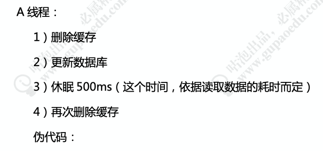

###  redis 单线程模型

#### 2  redis 过期策略

 redis 对于过期的key 删除策略是 定期删除 + 惰性删除

 

### 手写lru

   linkhashmap   accessOrder = true, 按照访问顺序排序，然后重写removeEldestEntry，判断size 大于 容量

### redis 高可用

   主从同步：

​     步骤 一 全量复制

​       master  node 第一次全量复制，同步bgsvae，生成rdb 快照，把rdb快照文件发给slave，如果生成rdb期间，master接收到了命令，master会把命令写到缓冲区，在slave 保存了RDB后，再把命令复制给slave node。

  步骤二  命令传播

   master node 持续将写命令，异步复制给 slave node，会有延迟问题。

  主从切换过程中会丢失数据

  哨兵模式：

​       哨兵即监控所有的redis服务，哨兵之间也相互监听

​       

​    故障转移 和leader 选举 

### redis 分布式方案

​     代理服务：  codis ， codis 需要集群部署，主备切换，key 计算到曹，曹对应的redis

​     服务端实现： 一致性hash算法

### redis 一致性

   先删除，在跟新：

  

  ### 布隆过滤器

​    

