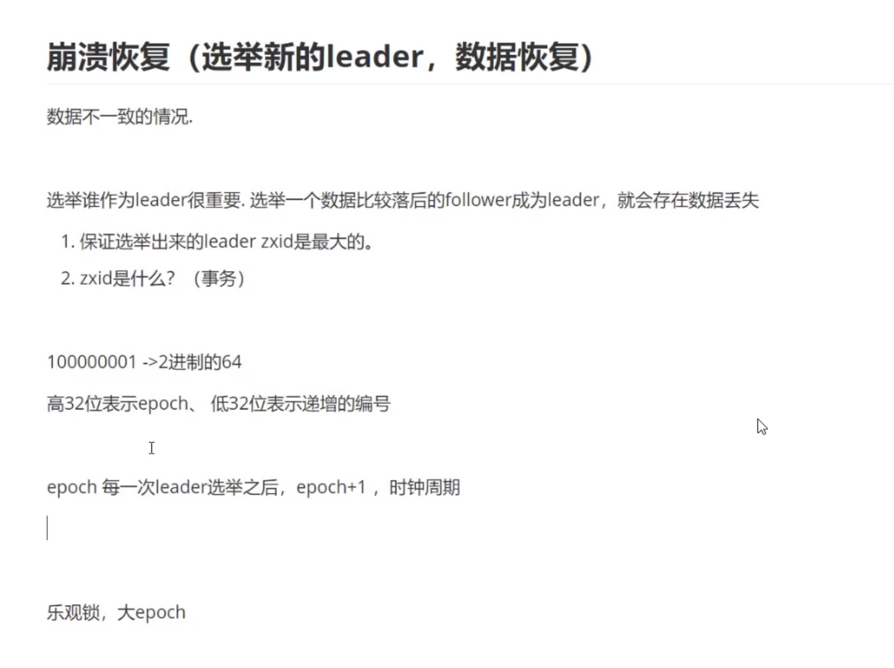

zookeeper 分布式协调组件

### 分布式一致性问题

惊群效应

master 选举 一致性算法

leader 选举 和数据同步都需要投票

为了提升读的性能，增加了observer，observer不参与投票，只同步数据

授权 只针对当前会话里授权的

### node 事件

### 分布式锁

### zab协议

两阶段提交

zab解决了  崩溃恢复  和 原子广播

### 一致性

顺序一致性

