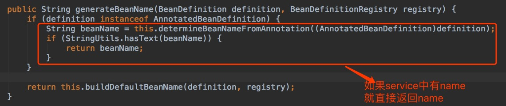
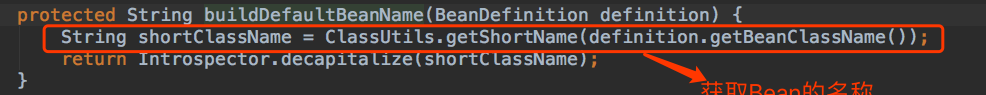
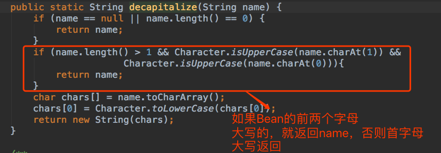

## Spring Bean 默认名称生成规则

> 在Spring中如果@Service 没有指定name属性，则spring会按照自己的规则默认生成Bean的name

---
Spring 默认Bean的名称生成规则为：

```
AnnotationBeanNameGenerator
```

具体流程：
1  调动## Spring Bean 默认名称生成规则

> 在Spring中如果@Service 没有指定name属性，则spring会按照自己的规则默认生成Bean的name

---
Spring 默认Bean的名称生成规则为：

```
AnnotationBeanNameGenerator
```
---
具体流程：

1. 调用generateBeanName 方法
     

2. 如果@Service注解没有设置名称,

     

​       

  

---
#### 总结：
   如果在配置Bean的时候（xml，注解形式）,没有指定bean的名称。Spring会默认给Bean指定一个名称，规则为，如果Bean的类名称前两个字母大写，那么bean的类型，就是Bean的名称，如果不是，则Bean的类型首字母小写，就是Bean的name。
