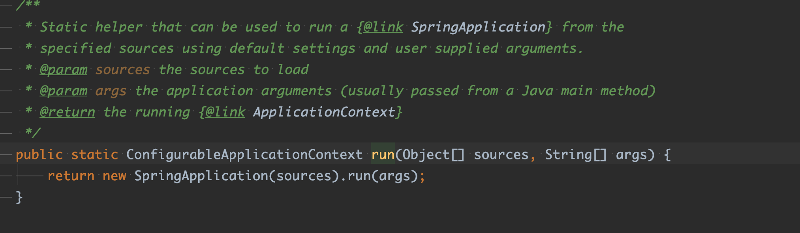
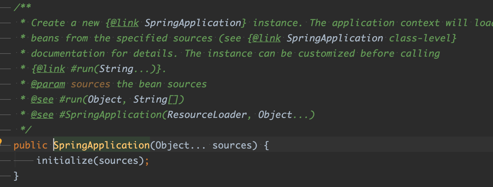
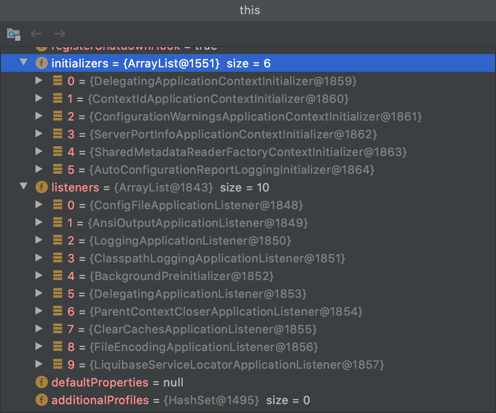
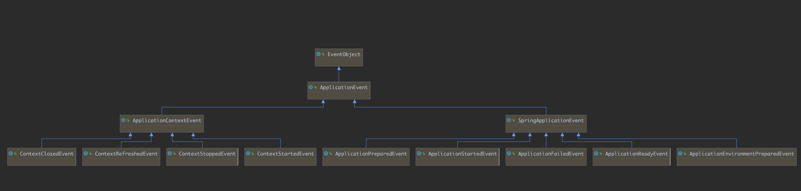

### spring-boot 启动过程分析

## 1. SpringApplication.java 中

在main方法中调用SpringApplication的run方法



初始化SpringApplication



````java
@SuppressWarnings({ "unchecked", "rawtypes" })
	private void initialize(Object[] sources) {
		if (sources != null && sources.length > 0) {
			this.sources.addAll(Arrays.asList(sources));
		}
    // 判断是否是web环境
		this.webEnvironment = deduceWebEnvironment();
    //从fav文件里获取初始化的类
		setInitializers((Collection) getSpringFactoriesInstances(ApplicationContextInitializer.class));
    // 从fav文件里获取listen        
		setListeners((Collection) getSpringFactoriesInstances(ApplicationListener.class));
    // 推断出main
		this.mainApplicationClass = deduceMainApplicationClass();
	}
````

   1. deduceWebEnvironment()方法主要是判断在classload 下是否有 javax.servlet.Servlet  和  org.springframework.web.context.ConfigurableWebApplicationContext 

      如果有 则认为是web环境，否则就不是web环境。

```java
private boolean deduceWebEnvironment() {
   for (String className : WEB_ENVIRONMENT_CLASSES) {
      if (!ClassUtils.isPresent(className, null)) {
         return false;
      }
   }
   return true;
}

	private static final String[] WEB_ENVIRONMENT_CLASSES = { "javax.servlet.Servlet",
			"org.springframework.web.context.ConfigurableWebApplicationContext" };
```


2.  	setInitializers((Collection) getSpringFactoriesInstances(ApplicationContextInitializer.class))

   从 META-INF/spring.factories 文件中加载并初始化 实现 ApplicationContextInitializer 的类，并赋值给 SpringApplication. initializers

   

3. ​	setListeners((Collection) getSpringFactoriesInstances(ApplicationListener.class)) 

   从 META-INF/spring.factories 文件中加载并初始化 实现 ApplicationListener 的类，并赋值给 SpringApplication. listeners

   

   最终的SpringApplication 类:




## 2. 调用SpringApplication的run方法

  ```java

	public ConfigurableApplicationContext run(String... args) {
		StopWatch stopWatch = new StopWatch();
		stopWatch.start();
		ConfigurableApplicationContext context = null;
		FailureAnalyzers analyzers = null;
		configureHeadlessProperty();
		// 获取到spring启动的监听器
    // listeners  (SpringApplicationRunListeners)，包装了 EventPublishingRunListener,用来处理事件发布
    // EventPublishingRunListener 中有SimpleApplicationEventMulticaster 对象，用来发布事件
		SpringApplicationRunListeners listeners = getRunListeners(args);
    // 发布启动事件
		listeners.started();
		try {
			ApplicationArguments applicationArguments = new DefaultApplicationArguments(
					args);
      //设置启动环境
			ConfigurableEnvironment environment = prepareEnvironment(listeners,applicationArguments);
      //打印出banner 图
			Banner printedBanner = printBanner(environment);
      //创建上下文
			context = createApplicationContext();
			analyzers = new FailureAnalyzers(context);
			prepareContext(context, environment, listeners, applicationArguments,
					printedBanner);
			refreshContext(context);
			afterRefresh(context, applicationArguments);
			listeners.finished(context, null);
			stopWatch.stop();
			if (this.logStartupInfo) {
				new StartupInfoLogger(this.mainApplicationClass)
						.logStarted(getApplicationLog(), stopWatch);
			}
			return context;
		}
		catch (Throwable ex) {
			handleRunFailure(context, listeners, analyzers, ex);
			throw new IllegalStateException(ex);
		}
	}
  ```

###### 准备环境

主要是用来判断启动的那个环境

```java
private ConfigurableEnvironment prepareEnvironment(
			SpringApplicationRunListeners listeners,
			ApplicationArguments applicationArguments) {
		// Create and configure the environment
		ConfigurableEnvironment environment = getOrCreateEnvironment();
		configureEnvironment(environment, applicationArguments.getSourceArgs());
    //发布事件，此时会触发 ConfigFileApplicationListener 监听器，
		listeners.environmentPrepared(environment);
		if (isWebEnvironment(environment) && !this.webEnvironment) {
			environment = convertToStandardEnvironment(environment);
		}
		return environment;
	}

  //判断是否是web环境，如果是创建StandardServletEnvironment，否则创建StandardEnvironment
	private ConfigurableEnvironment getOrCreateEnvironment() {
		if (this.environment != null) {
			return this.environment;
		}
		if (this.webEnvironment) {
			return new StandardServletEnvironment();
		}
		return new StandardEnvironment();
	}

  //环境配置，1 处理命令行参数，2 处理配置文件
	protected void configureEnvironment(ConfigurableEnvironment environment,
			String[] args) {
		configurePropertySources(environment, args);
		configureProfiles(environment, args);
	}


protected void configurePropertySources(ConfigurableEnvironment environment,
			String[] args) {
		MutablePropertySources sources = environment.getPropertySources();
		if (this.defaultProperties != null && !this.defaultProperties.isEmpty()) {
			sources.addLast(
					new MapPropertySource("defaultProperties", this.defaultProperties));
		}
  
    //如果启动过程中存在命令行参数，则解析它并封装进SimpleCommandLinePropertySource对象，同时将此对象放到sources的第一位置（优先级最高）
		if (this.addCommandLineProperties && args.length > 0) {
			String name = CommandLinePropertySource.COMMAND_LINE_PROPERTY_SOURCE_NAME;
			if (sources.contains(name)) {
				PropertySource<?> source = sources.get(name);
				CompositePropertySource composite = new CompositePropertySource(name);
				composite.addPropertySource(new SimpleCommandLinePropertySource(
						name + "-" + args.hashCode(), args));
				composite.addPropertySource(source);
				sources.replace(name, composite);
			}
			else {
        //将启动参数，解析为一个source ，并放到第一为
				sources.addFirst(new SimpleCommandLinePropertySource(args));
			}
		}
	}

    // 保证environment的activeProfiles属性被初始化了。从PropertySources中查找spring.profiles.active属性
    // 存在则将其值添加activeProfiles集合中。我们可以通过命令行参数指定该参数，但我们没有指定
	protected void configureProfiles(ConfigurableEnvironment environment, String[] args) { 
		environment.getActiveProfiles(); // ensure they are initialized
		// But these ones should go first (last wins in a property key clash)
		Set<String> profiles = new LinkedHashSet<String>(this.additionalProfiles);
		profiles.addAll(Arrays.asList(environment.getActiveProfiles()));
		environment.setActiveProfiles(profiles.toArray(new String[profiles.size()]));
	}

```

代码执行到此处，如果我们在程序启动时候，没有在命令行指定spring.profiles.active,此时 enviroment 的ActiveProfiles 为default

ConfigFileApplicationListener 监听器

```java
private void onApplicationEnvironmentPreparedEvent(ApplicationEnvironmentPreparedEvent event) {
    //加载所有实现了EnvironmentPostProcessor 接口的类
		List<EnvironmentPostProcessor> postProcessors = loadPostProcessors();
    // 把自己也加载进去，因为自己也实现了EnvironmentPostProcessor接口
		postProcessors.add(this);
    //根据order 决定执行顺序
		AnnotationAwareOrderComparator.sort(postProcessors);
    //遍历执行
		for (EnvironmentPostProcessor postProcessor : postProcessors) {
			postProcessor.postProcessEnvironment(event.getEnvironment(),event.getSpringApplication());
		}
	}

	List<EnvironmentPostProcessor> loadPostProcessors() {
		return SpringFactoriesLoader.loadFactories(EnvironmentPostProcessor.class,
				getClass().getClassLoader());
	}

  // ConfigFileApplicationListener 的 postProcessEnvironment 方法
	@Override
	public void postProcessEnvironment(ConfigurableEnvironment environment,SpringApplication application) {
    // 查找配置文件属性，并设置到environment 
		addPropertySources(environment, application.getResourceLoader());
		configureIgnoreBeanInfo(environment);
		bindToSpringApplication(environment, application);
	}

```

ConfigFileApplicationListener：

　　　　　　　　　　　　添加名叫random的RandomValuePropertySource到名叫systemEnvironment的PropertySource后；

　　　　　　　　　　　　并初始化Profiles；初始化PropertiesPropertySourceLoader和YamlPropertySourceLoader这两个加载器从file:./config/,file:./,classpath:/config/,classpath:/路径下加载配置文件，PropertiesPropertySourceLoader加载配置文件application.xml和application.properties，YamlPropertySourceLoader加载配置文件application.yml和application.yaml。目前我们之后classpath:/路径下有个application.yml配置文件，将其属性配置封装进了一个名叫applicationConfig:[classpath:/application.yml]的OriginTrackedMapPropertySource中，并将此对象放到了propertySourceList的最后。


##### 创建应用程序上下文

```java
//如果是web环境，创建 AnnotationConfigEmbeddedWebApplicationContext  否则创建 AnnotationConfigApplicationContext
protected ConfigurableApplicationContext createApplicationContext() {
   Class<?> contextClass = this.applicationContextClass;
   if (contextClass == null) {
      try {
         contextClass = Class.forName(this.webEnvironment
               ? DEFAULT_WEB_CONTEXT_CLASS : DEFAULT_CONTEXT_CLASS);
      }
      catch (ClassNotFoundException ex) {
         throw new IllegalStateException(
               "Unable create a default ApplicationContext, "
                     + "please specify an ApplicationContextClass",
               ex);
      }
   }
   return (ConfigurableApplicationContext) BeanUtils.instantiate(contextClass);
}
```


##### 事件发布模型（三要素）

1. 事件源  SpringApplication
2. 事件本体ApplicationStartingEvent



2. 事件监听器

    在构造SpringApplication时候，从fav文件中读取到的实现了ApplicationListener接口的对象，不同的环境，监听器的数量也不相同

3. 事件发布器 EventPublishingListener

   

   

   

   

   

