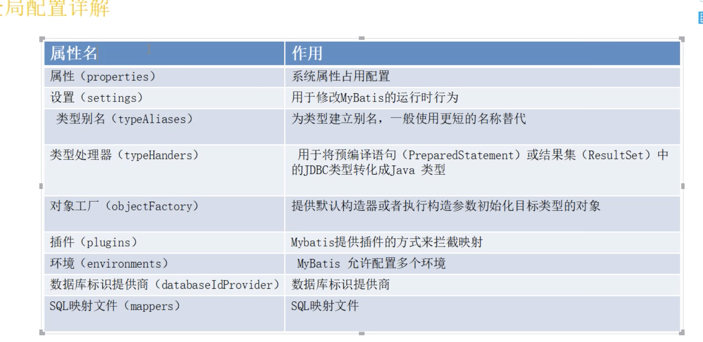

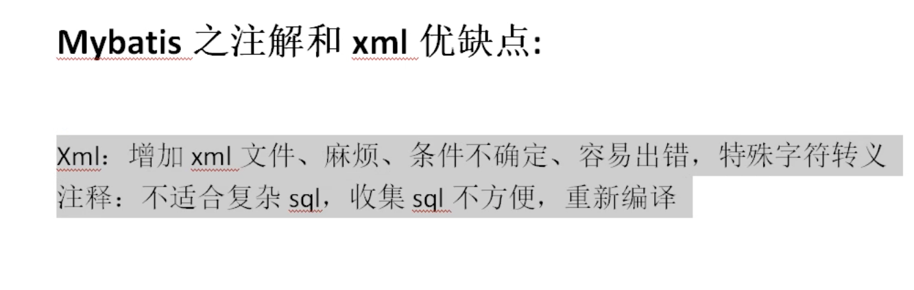

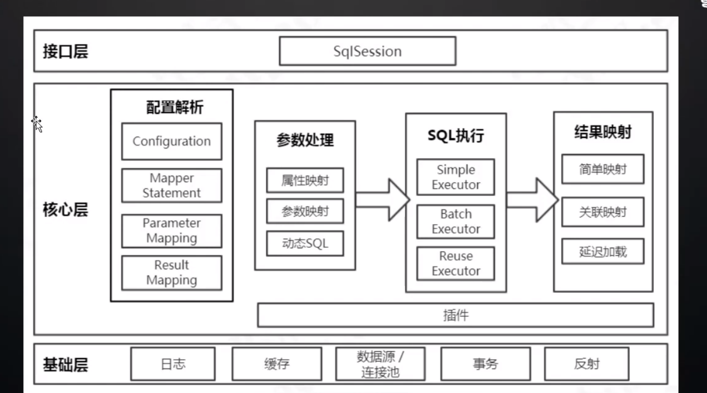

huancun

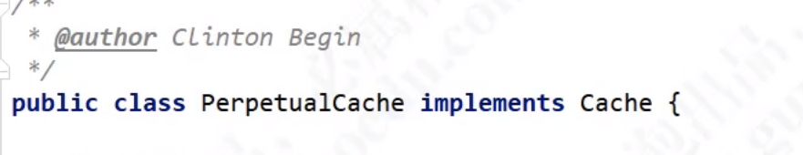

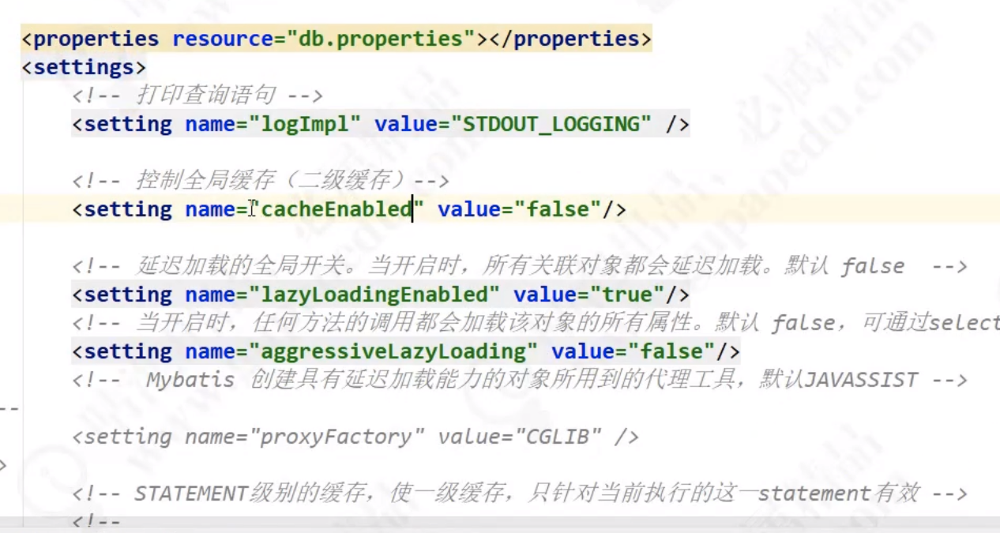

一级缓存和二级缓存 开启

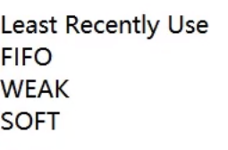

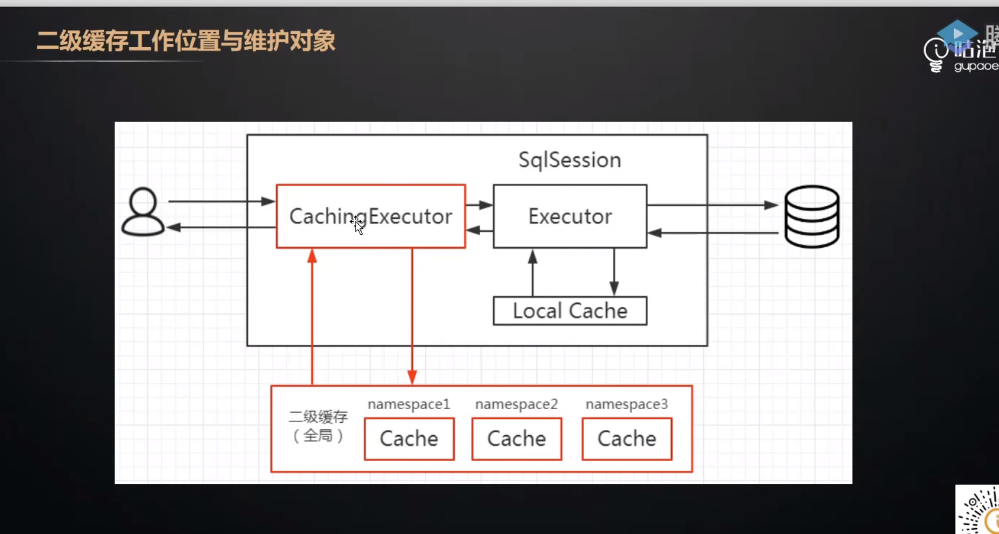

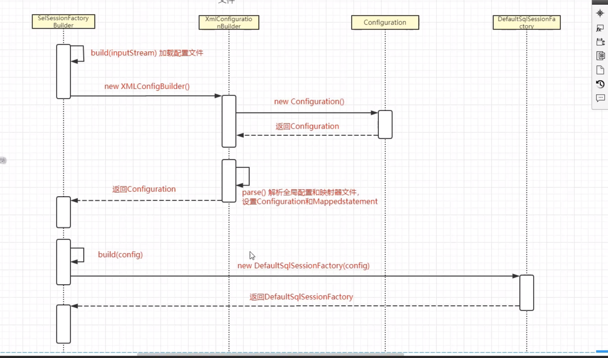

batchExecutor

reuseExecutor

simpleExecutor

CachingeXECUTRO  

Mybatis 事务问题

1.  jdbc  封装jdbc 实现事务
2. manager  托管给容器管理事务， 才是单独使用mybatis 没有事务

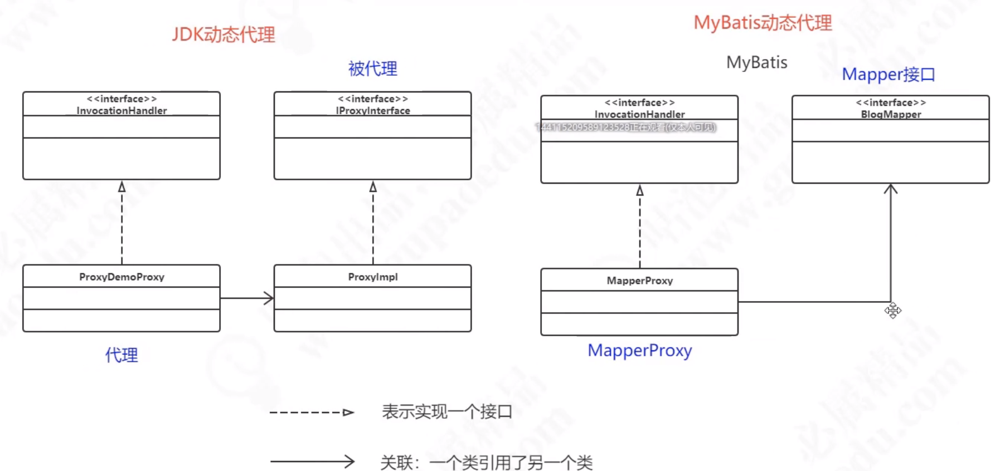

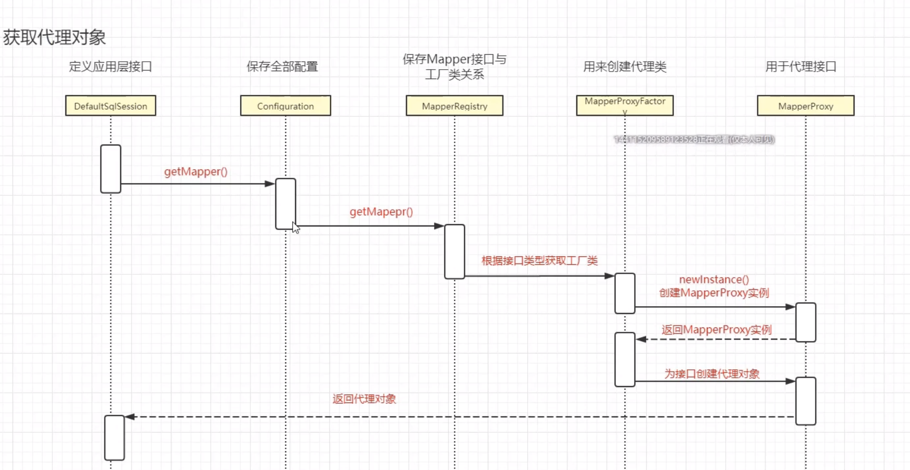

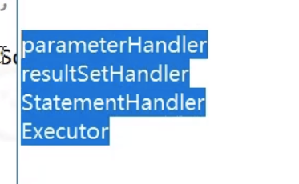

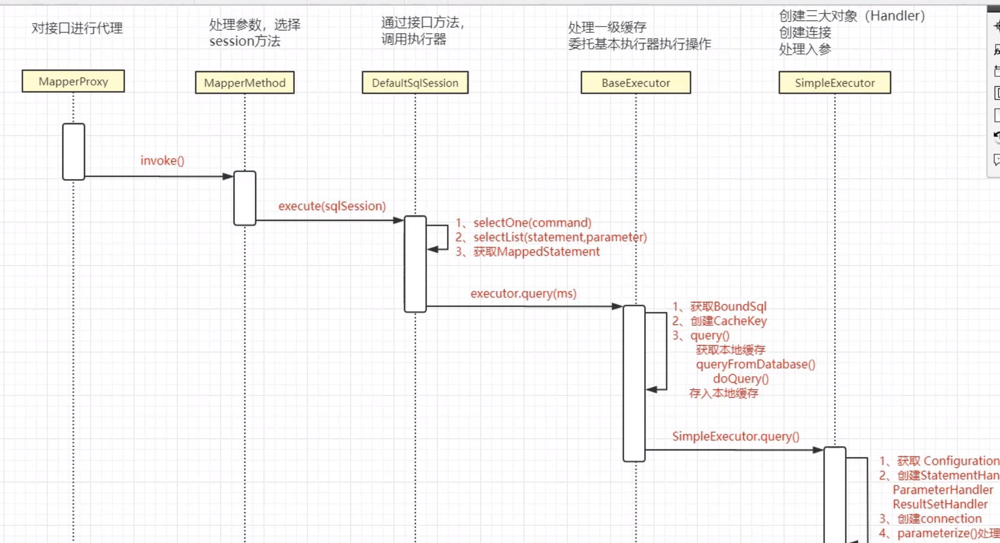

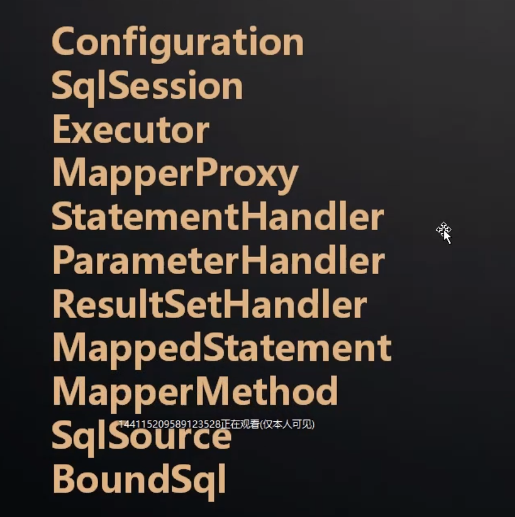

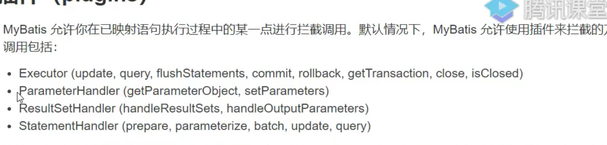

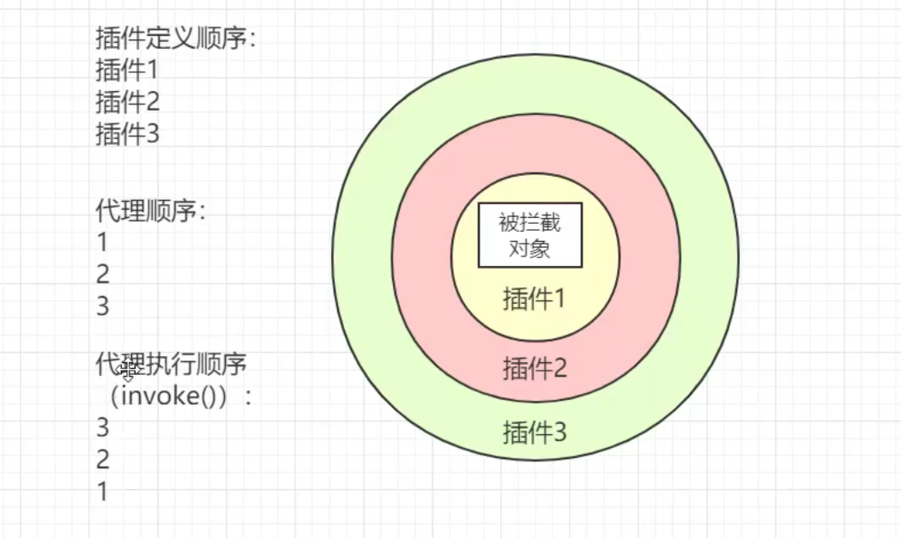

plugin 代理方法

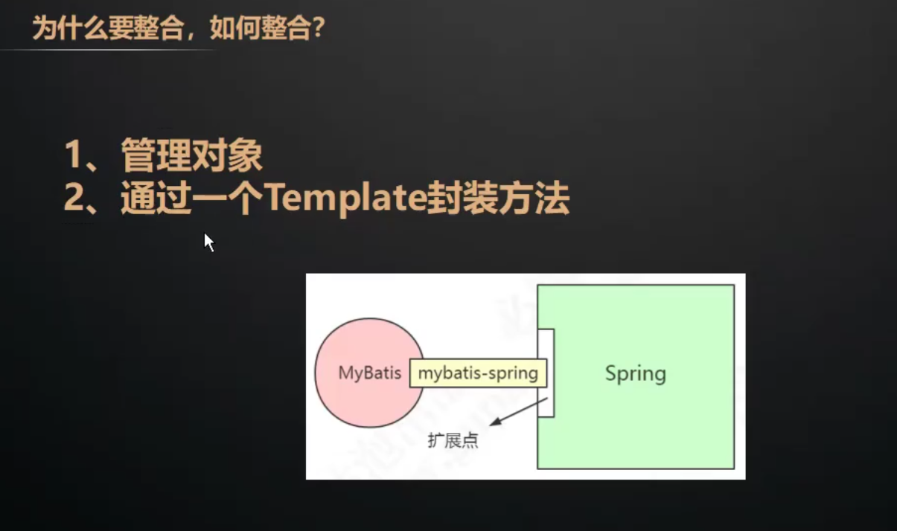

DefaultSqlSession 不是线程安全的

