非懒加载的单例类  在启动时候创建
原型和懒记载bin 和factorybin 是在getbena时候创建的


@AutoWire 先by type再by name

Aware 表示一种回调

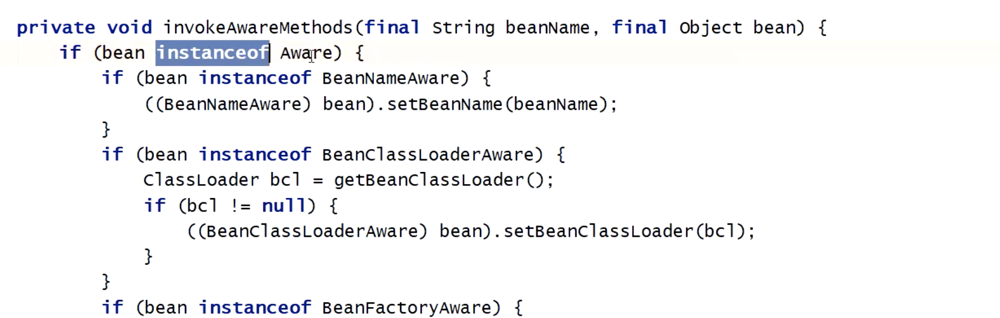

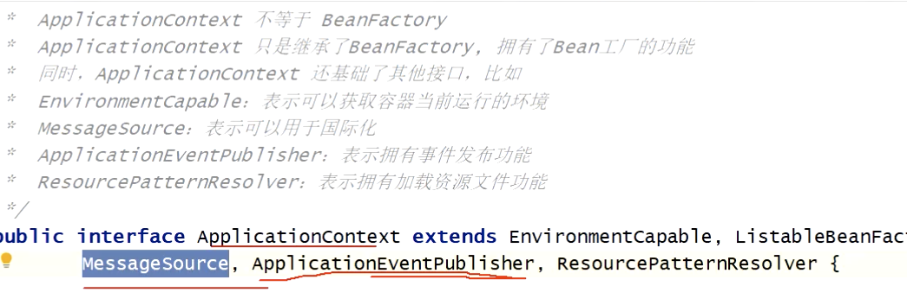


### BeanDefinition

Bean工厂 的后置处理器 用来干扰spring 容器的bean 工厂初始化过程

```
BeanFactoryPostProcessor
```

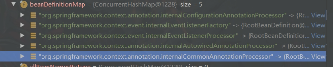


### Spring bean的生命周期

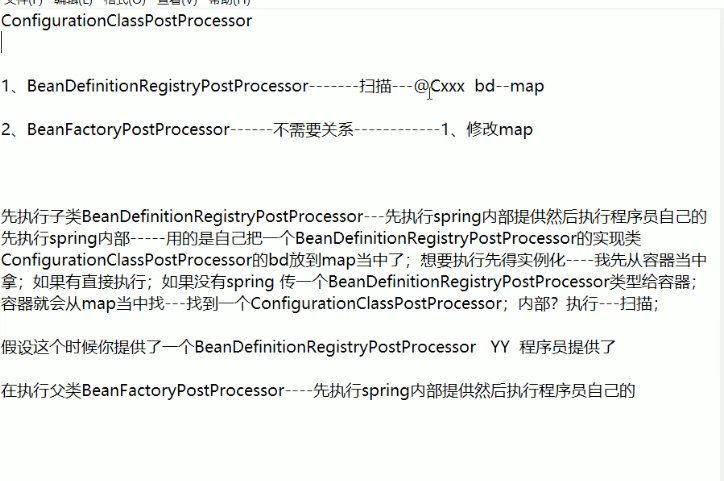

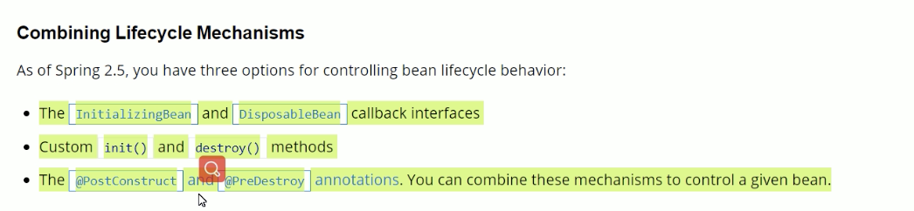

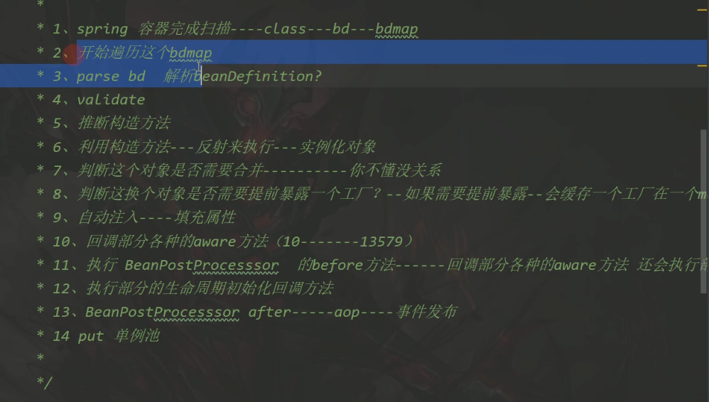

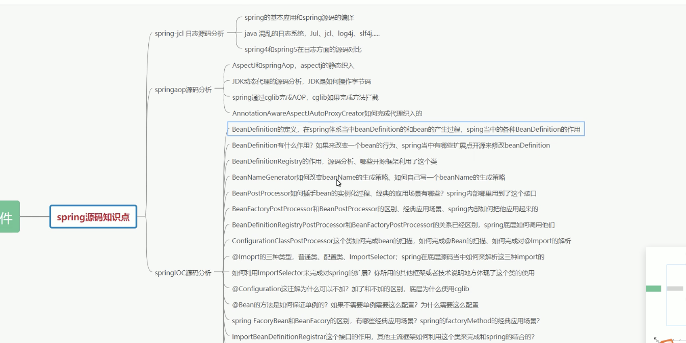

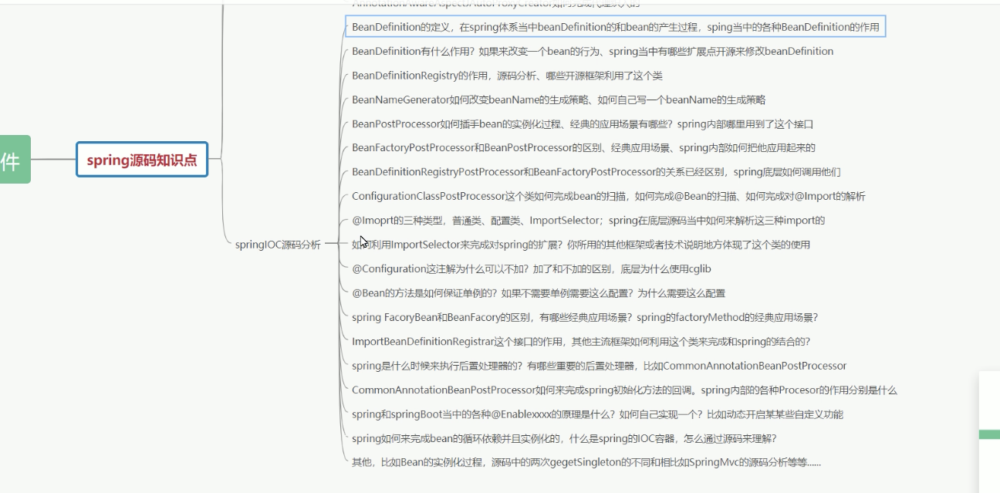

### 循环依赖

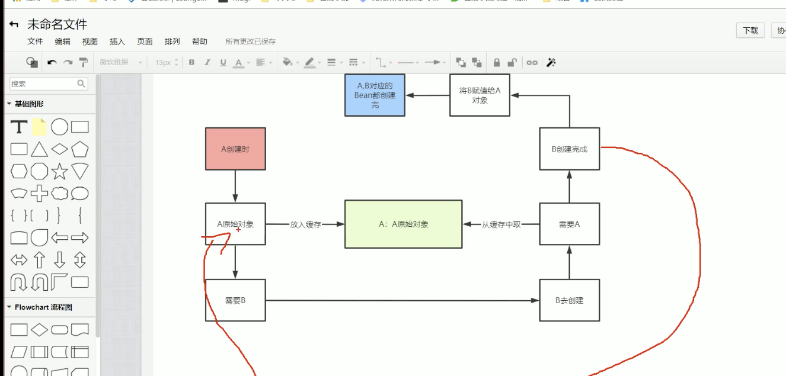

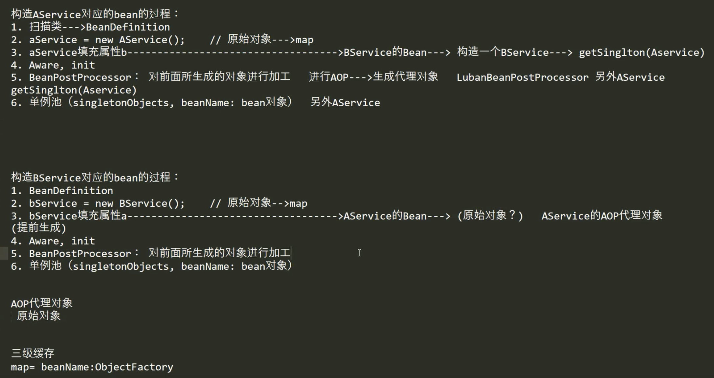

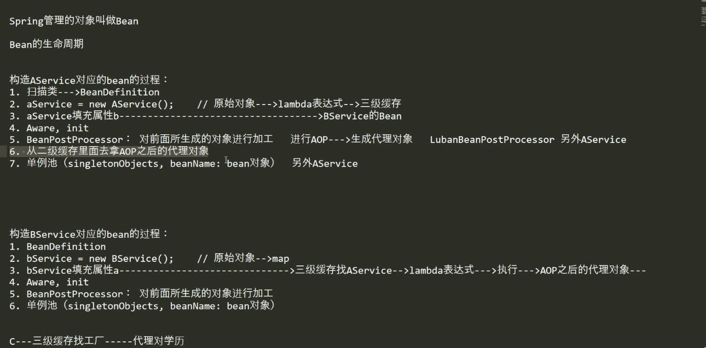


```java
@Override
protected Object createBean(String beanName, RootBeanDefinition mbd, Object[] args) throws BeanCreationException {
   if (logger.isDebugEnabled()) {
      logger.debug("Creating instance of bean '" + beanName + "'");
   }
   RootBeanDefinition mbdToUse = mbd;

   // Make sure bean class is actually resolved at this point, and
   // clone the bean definition in case of a dynamically resolved Class
   // which cannot be stored in the shared merged bean definition.
   Class<?> resolvedClass = resolveBeanClass(mbd, beanName);
   if (resolvedClass != null && !mbd.hasBeanClass() && mbd.getBeanClassName() != null) {
      mbdToUse = new RootBeanDefinition(mbd);
      mbdToUse.setBeanClass(resolvedClass);
   }

   // Prepare method overrides.
   try {
      mbdToUse.prepareMethodOverrides();
   }
   catch (BeanDefinitionValidationException ex) {
      throw new BeanDefinitionStoreException(mbdToUse.getResourceDescription(),
            beanName, "Validation of method overrides failed", ex);
   }

   try {
      // Give BeanPostProcessors a chance to return a proxy instead of the target bean instance.
      Object bean = resolveBeforeInstantiation(beanName, mbdToUse);
      if (bean != null) {
         return bean;
      }
   }
   catch (Throwable ex) {
      throw new BeanCreationException(mbdToUse.getResourceDescription(), beanName,
            "BeanPostProcessor before instantiation of bean failed", ex);
   }

   Object beanInstance = doCreateBean(beanName, mbdToUse, args);
   if (logger.isDebugEnabled()) {
      logger.debug("Finished creating instance of bean '" + beanName + "'");
   }
   return beanInstance;
}

/**
	 * Apply before-instantiation post-processors, resolving whether there is a
	 * before-instantiation shortcut for the specified bean.
	 * @param beanName the name of the bean
	 * @param mbd the bean definition for the bean
	 * @return the shortcut-determined bean instance, or {@code null} if none
	 */
	protected Object resolveBeforeInstantiation(String beanName, RootBeanDefinition mbd) {
		Object bean = null;
		if (!Boolean.FALSE.equals(mbd.beforeInstantiationResolved)) {
			// Make sure bean class is actually resolved at this point.
			if (!mbd.isSynthetic() && hasInstantiationAwareBeanPostProcessors()) {
				Class<?> targetType = determineTargetType(beanName, mbd);
				if (targetType != null) {
					bean = applyBeanPostProcessorsBeforeInstantiation(targetType, beanName);
					if (bean != null) {
						bean = applyBeanPostProcessorsAfterInitialization(bean, beanName);
					}
				}
			}
			mbd.beforeInstantiationResolved = (bean != null);
		}
		return bean;
	}
```

前置处理器 修改返回null


第三层缓存

```
if (earlySingletonExposure) {
   if (logger.isDebugEnabled()) {
      logger.debug("Eagerly caching bean '" + beanName +
            "' to allow for resolving potential circular references");
   }
   addSingletonFactory(beanName, new ObjectFactory<Object>() {
      @Override
      public Object getObject() throws BeansException {
         return getEarlyBeanReference(beanName, mbd, bean);
      }
   });
}
```


```
InstantiationAwareBeanPostProcessor
```

```
hasInstantiationAwareBeanPostProcessors
```